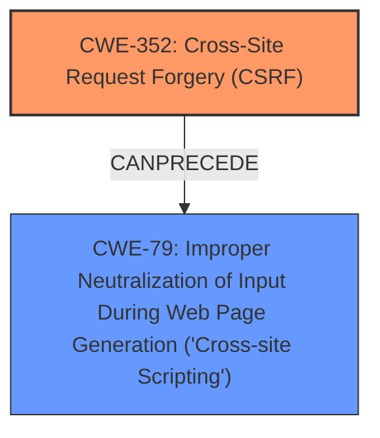

# Analysis Report for CVE-2025-31570

# Vulnerability Analysis Report: CVE-2025-31570

## Description

Cross-Site Request Forgery (CSRF) vulnerability in wp-buy Related Posts Widget with Thumbnails allows Stored XSS. This issue affects Related Posts Widget with Thumbnails from n/a through 1.2.

## Vulnerability Description Key Phrases

- **Weakness:** Stored XSS, cross-site request forgery
- **Product:** Related Posts Widget with Thumbnails
- **Version:** through 1.2

## Analysis (with Relationship Data)

# Summary
| CWE ID | CWE Name | Confidence | CWE Abstraction Level | CWE Vulnerability Mapping Label | CWE-Vulnerability Mapping Notes |
|---|---|---|---|---|---|
| CWE-352 | Cross-Site Request Forgery (CSRF) | 0.9 | Compound | Primary | Allowed |
| CWE-79 | Improper Neutralization of Input During Web Page Generation ('Cross-site Scripting') | 0.8 | Base | Secondary | Allowed |

## Evidence and Confidence

*   **Confidence Score:** 0.85
*   **Evidence Strength:** HIGH

## Relationship Analysis
The primary weakness identified is CWE-352 [Cross-Site Request Forgery (CSRF)], which can **precede** other weaknesses or require certain conditions to be exploitable. The vulnerability description states that the CSRF vulnerability allows for Stored XSS. This implies that successful exploitation of the CSRF vulnerability can lead to stored XSS because of **improper neutralization of input**. Therefore CWE-79 [Improper Neutralization of Input During Web Page Generation ('Cross-site Scripting')] is considered a secondary weakness here because it is a consequence of the primary CSRF vulnerability and present due to the lack of input validation when handling requests triggered via CSRF.



## Vulnerability Chain
The vulnerability chain starts with the **lack of CSRF protection (CWE-352)**, which allows an attacker to **forge requests**. If these requests are not properly validated or sanitized, they can lead to **stored XSS (CWE-79)**.

## Summary of Analysis
The primary focus is on the Cross-Site Request Forgery (CSRF) vulnerability (CWE-352), which is the root cause, as stated in the "CVE Reference Links Content Summary". The vulnerability description also mentions "Stored XSS", and the retriever results also show CWE-79 [Improper Neutralization of Input During Web Page Generation ('Cross-site Scripting')] as a likely candidate.

The evidence provided states: "Cross-Site Request Forgery (CSRF) vulnerability in wp-buy Related Posts Widget with Thumbnails allows Stored XSS." and "The vulnerability is a Cross-Site Request Forgery (CSRF)".

CWE-352 is a Compound weakness, while CWE-79 is a Base weakness. Given the evidence and relationship analysis, CWE-352 accurately represents the root cause, and CWE-79 represents a potential impact or consequence of the CSRF vulnerability.

Relevant CWE Information:

# Enhanced Context (25 CWEs)
The following CWEs were identified as potentially relevant to this vulnerability:

## CWE-352: Cross-Site Request Forgery (CSRF)
**Abstraction Level**: Compound
**Similarity Score**: 0.81
**Source**: dense

**Description**:
The web application does not, or can not, sufficiently verify whether a well-formed, valid, consistent request was intentionally provided by the user who submitted the request.

**Mapping Guidance**:
- Usage: Allowed
- Rationale: This is a well-known Composite of multiple weaknesses that must all occur simultaneously, although it is attack-oriented in nature.

## CWE-79: Improper Neutralization of Input During Web Page Generation ('Cross-site Scripting')
**Abstraction Level**: Base
**Similarity Score**: 0.73
**Source**: dense

**Description**:
The product does not neutralize or incorrectly neutralizes user-controllable input before it is placed in output that is used as a web page that is served to other users.

**Mapping Guidance**:
- Usage: Allowed
- Rationale: This CWE entry is at the Base level of abstraction, which is a preferred level of abstraction for mapping to the root causes of vulnerabilities.

### CWEs Considered but Not Used:

*   **CWE-89 [Improper Neutralization of Special Elements used in an SQL Command ('SQL Injection')]**: While SQL Injection is a common vulnerability, there is no specific evidence in the description or summary to suggest that SQL injection is the issue.
*   **CWE-918 [Server-Side Request Forgery (SSRF)]**: There's no evidence of SSRF in the provided information.
*   **CWE-601 [URL Redirection to Untrusted Site ('Open Redirect')]**: No evidence of URL redirection.
*   **CWE-434 [Unrestricted Upload of File with Dangerous Type]**: There is no file upload functionality mentioned.
*   **CWE-96 [Improper Neutralization of Directives in Statically Saved Code ('Static Code Injection')]**: No evidence to support code injection.
*   **CWE-425 [Direct Request ('Forced Browsing')]**: While authorization is a factor in CSRF, the primary issue is the lack of CSRF protection, not direct access to resources.


## CWE Relationship Analysis

Current CWEs represent these abstraction levels: .


### Vulnerability Chain Analysis

**Chain starting from CWE-89:**
- 89 (Improper Neutralization of Special Elements used in an SQL Command ('SQL Injection')) - ROOT


**Chain starting from CWE-601:**
- 601 (URL Redirection to Untrusted Site ('Open Redirect')) - ROOT


### CWE Relationship Diagram

```mermaid
graph TD
    classDef primary fill:#f96,stroke:#333,stroke-width:2px
    classDef secondary fill:#69f,stroke:#333
    classDef tertiary fill:#9e9,stroke:#333
```


*Report generated on 2025-07-14 18:54:33*
