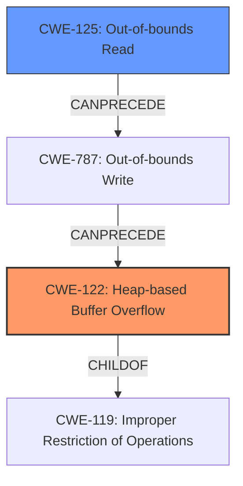

# Enhanced Analysis for CVE-2025-3159

# Summary
| CWE ID | CWE Name | Confidence | CWE Abstraction Level | CWE Vulnerability Mapping Label | CWE-Vulnerability Mapping Notes |
|---|---|---|---|---|---|
| CWE-122 | Heap-based Buffer Overflow | 1.0 | Variant | Primary | Allowed |
| CWE-125 | Out-of-bounds Read | 0.8 | Base | Secondary | Allowed |

## Evidence and Confidence

*   **Confidence Score:** 0.9
*   **Evidence Strength:** HIGH

## Relationship Analysis
The primary CWE is CWE-122, which is a variant of CWE-119 (Improper Restriction of Operations within the Bounds of a Memory Buffer). CWE-125 (Out-of-bounds Read) is identified as a related weakness, and it can often precede CWE-787 (Out-of-bounds Write), which is a more general case of CWE-122. The relationships highlight a potential vulnerability chain involving out-of-bounds access leading to a heap-based buffer overflow.



## Vulnerability Chain
The vulnerability chain starts with an out-of-bounds read (CWE-125) when accessing the `mesh.mBoneVertices` container due to an incorrect index calculation, leading to a **heap-based buffer overflow** (CWE-122) during the `push_back` operation. The root cause is the **incorrect** index assignment, which triggers the overflow.

## Summary of Analysis
The analysis strongly suggests CWE-122 (Heap-based Buffer Overflow) as the primary CWE due to the explicit mention of "heap-based buffer overflow" in both the vulnerability description and the CVE reference summary. The CVE reference also details how the **out-of-bounds read** of `mesh.mBoneVertices` causes the overflow, suggesting CWE-125 as a secondary contributing factor. The retriever results also support these findings, with CWE-122 and CWE-125 having high relevance scores.

The evidence supporting the primary CWE is:
*   "The manipulation leads to **heap-based buffer overflow**" from the Vulnerability Description.
*   "The root cause is a heap buffer overflow in Assimp::ASE::Parser::ParseLV4MeshBonesVertices" from the CVE Reference Links Content Summary.
*   "which is reading out of bound for mesh.mBoneVertices. It causes the push_back function to trigger a heap buffer overflow." from the CVE Reference Links Content Summary.

The evidence supporting the secondary CWE is:
*   "iIndex was assigned to (unsigned int)mesh.mPositions.size() - 1, which is reading out of bound for mesh.mBoneVertices" from the CVE Reference Links Content Summary.
*   "Weaknesses/vulnerabilities present: Heap-based buffer overflow and out-of-bounds read." from the CVE Reference Links Content Summary.

The selection of CWE-122 as the primary cause and CWE-125 as a contributing factor provides a detailed and accurate representation of the vulnerability. This is at the Variant and Base level of abstraction, respectively, which are the preferred levels of abstraction.

CWEs Considered and Rejected:
*   CWE-119 (Improper Restriction of Operations within the Bounds of a Memory Buffer): While this is a parent of CWE-122, CWE-122 is more specific and thus a better fit.
*   CWE-190 (Integer Overflow or Wraparound): Not directly related to the described vulnerability. The issue is not an integer overflow, but an out-of-bounds access leading to a heap overflow.
*   CWE-131 (Incorrect Calculation of Buffer Size): While a miscalculation leads to the overflow, the core issue is writing beyond the buffer's boundary due to incorrect indexing, making CWE-122 a more direct representation.
*   CWE-787 (Out-of-bounds Write): CWE-122 is more specific as this is on the heap.

# Enhanced Context (25 CWEs)
The following CWEs were identified as potentially relevant to this vulnerability:

## CWE-131: Incorrect Calculation of Buffer Size
**Abstraction Level**: Base
**Similarity Score**: 0.74
**Source**: dense

**Description**:
The product does not correctly calculate the size to be used when allocating a buffer, which could lead to a buffer overflow.

**Mapping Guidance**:
- Usage: Allowed
- Rationale: This CWE entry is at the Base level of abstraction, which is a preferred level of abstraction for mapping to the root causes of vulnerabilities.

## CWE-129: Improper Validation of Array Index
**Abstraction Level**: Variant
**Similarity Score**: 0.74
**Source**: dense

**Description**:
The product uses untrusted input when calculating or using an array index, but the product does not validate or incorrectly validates the index to ensure the index references a valid position within the array.

**Mapping Guidance**:
- Usage: Allowed
- Rationale: This CWE entry is at the Variant level of abstraction, which is a preferred level of abstraction for mapping to the root causes of vulnerabilities.

## CWE-125: Out-of-bounds Read
**Abstraction Level**: Base
**Similarity Score**: 0.73
**Source**: dense

**Description**:
The product reads data past the end, or before the beginning, of the intended buffer.

**Mapping Guidance**:
- Usage: Allowed
- Rationale: This CWE entry is at the Base level of abstraction, which is a preferred level of abstraction for mapping to the root causes of vulnerabilities.

## CWE-193: Off-by-one Error
**Abstraction Level**: Base
**Similarity Score**: 0.72
**Source**: dense

**Description**:
A product calculates or uses an incorrect maximum or minimum value that is 1 more, or 1 less, than the correct value.

**Mapping Guidance**:
- Usage: Allowed
- Rationale: This CWE entry is at the Base level of abstraction, which is a preferred level of abstraction for mapping to the root causes of vulnerabilities.

## CWE-191: Integer Underflow (Wrap or Wraparound)
**Abstraction Level**: Base
**Similarity Score**: 0.72
**Source**: dense

**Description**:
The product subtracts one value from another, such that the result is less than the minimum allowable integer value, which produces a value that is not equal to the correct result.

**Mapping Guidance**:
- Usage: Allowed
- Rationale: This CWE entry is at the Base level of abstraction, which is a preferred level of abstraction for mapping to the root causes of vulnerabilities.

## CWE-252: Unchecked Return Value
**Abstraction Level**: Base
**Similarity Score**: 0.72
**Source**: dense

**Description**:
The product does not check the return value from a method or function, which can prevent it from detecting unexpected states and conditions.

**Mapping Guidance**:
- Usage: Allowed
- Rationale: This CWE entry is at the Base level of abstraction, which is a preferred level of abstraction for mapping to the root causes of vulnerabilities.

## CWE-824: Access of Uninitialized Pointer
**Abstraction Level**: Base
**Similarity Score**: 0.72
**Source**: dense

**Description**:
The product accesses or uses a pointer that has not been initialized.

**Mapping Guidance**:
- Usage: Allowed
- Rationale: This CWE entry is at the Base level of abstraction, which is a preferred level of abstraction for mapping to the root causes of vulnerabilities.

## CWE-126: Buffer Over-read
**Abstraction Level**: Variant
**Similarity Score**: 0.72
**Source**: dense

**Description**:
The product reads from a buffer using buffer access mechanisms such as indexes or pointers that reference memory locations after the targeted buffer.

**Mapping Guidance**:
- Usage: Allowed
- Rationale: This CWE entry is at the Variant level of abstraction, which is a preferred level of abstraction for mapping to the root causes of vulnerabilities.

## CWE-1286: Improper Validation of Syntactic Correctness of Input
**Abstraction Level**: Base
**Similarity Score**: 0.72
**Source**: dense

**Description**:
The product receives input that is expected to be well-formed - i.e., to comply with a certain syntax - but it does not validate or incorrectly validates that the input complies with the syntax.

**


## CWE Relationship Analysis

Current CWEs represent these abstraction levels: .


### Vulnerability Chain Analysis

**Chain starting from CWE-125:**
- 125 (Out-of-bounds Read) - ROOT


**Chain starting from CWE-131:**
- 131 (Incorrect Calculation of Buffer Size) - ROOT


### CWE Relationship Diagram

```mermaid
graph TD
    classDef primary fill:#f96,stroke:#333,stroke-width:2px
    classDef secondary fill:#69f,stroke:#333
    classDef tertiary fill:#9e9,stroke:#333
```