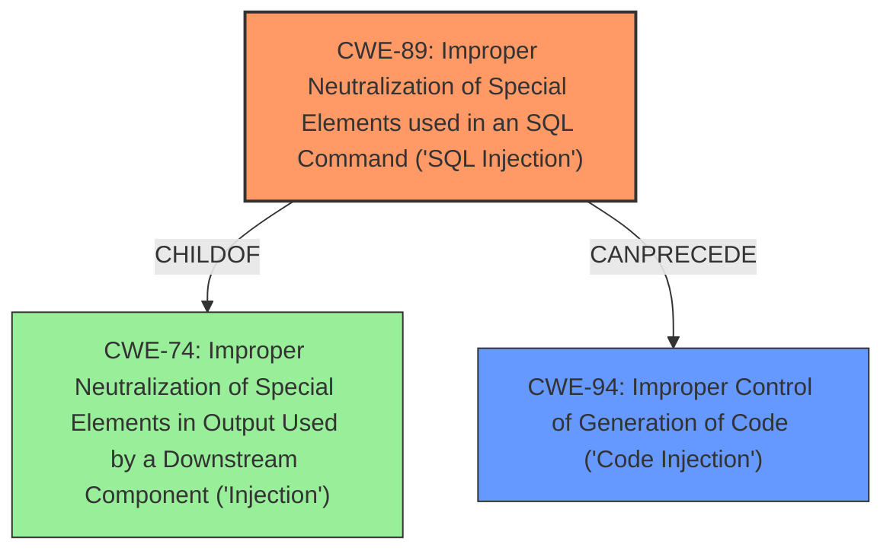

# Analysis Report for CVE-2025-3164

# Vulnerability Analysis Report: CVE-2025-3164

## Description

A vulnerability was found in Tencent Music Entertainment SuperSonic up to 0.9.8. It has been rated as critical. Affected by this issue is some unknown functionality of the file /api/semantic/database/testConnect of the component H2 Database Connection Handler. The manipulation leads to **code injection**. The attack may be launched remotely. The exploit has been disclosed to the public and may be used.

## Vulnerability Description Key Phrases

- **Weakness:** code injection
- **Product:** Tencent Music Entertainment SuperSonic
- **Version:** up to 0.9.8
- **Component:** /api/semantic/database/testConnect in H2 Database Connection Handler

## Analysis (with Relationship Data)

# Summary
| CWE ID | CWE Name | Confidence | CWE Abstraction Level | CWE Vulnerability Mapping Label | CWE-Vulnerability Mapping Notes |
|---|---|---|---|---|---|
| CWE-89 | Improper Neutralization of Special Elements used in an SQL Command ('SQL Injection') | 1.0 | Base | Allowed | Primary CWE: The **root cause** is the **improper neutralization** that leads to SQL injection. |
| CWE-94 | Improper Control of Generation of Code ('Code Injection') | 0.8 | Base | Allowed-with-Review | Secondary CWE: The **code injection** allows the attacker to execute arbitrary code on the server. |

## Evidence and Confidence

*   **Confidence Score:** 0.9
*   **Evidence Strength:** HIGH

## Relationship Analysis
The primary CWE is CWE-89, which represents the root cause SQL Injection due to **improper neutralization**. CWE-94, **Code Injection**, is a consequence of successful SQL injection. CWE-89 is a base CWE, providing a good level of detail, and CWE-94 is also a base CWE. The relationship is that successful exploitation of CWE-89 *can precede* CWE-94.



## Vulnerability Chain
The vulnerability chain begins with **improper neutralization** of special elements in the H2 database connection URL, leading to SQL injection (CWE-89). This then results in arbitrary code execution (CWE-94) on the server.

## Summary of Analysis
The analysis is based on the provided evidence, particularly the CVE Reference Links Content Summary, which explicitly states that the vulnerability lies in the lack of proper input validation and sanitization of the H2 database connection URL, leading to SQL injection. The successful SQL injection allows for arbitrary code execution. The relationship graph reinforces this understanding, showing how CWE-89 can precede CWE-94.

The evidence supporting CWE-89 is:
*   "The vulnerability lies in the lack of proper input validation and sanitization of the H2 database connection URL provided by the user."
*   "Specifically, the `INIT` parameter within the JDBC URL is not adequately restricted, allowing an attacker to execute arbitrary SQL commands during database initialization."
The evidence supporting CWE-94 is:
*   "An attacker can execute arbitrary commands on the server by injecting malicious SQL code into the `INIT` parameter of the H2 database connection URL."

CWE-89 is selected because it precisely describes the root cause of the vulnerability: **improper neutralization** of special elements in an SQL command. CWE-94 is selected because it represents the direct consequence of the successful SQL injection: arbitrary code execution. Both CWEs are at the base level of abstraction, providing sufficient detail.

Other CWEs Considered:

*   CWE-79 (Improper Neutralization of Input During Web Page Generation ('Cross-site Scripting')): While **improper neutralization** is a factor, this vulnerability doesn't directly involve web page generation or cross-site scripting.
*   CWE-78 (Improper Neutralization of Special Elements used in an OS Command ('OS Command Injection')): Similar to CWE-79, OS command injection is a consequence of successful exploitation, but not the direct cause.
*   CWE-74 (Improper Neutralization of Special Elements in Output Used by a Downstream Component ('Injection')): This is a higher-level class. SQL Injection (CWE-89) is more specific.
*   CWE-1336 (Improper Neutralization of Special Elements Used in a Template Engine): This is not related to template engine usage.

Relevant CWE Information:
N/A


## CWE Relationship Analysis

Current CWEs represent these abstraction levels: .


### Vulnerability Chain Analysis

**Chain starting from CWE-89:**
- 89 (Improper Neutralization of Special Elements used in an SQL Command ('SQL Injection')) - ROOT


**Chain starting from CWE-94:**
- 94 (Improper Control of Generation of Code ('Code Injection')) - ROOT


### CWE Relationship Diagram

```mermaid
graph TD
    classDef primary fill:#f96,stroke:#333,stroke-width:2px
    classDef secondary fill:#69f,stroke:#333
    classDef tertiary fill:#9e9,stroke:#333
```


*Report generated on 2025-07-14 18:58:32*
