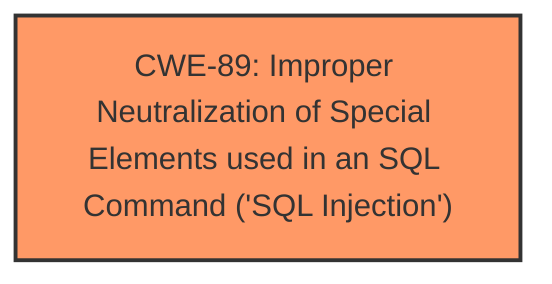

# Analysis for CVE-2025-3173

# Summary
| CWE ID | CWE Name | Confidence | CWE Abstraction Level | CWE Vulnerability Mapping Label | CWE-Vulnerability Mapping Notes |
|---|---|---|---|---|---|
| CWE-89 | Improper Neutralization of Special Elements used in an SQL Command ('SQL Injection') | 1.0 | Base | Primary | Allowed |

## Evidence and Confidence

*   **Confidence Score:** 1.0
*   **Evidence Strength:** HIGH

## Relationship Analysis
The primary relationship impacting the CWE selection is the direct match of the vulnerability description to the characteristics of CWE-89. There are no clear parent-child or chain relationships evident in the provided information that would suggest a more specific or related CWE.

## Vulnerability Chain
The vulnerability chain is relatively simple:
1.  **Root Cause:** **Improper Neutralization of Special Elements used in an SQL Command ('SQL Injection')** (CWE-89) due to direct use of the `lawyer_id` parameter in SQL queries without proper cleaning or validation.
2.  **Impact:** Unauthorized database access, sensitive data leakage, data tampering, comprehensive system control, service interruption.

## Summary of Analysis
The vulnerability description explicitly states that the vulnerability is an **sql injection** in the `/save_booking.php` file, affecting the `lawyer_id/description` argument. The CVE Reference Links Content Summary confirms this by stating that the root cause is the direct use of the `lawyer_id` parameter in SQL queries without proper cleaning or validation. The report also suggests using prepared statements and input validation as mitigation techniques, which are standard practices for preventing SQL injection vulnerabilities.

The Retriever Results also lists CWE-89 as the top candidate.

Therefore, based on the evidence provided, CWE-89 is the most appropriate mapping. It is a Base level CWE, which is the preferred level of abstraction.

The other CWEs were considered but are not as directly relevant as CWE-89:

*   CWE-79 (Improper Neutralization of Input During Web Page Generation ('Cross-site Scripting')): While input neutralization is a concern, the specific vulnerability is SQL injection, not XSS.
*   CWE-434 (Unrestricted Upload of File with Dangerous Type): This is not related to the vulnerability description.
*   CWE-1336 (Improper Neutralization of Special Elements Used in a Template Engine): There is no mention of a template engine in the vulnerability description.
*   CWE-117 (Improper Output Neutralization for Logs): This is not related to the vulnerability description.
*   CWE-472 (External Control of Assumed-Immutable Web Parameter): This is not directly applicable, as the vulnerability stems from **improper sanitization** rather than external control of immutable parameters.

Relevant CWE Information:

# Enhanced Context (25 CWEs)

## CWE-89: Improper Neutralization of Special Elements used in an SQL Command ('SQL Injection')
**Abstraction Level**: Base
**Similarity Score**: 0.78
**Source**: dense

**Description**:
The product constructs all or part of an SQL command using externally-influenced input from an upstream component, but it does not neutralize or incorrectly neutralizes special elements that could modify the intended SQL command when it is sent to a downstream component. Without sufficient removal or quoting of SQL syntax in user-controllable inputs, the generated SQL query can cause those inputs to be interpreted as SQL instead of ordinary user data.

**Mapping Guidance**:
- Usage: Allowed
- Rationale: This CWE entry is at the Base level of abstraction, which is a preferred level of abstraction for mapping to the root causes of vulnerabilities.