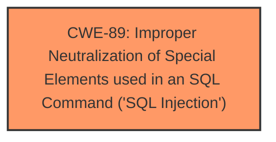

# Analysis Report for CVE-2025-3174

# Vulnerability Analysis Report: CVE-2025-3174

## Description

A vulnerability has been found in Project Worlds Online Lawyer Management System 1.0 and classified as critical. Affected by this vulnerability is an unknown functionality of the file /searchLawyer.php. The manipulation of the argument experience leads to **sql injection**. The attack can be launched remotely. The exploit has been disclosed to the public and may be used.

## Vulnerability Description Key Phrases

- **Weakness:** sql injection
- **Vector:** manipulation of argument experience
- **Product:** Project Worlds Online Lawyer Management System
- **Version:** 1
- **Component:** /searchLawyer.php

## Analysis (with Relationship Data)

# Summary
| CWE ID | CWE Name | Confidence | CWE Abstraction Level | CWE Vulnerability Mapping Label | CWE-Vulnerability Mapping Notes |
|---|---|---|---|---|---|
| CWE-89 | Improper Neutralization of Special Elements used in an SQL Command ('SQL Injection') | 1.0 | Base | Allowed | Primary CWE |

## Evidence and Confidence

*   **Confidence Score:** 1.0
*   **Evidence Strength:** HIGH

## Relationship Analysis
The primary relationship that influenced the decision was the direct match of the vulnerability description to the definition of CWE-89. The other CWEs presented in the retriever results were considered but deemed less relevant as they represent different types of vulnerabilities or are at a higher abstraction level.



## Vulnerability Chain
The vulnerability chain consists of the following:
1.  **Root Cause:** **Improper Neutralization of Special Elements used in an SQL Command ('SQL Injection')** (CWE-89) due to lack of input validation on the `experience` parameter.
2.  **Impact:** Unauthorized database access, sensitive data leakage, data tampering, system control, service interruption.

## Summary of Analysis
The vulnerability description clearly indicates an **SQL injection** vulnerability in the `/searchLawyer.php` file, specifically through the manipulation of the `experience` argument. The CVE Reference Links Content Summary confirms that the root cause is the **lack of proper cleaning or validation** of the `experience` parameter before it is used in SQL queries. This aligns directly with the definition of CWE-89, "Improper Neutralization of Special Elements used in an SQL Command ('SQL Injection')", which states that the product does not neutralize or incorrectly neutralizes special elements that could modify the intended SQL command.

The retriever results strongly support this classification, with CWE-89 having the highest score. The mapping guidance for CWE-89 indicates that its usage is allowed and that it is at the Base level of abstraction, which is preferred.

The other CWEs in the retriever results were considered but deemed less relevant:

*   CWE-79 (Improper Neutralization of Input During Web Page Generation ('Cross-site Scripting')): While also related to improper neutralization, it is specific to cross-site scripting, which is not the case here.
*   CWE-434 (Unrestricted Upload of File with Dangerous Type): This is related to file uploads, which is not relevant to this vulnerability.
*   CWE-1336 (Improper Neutralization of Special Elements Used in a Template Engine): This is specific to template engines, which is not mentioned in the vulnerability description.
*   CWE-425 (Direct Request ('Forced Browsing')): While authorization could be a factor, the primary issue is the **SQL injection** itself.
*   CWE-74 (Improper Neutralization of Special Elements in Output Used by a Downstream Component ('Injection')) is a broader category of injection and the SQL Injection is a better and more precise fit for this vulnerability.

The selected CWE-89 is at the optimal level of specificity, as it directly addresses the root cause of the vulnerability.


## CWE Relationship Analysis

Current CWEs represent these abstraction levels: .


### Vulnerability Chain Analysis

**Chain starting from CWE-89:**
- 89 (Improper Neutralization of Special Elements used in an SQL Command ('SQL Injection')) - ROOT


**Chain starting from CWE-79:**
- 79 (Improper Neutralization of Input During Web Page Generation ('Cross-site Scripting')) - ROOT


### CWE Relationship Diagram

```mermaid
graph TD
    classDef primary fill:#f96,stroke:#333,stroke-width:2px
    classDef secondary fill:#69f,stroke:#333
    classDef tertiary fill:#9e9,stroke:#333
```


*Report generated on 2025-07-14 19:05:31*
