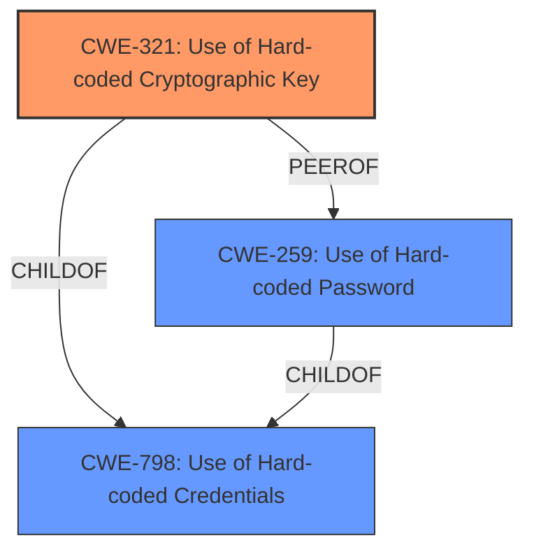

# Analysis for CVE-2025-3177

# Summary

| CWE ID | CWE Name | Confidence | CWE Abstraction Level | CWE Vulnerability Mapping Label | CWE-Vulnerability Mapping Notes |
|---|---|---|---|---|---|
| CWE-321 | Use of Hard-coded Cryptographic Key | 1.0 | Variant | Allowed | Primary CWE |
| CWE-798 | Use of Hard-coded Credentials | 0.7 | Base | Allowed | Secondary Candidate |
| CWE-259 | Use of Hard-coded Password | 0.6 | Variant | Allowed | Secondary Candidate |

## Evidence and Confidence

*   **Confidence Score:** 0.9
*   **Evidence Strength:** HIGH

## Relationship Analysis

The primary CWE, CWE-321 [CWE-321: Use of Hard-coded Cryptographic Key], is a variant of CWE-798 [CWE-798: Use of Hard-coded Credentials]. CWE-259 [CWE-259: Use of Hard-coded Password] is a peer of CWE-321 and also a child of CWE-798. Because the vulnerability specifically involves a cryptographic key, CWE-321 is a more specific and appropriate choice than its parent CWE-798. CWE-259 is another variant of CWE-798, but is less specific than CWE-321 in this context.

## Vulnerability Chain

The vulnerability chain starts with the **use of a hard-coded cryptographic key** (CWE-321). This allows an attacker to forge JWT tokens, leading to potential unauthorized access.

## Summary of Analysis

The primary vulnerability is the **use of a hard-coded cryptographic key** in the JWT handler of FastCMS 0.1.5. The vulnerability description explicitly states, "The manipulation leads to **use of hard-coded cryptographic key**." The CVE reference links content summary confirms this, stating, "The root cause is JWT hard coding within the Fastcms application. A default JWT key is used, allowing attackers to forge identity tokens."

CWE-321 [CWE-321: Use of Hard-coded Cryptographic Key] is the most specific and appropriate CWE, as it directly addresses the **use of a hard-coded cryptographic key**. It is a Variant level CWE, which is preferred. The retriever results also list CWE-321 as a highly relevant CWE.

CWE-798 [CWE-798: Use of Hard-coded Credentials] is a broader CWE that encompasses various types of hard-coded credentials. While relevant, it is less specific than CWE-321.

CWE-259 [CWE-259: Use of Hard-coded Password] is another variant of CWE-798, but it is specific to passwords. Since the vulnerability involves a cryptographic key, CWE-321 is a more precise fit.

Other CWEs were considered but deemed less relevant:

*   CWE-1391 [CWE-1391: Use of Weak Credentials]: This is a class-level CWE and less specific than CWE-321.
*   CWE-89 [CWE-89: Improper Neutralization of Special Elements used in an SQL Command ('SQL Injection')]: This is not related to the described vulnerability.
*   CWE-79 [CWE-79: Improper Neutralization of Input During Web Page Generation ('Cross-site Scripting')]: This is not related to the described vulnerability.
*   CWE-327 [CWE-327: Use of a Broken or Risky Cryptographic Algorithm]: This CWE addresses the **use of a broken algorithm**, not the **use of a hard-coded key**.
*   CWE-434 [CWE-434: Unrestricted Upload of File with Dangerous Type]: This is not related to the described vulnerability.
*   CWE-1336 [CWE-1336: Improper Neutralization of Special Elements Used in a Template Engine]: This is not related to the described vulnerability.
*   CWE-425 [CWE-425: Direct Request ('Forced Browsing')]: This is not related to the described vulnerability.
*   CWE-472 [CWE-472: External Control of Assumed-Immutable Web Parameter]: This is not related to the described vulnerability.
*   CWE-639 [CWE-639: Authorization Bypass Through User-Controlled Key]: This is not related to the described vulnerability.
*   CWE-303 [CWE-303: Incorrect Implementation of Authentication Algorithm]: This is not related to the described vulnerability.
*   CWE-319 [CWE-319: Cleartext Transmission of Sensitive Information]: This is not related to the described vulnerability.
*   CWE-178 [CWE-178: Improper Handling of Case Sensitivity]: This is not related to the described vulnerability.
*   CWE-471 [CWE-471: Modification of Assumed-Immutable Data (MAID)]: This is not related to the described vulnerability.
*   CWE-94 [CWE-94: Improper Control of Generation of Code ('Code Injection')]: This is not related to the described vulnerability.
*   CWE-184 [CWE-184: Incomplete List of Disallowed Inputs]: This is not related to the described vulnerability.