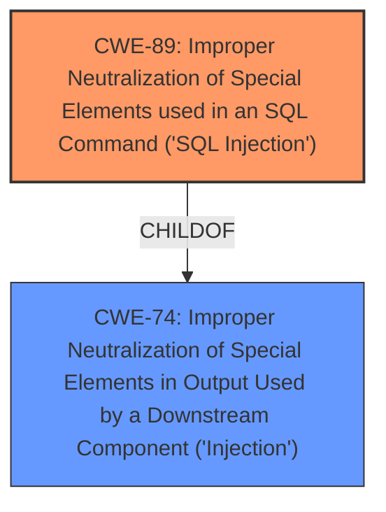

# Analysis for CVE-2025-3183

# Summary
| CWE ID | CWE Name | Confidence | CWE Abstraction Level | CWE Vulnerability Mapping Label | CWE-Vulnerability Mapping Notes |
|---|---|---|---|---|---|
| CWE-89 | Improper Neutralization of Special Elements used in an SQL Command ('SQL Injection') | 1.0 | Base | Allowed | Primary CWE: The **root cause** of the vulnerability is the **improper neutralization** of special elements used in an SQL command. |

## Evidence and Confidence

*   **Confidence Score:** 1.0
*   **Evidence Strength:** HIGH

## Relationship Analysis
The primary relationship considered was the parent-child relationship of CWE-89 to higher-level injection CWEs. While CWE-74 (Improper Neutralization of Special Elements in Output Used by a Downstream Component ('Injection')) is a more general injection CWE, CWE-89 is a specific type of injection that directly applies to SQL commands. Therefore, selecting CWE-89 provides a more precise classification.

## Vulnerability Chain
The vulnerability chain starts with the **improper neutralization** of the `patientFirstName` parameter, which leads to **SQL injection**. This allows an attacker to potentially gain unauthorized database access, sensitive data leakage, data tampering, comprehensive system control, or service interruption.

## Summary of Analysis
The primary CWE selected is CWE-89 (Improper Neutralization of Special Elements used in an SQL Command ('SQL Injection')). This decision is based on the vulnerability description, which states that the manipulation of the `patientFirstName` argument leads to **SQL injection**. The CVE Reference Links Content Summary confirms this, stating that the **root cause** is insufficient user input validation of the `patientFirstName` parameter, which is then directly used in SQL queries without proper cleaning or validation. The payload example provided further supports this classification.

The Retriever Results also strongly support CWE-89 as the primary CWE, with a score of 1.000. The Complete CWE Specifications for CWE-89 describe the vulnerability accurately: "The product constructs all or part of an SQL command using externally-influenced input...but it does not neutralize or incorrectly neutralizes special elements."

CWE-74 was considered but not used because it is a more general "Injection" class, and CWE-89 provides a more specific and accurate description of the vulnerability.

Relevant CWE Information:

# Enhanced Context (25 CWEs)
The following CWEs were identified as potentially relevant to this vulnerability:

## CWE-89: Improper Neutralization of Special Elements used in an SQL Command ('SQL Injection')
**Abstraction Level**: Base
**Similarity Score**: 0.78
**Source**: dense

**Description**:
The product constructs all or part of an SQL command using externally-influenced input from an upstream component, but it does not neutralize or incorrectly neutralizes special elements that could modify the intended SQL command when it is sent to a downstream component. Without sufficient removal or quoting of SQL syntax in user-controllable inputs, the generated SQL query can cause those inputs to be interpreted as SQL instead of ordinary user data.

**Mapping Guidance**:
- Usage: Allowed
- Rationale: This CWE entry is at the Base level of abstraction, which is a preferred level of abstraction for mapping to the root causes of vulnerabilities.

## CWE-74: Improper Neutralization of Special Elements in Output Used by a Downstream Component ('Injection')
**Abstraction Level**: Class
**Similarity Score**: 0.75
**Source**: dense

**Description**:
The product constructs all or part of a command, data structure, or record using externally-influenced input from an upstream component, but it does not neutralize or incorrectly neutralizes special elements that could modify how it is parsed or interpreted when it is sent to a downstream component.

**Mapping Guidance**:
- Usage: Discouraged
- Rationale: CWE-74 is high-level and often misused when lower-level weaknesses are more appropriate.

## CWE-89: Improper Neutralization of Special Elements used in an SQL Command ('SQL Injection')
**Abstraction Level**: Base
**Similarity Score**: 1120.89
**Source**: sparse

**Description**:
The product constructs all or part of an SQL command using externally-influenced input from an upstream component, but it does not neutralize or incorrectly neutralizes special elements that could modify the intended SQL command when it is sent to a downstream component. Without sufficient removal or quoting of SQL syntax in user-controllable inputs, the generated SQL query can cause those inputs to be interpreted as SQL instead of ordinary user data.

**Mapping Guidance**:
- Usage: Allowed
- Rationale: This CWE entry is at the Base level of abstraction, which is a preferred level of abstraction for mapping to the root causes of vulnerabilities.