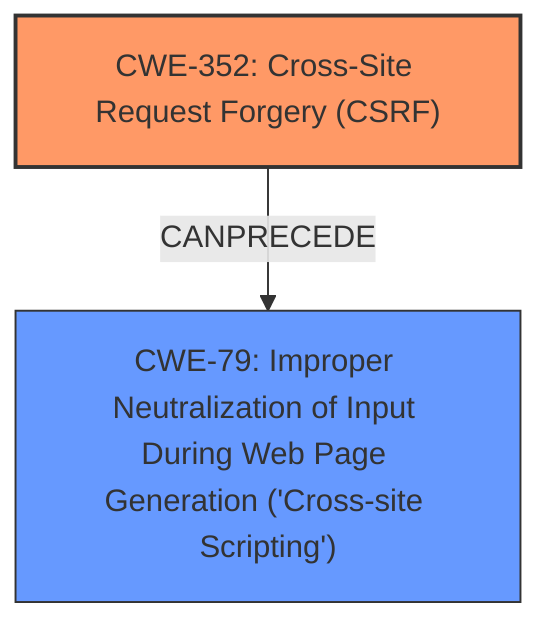

# Raw Analyzer Response for CVE-2025-31922

# Summary
| CWE ID | CWE Name | Confidence | CWE Abstraction Level | CWE Vulnerability Mapping Label | CWE-Vulnerability Mapping Notes |
|---|---|---|---|---|---|
| CWE-352 | Cross-Site Request Forgery (CSRF) | 0.9 | Compound | Primary | Allowed |
| CWE-79 | Improper Neutralization of Input During Web Page Generation ('Cross-site Scripting') | 0.9 | Base | Secondary | Allowed |

## Evidence and Confidence

*   **Confidence Score:** 0.9
*   **Evidence Strength:** HIGH

## Relationship Analysis
The primary weakness is Cross-Site Request Forgery (CSRF), which allows an attacker to induce a user to perform actions they did not intend. In this specific case, the CSRF vulnerability leads to Stored XSS. CWE-352 is a compound weakness that can lead to other vulnerabilities, such as CWE-79. CWE-79 is a base weakness related to improper neutralization of input during web page generation, resulting in Cross-site Scripting. There is a clear chain relationship where a successful CSRF attack allows the attacker to inject malicious scripts that are then executed in the user's browser due to the lack of proper input sanitization (XSS).

## Vulnerability Chain
The vulnerability chain starts with the **Cross-Site Request Forgery (CSRF)** vulnerability (CWE-352).
1.  The attacker exploits the CSRF vulnerability to force a user to perform unwanted actions.
2.  This leads to the injection of malicious input due to **Improper Neutralization of Input During Web Page Generation ('Cross-site Scripting')** (CWE-79), resulting in Stored XSS.

CWE-352 is the root cause, and CWE-79 is the subsequent weakness that allows for the exploitation of XSS.

## Summary of Analysis
The analysis indicates a Cross-Site Request Forgery (CSRF) vulnerability that allows for Stored XSS. The primary CWE is CWE-352, as it represents the **rootcause** of the vulnerability, where a malicious actor can force higher privileged users to execute unwanted actions under their current authentication. The secondary CWE is CWE-79, as the CSRF vulnerability leads to Stored XSS because of the **lack of proper input sanitization**.

The evidence from the CVE description includes:
-   "Cross-Site Request Forgery (CSRF) vulnerability in QuanticaLabs CSS3 Accordions for WordPress allows Stored **XSS**."
-   "The WordPress CSS3 Accordions for WordPress Plugin versions <= 3.0 are vulnerable to Cross Site Request Forgery (CSRF)."

The retriever results and graph relationships support this mapping, with CWE-352 and CWE-79 being highly relevant. The abstraction levels are appropriate (Compound for CWE-352 and Base for CWE-79).

Other CWEs Considered:

*   CWE-89: Improper Neutralization of Special Elements used in an SQL Command ('SQL Injection') - This was considered because the OWASP Top 10 listed A3: Injection, however, the vulnerability specifically states "Cross-Site Request Forgery (CSRF) vulnerability in QuanticaLabs CSS3 Accordions for WordPress allows Stored **XSS**." so this is not an SQL Injection vulnerability.
*   CWE-425: Direct Request ('Forced Browsing') - While related to authorization, it doesn't directly represent the CSRF aspect.
*   CWE-601: URL Redirection to Untrusted Site ('Open Redirect') - Not relevant as the vulnerability involves CSRF and XSS, not redirection.