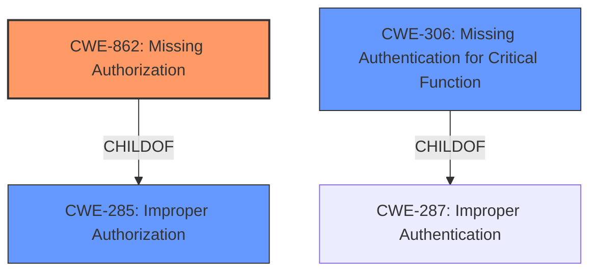

# Analysis Report for CVE-2025-3199

# Vulnerability Analysis Report: CVE-2025-3199

## Description

A vulnerability was found in ageerle ruoyi-ai up to 2.0.1 and classified as critical. Affected by this issue is some unknown functionality of the file ruoyi-modules/ruoyi-system/src/main/java/org/ruoyi/system/controller/system/SysModelController.java of the component API Interface. The manipulation leads to **improper authorization**. The attack may be launched remotely. The exploit has been disclosed to the public and may be used. Upgrading to version 2.0.2 is able to address this issue. The name of the patch is c0daf641fb25b244591b7a6c3affa35c69d321fe. It is recommended to upgrade the affected component.

## Vulnerability Description Key Phrases

- **Rootcause:** improper authorization
- **Product:** ageerle ruoyi-ai
- **Version:** up to 2.0.1
- **Component:** ruoyi-modules/ruoyi-system/src/main/java/org/ruoyi/system/controller/system/SysModelController.java

## Analysis (with Relationship Data)

# Summary
| CWE ID | CWE Name | Confidence | CWE Abstraction Level | CWE Vulnerability Mapping Label | CWE-Vulnerability Mapping Notes |
|---|---|---|---|---|---|
| CWE-862 | Missing Authorization | 0.9 | Base | Primary | Allowed |
| CWE-285 | Improper Authorization | 0.7 | Class | Secondary | Discouraged |
| CWE-306 | Missing Authentication for Critical Function | 0.6 | Base | Secondary | Allowed |

## Evidence and Confidence

*   **Confidence Score:** 0.9
*   **Evidence Strength:** HIGH

## Relationship Analysis
The primary CWE is CWE-862, which is a Base level CWE, while CWE-285 is a Class level CWE that represents a more general category of authorization issues. CWE-306 is also considered because the description mentions that the API interfaces can be accessed without authentication which is related to authorization bypass. CWE-862 is a more specific child of CWE-285 and a sibling to CWE-863 Incorrect Authorization. These relationships helped in refining the selection towards the most accurate representation of the vulnerability.



## Vulnerability Chain
The vulnerability chain starts with the **missing authorization** check on the API interfaces, which leads to unauthorized access to sensitive functionalities such as adding, deleting, modifying, and querying large model configurations. The final impact is that attackers can compromise the confidentiality, integrity, and availability of the system.
  - **Root Cause:** **Missing authorization** check.
  - **Weakness:** Unauthorized access to sensitive API interfaces.
  - **Impact:** Compromised confidentiality, integrity, and availability.

## Summary of Analysis
The initial analysis identified **improper authorization** as the root cause. After reviewing the details from the CVE reference link, the vulnerability is more specifically about the **missing authorization** checks for the SysModelController component. The reference link content confirms that the API interfaces lack proper access control, allowing unauthorized access to sensitive functionalities. The selection of CWE-862 is based on the fact that the application doesn't check whether the user is authorized at all.
The decision to select CWE-862 is based on the evidence from the CVE reference links content summary: "The SysModelController component in the ruoyi-ai project lacks proper access control, allowing unauthorized access to sensitive API interfaces...the APIs for adding, deleting, modifying, and querying large model configurations can be accessed without authentication." This clearly indicates a **missing authorization** check, making CWE-862 the most appropriate choice.

Relevant CWE Information:

# Enhanced Context (25 CWEs)
The following CWEs were identified as potentially relevant to this vulnerability:

## CWE-284: Improper Access Control
**Abstraction Level**: Pillar
**Similarity Score**: 0.800

**Description**: The product does not adequately control access to resources or privileges, which allows an attacker to violate integrity, confidentiality, or availability.

**Mapping Guidance**:
- Usage: Discouraged
- Rationale: This CWE entry is very high-level and should only be used when a more specific CWE entry cannot be identified.

## CWE-79: Improper Neutralization of Input During Web Page Generation ('Cross-site Scripting')
**Abstraction Level**: Base
**Similarity Score**: 0.669

**Description**: The product does not neutralize or incorrectly neutralizes input before it is placed in output that is used as a web page that is served to other users.

**Mapping Guidance**:
- Usage: Allowed
- Rationale: This CWE entry is at the Base level of abstraction, which is a preferred level of abstraction for mapping to the root causes of vulnerabilities.

## CWE-89: Improper Neutralization of Special Elements used in an SQL Command ('SQL Injection')
**Abstraction Level**: Base
**Similarity Score**: 0.624

**Description**: The product constructs all or part of an SQL command using externally-influenced input from an upstream component, but it does not neutralize or incorrectly neutralizes special elements that could modify the intended SQL command when it is sent to a downstream component.

**Mapping Guidance**:
- Usage: Allowed
- Rationale: This CWE entry is at the Base level of abstraction, which is a preferred level of abstraction for mapping to the root causes of vulnerabilities.

## CWE-705: Incorrect Control Flow Scoping
**Abstraction Level**: Class
**Similarity Score**: 0.568

**Description**: The application defines a control flow scope that is either too broad or too narrow, which could expose resources or functionality to unintended actors.

**Mapping Guidance**:
- Usage: Allowed-with-Review
- Rationale: This CWE entry is a Class and might have Base-level children that would be more appropriate

## CWE-1336: Improper Neutralization of Special Elements Used in a Template Engine
**Abstraction Level**: Base
**Similarity Score**: 0.563

**Description**: The product constructs all or part of a template using externally-influenced input from an upstream component, but it does not neutralize or incorrectly neutralizes special elements that could modify the intended template when it is sent to a downstream component.

**Mapping Guidance**:
- Usage: Allowed
- Rationale: This CWE entry is at the Base level of abstraction, which is a preferred level of abstraction for mapping to the root causes of vulnerabilities.

## CWE-334: Small Space of Random Values
**Abstraction Level**: Base
**Similarity Score**: 0.559

**Description**: The application uses a pseudorandom number generator (PRNG) that can only produce a small number of possible values. This can reduce the effectiveness of the generated value, especially if it is used for security purposes.

**Mapping Guidance**:
- Usage: Allowed
- Rationale: This CWE entry is at the Base level of abstraction, which is a preferred level of abstraction for mapping to the root causes of vulnerabilities.

## CWE-285: Improper Authorization
**Abstraction Level**: Class
**Similarity Score**: 0.552

**Description**: The product does not perform or incorrectly performs an authorization check when an actor attempts to access a resource or perform an action.

**Mapping Guidance**:
- Usage: Discouraged
- Rationale: CWE-285 is high-level and lower-level CWEs can frequently be used instead. It is a level-1 Class (i.e., a child of a Pillar).

## CWE-306: Missing Authentication for Critical Function
**Abstraction Level**: Base
**Similarity Score**: 0.549

**Description**: The product does not perform any authentication for functionality that requires a provable user identity or consumes a significant amount of resources.

**Mapping Guidance**:
- Usage: Allowed
- Rationale: This CWE entry is at the Base level of abstraction, which is a preferred level of abstraction for mapping to the root causes of vulnerabilities.

## CWE-269: Improper Privilege Management
**Abstraction Level**: Class
**Similarity Score**: 0.583

**Description**: The software does not properly manage privileges, possibly including privilege assignment, privilege revocation, or checking whether the caller has sufficient privileges.

**Mapping Guidance**:
- Usage: Discouraged
- Rationale: This CWE entry is a level-1 Class (i.e., a child of a Pillar). It might have lower-level children that would be more appropriate

## CWE-78: Improper Neutralization of Special Elements used in an OS Command ('OS Command Injection')
**Abstraction Level**: base
**Similarity Score**: 0.003

**Description**: The product constructs all or part of an OS command using externally-influenced input from an upstream component, but it does not neutralize or incorrectly neutralizes special elements that could modify the intended OS command when it is sent to a downstream component.

**Mapping Guidance**:
- Usage: Allowed
- Rationale: This CWE entry is at the Base level of abstraction, which is a preferred level of abstraction for mapping to the root causes of vulnerabilities.

CWE-284 Improper Access Control, CWE-79 Improper Neutralization of Input During Web Page Generation ('Cross-site Scripting'), CWE-89 Improper Neutralization of Special Elements used in an SQL Command ('SQL Injection'), CWE-705 Incorrect Control Flow Scoping, CWE-1336 Improper Neutralization of Special Elements Used in a Template Engine, CWE-334 Small Space of Random Values, CWE-285 Improper Authorization, CWE-306 Missing Authentication for Critical Function, CWE-269 Improper Privilege Management, CWE-78 Improper Neutralization of Special Elements used in an OS Command ('OS Command Injection') were considered but not used.
C


## CWE Relationship Analysis

Current CWEs represent these abstraction levels: .


### Vulnerability Chain Analysis

**Chain starting from CWE-863:**
- 863 (Incorrect Authorization) - ROOT


**Chain starting from CWE-89:**
- 89 (Improper Neutralization of Special Elements used in an SQL Command ('SQL Injection')) - ROOT


### CWE Relationship Diagram

```mermaid
graph TD
    classDef primary fill:#f96,stroke:#333,stroke-width:2px
    classDef secondary fill:#69f,stroke:#333
    classDef tertiary fill:#9e9,stroke:#333
```


*Report generated on 2025-07-14 19:13:32*
