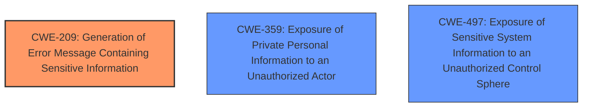

# Enhanced Analysis for CVE-2025-32044

# Summary
| CWE ID | CWE Name | Confidence | CWE Abstraction Level | CWE Vulnerability Mapping Label | CWE-Vulnerability Mapping Notes |
|---|---|---|---|---|---|
| CWE-209 | Generation of Error Message Containing Sensitive Information | 0.9 | Base | Allowed | Primary CWE |
| CWE-359 | Exposure of Private Personal Information to an Unauthorized Actor | 0.7 | Base | Allowed | Secondary Candidate |
| CWE-497 | Exposure of Sensitive System Information to an Unauthorized Control Sphere | 0.6 | Base | Allowed | Secondary Candidate |

## Evidence and Confidence

*   **Confidence Score:** 0.8
*   **Evidence Strength:** HIGH

## Relationship Analysis
The primary CWE identified is CWE-209 [CWE-209: Generation of Error Message Containing Sensitive Information], which is a base-level CWE. It has child CWEs like CWE-210 [CWE-210: Generation of Error Message Containing Full Path Disclosure] and CWE-211 [CWE-211: Exposure of Sensitive Information Through 'Man-in-the-Middle' Attack], which are more specific cases of sensitive information exposure. However, the provided description doesn't specify the exact type of sensitive information or the attack vector beyond the API call revealing a stack trace; thus, the base CWE is appropriate.

CWE-359 [CWE-359: Exposure of Private Personal Information to an Unauthorized Actor] and CWE-497 [CWE-497: Exposure of Sensitive System Information to an Unauthorized Control Sphere] are also at the base level and represent different facets of the information exposure.



## Vulnerability Chain
The vulnerability chain starts with a misconfiguration or default setting in the Moodle application and PHP, leading to the generation of stack traces that include sensitive information. This information is then exposed to unauthenticated users via API calls.

1.  **Root Cause:** Generation of stack traces containing sensitive information due to misconfiguration (zend.exception_ignore_args = 0).
2.  **Weakness:** CWE-209 [CWE-209: Generation of Error Message Containing Sensitive Information]
3.  **Impact:** Exposure of user data (names, contact information, hashed passwords) to unauthorized users.

## Summary of Analysis
The primary classification is CWE-209 [CWE-209: Generation of Error Message Containing Sensitive Information] because the root cause is the generation of error messages (stack traces) containing sensitive information. The vulnerability description and CVE details explicitly mention the retrieval of user data via stack traces returned by API calls, which aligns directly with the CWE description.

CWE-359 [CWE-359: Exposure of Private Personal Information to an Unauthorized Actor] is considered as a secondary CWE because the exposed information includes private personal information. CWE-497 [CWE-497: Exposure of Sensitive System Information to an Unauthorized Control Sphere] is also considered because the stack trace may contain system-level information.

Other CWEs were considered but deemed less relevant. For instance, CWE-306 [CWE-306: Missing Authentication for Critical Function] was considered because unauthenticated users can access the data. However, the primary issue is the exposure of sensitive information in error messages, not the lack of authentication. The API calls themselves might not require authentication by design, but the **sensitive data** should not be included in the response. Therefore, CWE-209 [CWE-209: Generation of Error Message Containing Sensitive Information] more accurately captures the **root cause**.

The selected CWEs are at the optimal level of specificity because they directly address the **root cause** and the nature of the exposed information based on the evidence provided.


## CWE Relationship Analysis

Current CWEs represent these abstraction levels: .


### Vulnerability Chain Analysis

**Chain starting from CWE-359:**
- 359 (Exposure of Private Personal Information to an Unauthorized Actor) - ROOT


**Chain starting from CWE-306:**
- 306 (Missing Authentication for Critical Function) - ROOT


### CWE Relationship Diagram

```mermaid
graph TD
    classDef primary fill:#f96,stroke:#333,stroke-width:2px
    classDef secondary fill:#69f,stroke:#333
    classDef tertiary fill:#9e9,stroke:#333
```