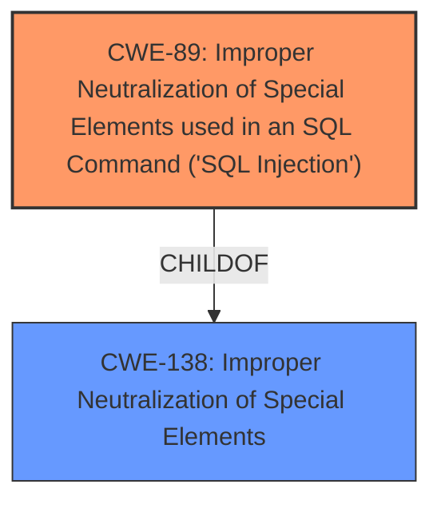

# Raw Analyzer Response for CVE-2025-3206

# Summary
| CWE ID | CWE Name | Confidence | CWE Abstraction Level | CWE Vulnerability Mapping Label | CWE-Vulnerability Mapping Notes |
|---|---|---|---|---|---|
| CWE-89 | Improper Neutralization of Special Elements used in an SQL Command ('SQL Injection') | 1.0 | Base | Allowed | Primary CWE. The application uses user-supplied input in SQL queries without proper sanitization or validation. |

## Evidence and Confidence

*   **Confidence Score:** 1.0
*   **Evidence Strength:** HIGH

## Relationship Analysis
The primary identified weakness is CWE-89, which is a Base level CWE. The retriever results did not indicate other CWEs that were a better fit for this vulnerability. CWE-89 is a child of CWE-138, Improper Neutralization of Special Elements.

## Vulnerability Chain
The vulnerability chain starts with **improper neutralization** of the `doctorspecilization` parameter, leading to **SQL injection**.

## Summary of Analysis
The vulnerability description clearly states that the manipulation of the `doctorspecilization` argument leads to **SQL injection**. The CVE reference links content summary confirms this, stating that the root cause is insufficient user input validation for the "doctorspecilization" parameter. The application directly uses user-supplied input in SQL queries without proper sanitization or validation. The retriever results also strongly suggest CWE-89 as the primary weakness. Therefore, CWE-89 is the most appropriate CWE for this vulnerability. The evidence provided is direct and clear, leading to high confidence in this assessment. The selected CWE is at the optimal level of specificity, as it directly addresses the SQL injection vulnerability.