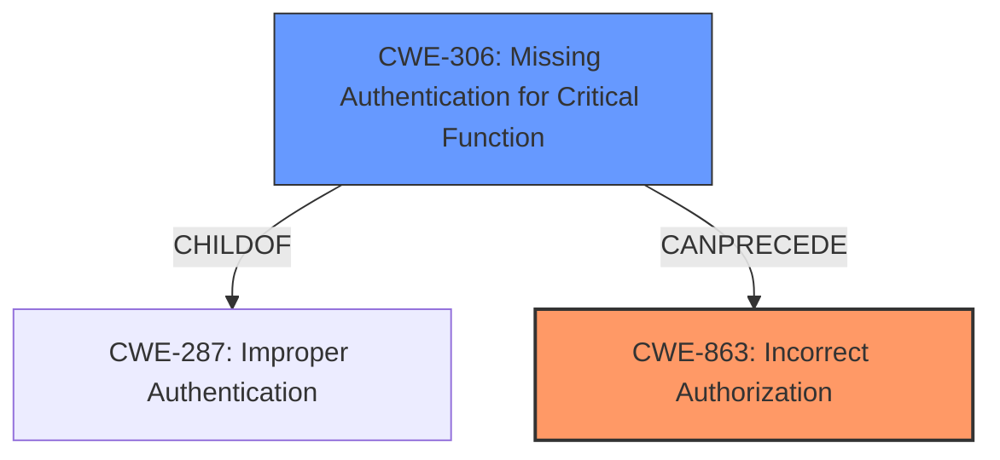

# Enhanced Analysis for CVE-2025-32068

# Summary

| CWE ID | CWE Name | Confidence | CWE Abstraction Level | CWE Vulnerability Mapping Label | CWE-Vulnerability Mapping Notes |
|---|---|---|---|---|---|
| CWE-863 | Incorrect Authorization | 0.9 | Class | Allowed-with-Review | Primary CWE |
| CWE-306 | Missing Authentication for Critical Function | 0.4 | Base | Allowed | Secondary Candidate |

## Evidence and Confidence

*   **Confidence Score:** 0.7
*   **Evidence Strength:** MEDIUM

## Relationship Analysis
The primary CWE is CWE-863, which is a Class-level CWE. While it would be ideal to find a more specific Base or Variant CWE, the provided information does not offer enough detail to pinpoint the exact nature of the **incorrect authorization**. CWE-306 is a child of CWE-287 (Improper Authentication), but the description focuses on **incorrect authorization**, making it less directly relevant. The relationship between authentication and authorization is relevant, as authentication typically precedes authorization.



## Vulnerability Chain
The vulnerability chain starts with an **incorrect authorization** check (CWE-863). Because the authorization check is flawed, it leads to the **impact** of Authentication Bypass. If the vulnerability was a complete **lack of authentication**, then the vulnerability would have started with CWE-306.

## Summary of Analysis
The initial assessment focused on the **incorrect authorization vulnerability**. The provided evidence, particularly the "Vulnerability Description Key Phrases" and "CVE Reference Links Content Summary", supports this assessment. The key phrase "**Incorrect Authorization vulnerability**" directly points to an authorization issue rather than an authentication one. The fact that revoking authorization doesn't invalidate refresh tokens suggests a flaw in how authorization is handled *after* a user is authenticated.

The selection of CWE-863 is based on the evidence indicating a flaw in the authorization logic itself, rather than a complete absence of authorization. The provided information does not go into sufficient detail to allow selection of a more specific, Base-level CWE.

CWE-306 (Missing Authentication for Critical Function) was considered because the impact is authentication bypass. However, the root cause is a flaw in the authorization process, making it a secondary candidate.

The confidence score of 0.7 reflects the evidence strength being "MEDIUM." While the description clearly states "**Incorrect Authorization vulnerability**", the details of the authorization process are not provided, limiting the ability to choose a more specific CWE.

Relevant CWE Information:

# Enhanced Context (25 CWEs)
The following CWEs were identified as potentially relevant to this vulnerability:

## CWE-639: Authorization Bypass Through User-Controlled Key
**Abstraction Level**: Base
**Similarity Score**: 0.75
**Source**: dense

**Description**:
The system's authorization functionality does not prevent one user from gaining access to another user's data or record by modifying the key value identifying the data.

**Mapping Guidance**:
- Usage: Allowed
- Rationale: This CWE entry is at the Base level of abstraction, which is a preferred level of abstraction for mapping to the root causes of vulnerabilities.

## CWE-863: Incorrect Authorization
**Abstraction Level**: Class
**Similarity Score**: 1642.33
**Source**: sparse

**Description**:
The product performs an authorization check when an actor attempts to access a resource or perform an action, but it does not correctly perform the check.

**Mapping Guidance**:
- Usage: Allowed-with-Review
- Rationale: This CWE entry is a Class and might have Base-level children that would be more appropriate

## CWE-306: Missing Authentication for Critical Function
**Abstraction Level**: Base
**Similarity Score**: 1545.73
**Source**: sparse

**Description**:
The product does not perform any authentication for functionality that requires a provable user identity or consumes a significant amount of resources.

**Mapping Guidance**:
- Usage: Allowed
- Rationale: This CWE entry is at the Base level of abstraction, which is a preferred level of abstraction for mapping to the root causes of vulnerabilities.


## CWE Relationship Analysis

Current CWEs represent these abstraction levels: .


### Vulnerability Chain Analysis

**Chain starting from CWE-863:**
- 863 (Incorrect Authorization) - ROOT


**Chain starting from CWE-306:**
- 306 (Missing Authentication for Critical Function) - ROOT


### CWE Relationship Diagram

```mermaid
graph TD
    classDef primary fill:#f96,stroke:#333,stroke-width:2px
    classDef secondary fill:#69f,stroke:#333
    classDef tertiary fill:#9e9,stroke:#333
```