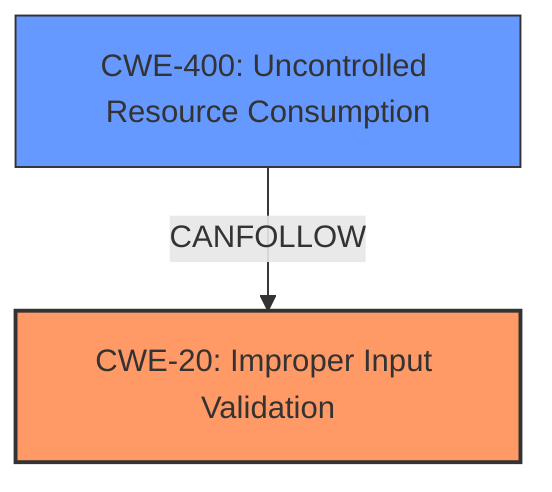

# Analysis Report for CVE-2025-32079

# Vulnerability Analysis Report: CVE-2025-32079

## Description

Improper **Input Validation vulnerability** in The Wikimedia Foundation Mediawiki - GrowthExperiments allows HTTP DoS.This issue affects Mediawiki - GrowthExperiments from 1.39 through 1.43.

## Vulnerability Description Key Phrases

- **Rootcause:** ['Input Validation vulnerability', 'Improper Input Validation']
- **Impact:** HTTP DoS
- **Product:** The Wikimedia Foundation Mediawiki
- **Version:** GrowthExperiments from 1.39 through 1.43
- **Component:** Mediawiki - GrowthExperiments

## Analysis (with Relationship Data)

# Summary
| CWE ID  | CWE Name                                                                 | Confidence | CWE Abstraction Level | CWE Vulnerability Mapping Label | CWE-Vulnerability Mapping Notes |
| :-------- | :----------------------------------------------------------------------- | :--------- | :---------------------- | :------------------------------ | :------------------------------ |
| CWE-20  | Improper Input Validation                                                | 0.9        | Class                   | Primary                         | Discouraged                     |
| CWE-400 | Uncontrolled Resource Consumption                                        | 0.7        | Class                   | Secondary                       | Allowed                         |

## Evidence and Confidence

*   **Confidence Score:** 0.8
*   **Evidence Strength:** MEDIUM

## Relationship Analysis
The primary relationship is that CWE-20 [CWE-20: Improper Input Validation] is a broad class that encompasses various types of input validation errors. The vulnerability description indicates an **improper input validation** issue leading to a HTTP DoS. While the description is general, the resulting HTTP DoS suggests that the **improper input validation** leads to resource consumption. CWE-400 [CWE-400: Uncontrolled Resource Consumption] is related to CWE-20 [CWE-20: Improper Input Validation] as a possible consequence of **improper input validation**, particularly when the input is related to resource allocation or processing.



## Vulnerability Chain
The vulnerability chain starts with **improper input validation** (CWE-20 [CWE-20: Improper Input Validation]). This **lack of validation** then leads to an HTTP DoS, which can be categorized as uncontrolled resource consumption (CWE-400 [CWE-400: Uncontrolled Resource Consumption]). The chain is: CWE-20 [CWE-20: Improper Input Validation] -> CWE-400 [CWE-400: Uncontrolled Resource Consumption].

## Summary of Analysis
The initial analysis focused on the **improper input validation** aspect which is the **root cause** of the vulnerability. The evidence indicates a general **lack of input validation**, which makes CWE-20 [CWE-20: Improper Input Validation] the most suitable primary classification. The resulting HTTP DoS suggests that the **improper input validation** leads to resource consumption, making CWE-400 [CWE-400: Uncontrolled Resource Consumption] a relevant secondary classification.

CWE-20 [CWE-20: Improper Input Validation] is selected as the primary CWE because the vulnerability description explicitly mentions **improper input validation** as the root cause. CWE-400 [CWE-400: Uncontrolled Resource Consumption] is included because the impact of the vulnerability is an HTTP DoS, which implies uncontrolled resource consumption.

Although CWE-20 [CWE-20: Improper Input Validation] is discouraged, there isn't enough information to specify a more precise Base or Variant level CWE for the **improper input validation**.
The selection of CWE-20 [CWE-20: Improper Input Validation] and CWE-400 [CWE-400: Uncontrolled Resource Consumption] offers an appropriate level of specificity based on the evidence available.

Relevant CWE Information:
# Enhanced Context (25 CWEs)
The following CWEs were identified as potentially relevant to this vulnerability:

## CWE-472: External Control of Assumed-Immutable Web Parameter
**Abstraction Level**: Base
**Similarity Score**: 0.75
**Source**: dense

**Description**:
The web application does not sufficiently verify inputs that are assumed to be immutable but are actually externally controllable, such as hidden form fields.

**Mapping Guidance**:
- Usage: Allowed
- Rationale: This CWE entry is at the Base level of abstraction, which is a preferred level of abstraction for mapping to the root causes of vulnerabilities.

*NOT USED:* There is no information about the input being related to assumed immutable web parameters.

## CWE-668: Exposure of Resource to Wrong Sphere
**Abstraction Level**: Class
**Similarity Score**: 0.74
**Source**: dense

**Description**:
The product exposes a resource to the wrong control sphere, providing unintended actors with inappropriate access to the resource.

**Mapping Guidance**:
- Usage: Discouraged
- Rationale: CWE-668 is high-level and is often misused as a catch-all when lower-level CWE IDs might be applicable. It is sometimes used for low-information vulnerability reports [REF-1287]. It is a level-1 Class (i.e., a child of a Pillar). It is not useful for trend analysis.

*NOT USED:* This is too high level and there is no indication of a resource being exposed to the wrong sphere.

## CWE-807: Reliance on Untrusted Inputs in a Security Decision
**Abstraction Level**: Base
**Similarity Score**: 0.74
**Source**: dense

**Description**:
The product uses a protection mechanism that relies on the existence or values of an input, but the input can be modified by an untrusted actor in a way that bypasses the protection mechanism.

**Mapping Guidance**:
- Usage: Allowed
- Rationale: This CWE entry is at the Base level of abstraction, which is a preferred level of abstraction for mapping to the root causes of vulnerabilities.

*NOT USED:* There is no information about security decisions being made based on untrusted inputs.

## CWE-212: Improper Removal of Sensitive Information Before Storage or Transfer
**Abstraction Level**: Base
**Similarity Score**: 0.74
**Source**: dense

**Description**:
The product stores, transfers, or shares a resource that contains sensitive information, but it does not properly remove that information before the product makes the resource available to unauthorized actors.

**Mapping Guidance**:
- Usage: Allowed
- Rationale: This CWE entry is at the Base level of abstraction, which is a preferred level of abstraction for mapping to the root causes of vulnerabilities.

*NOT USED:* There is no indication of sensitive information being stored or transferred.

## CWE-138: Improper Neutralization of Special Elements
**Abstraction Level**: Class
**Similarity Score**: 0.74
**Source**: dense

**Description**:
The product receives input from an upstream component, but it does not neutralize or incorrectly neutralizes special elements that could be interpreted as control elements or syntactic markers when they are sent to a downstream component.

**Mapping Guidance**:
- Usage: Discouraged
- Rationale: This CWE entry is a level-1 Class (i.e., a child of a Pillar). It might have lower-level children that would be more appropriate

*NOT USED:* There is no specific information about special elements being improperly neutralized.

## CWE-184: Incomplete List of Disallowed Inputs
**Abstraction Level**: Base
**Similarity Score**: 0.73
**Source**: dense

**Description**:
The product implements a protection mechanism that relies on a list of inputs (or properties of inputs) that are not allowed by policy or otherwise require other action to neutralize before additional processing takes place, but the list is incomplete.

**Mapping Guidance**:
- Usage: Allowed
- Rationale: This CWE entry is at the Base level of abstraction, which is a preferred level of abstraction for mapping to the root causes of vulnerabilities.

*NOT USED:* There is no specific information about an incomplete list of disallowed inputs.

## CWE-538: Insertion of Sensitive Information into Externally-Accessible File or Directory
**Abstraction Level**: Base
**Similarity Score**: 0.73
**Source**: dense

**Description**:
The product places sensitive information into files or directories that are accessible to actors who are allowed to have access to the files, but not to the sensitive information.

**Mapping Guidance**:
- Usage: Allowed
- Rationale: This CWE entry is at the Base level of abstraction, which is a preferred level of abstraction for mapping to the root causes of vulnerabilities.

*NOT USED:* There is no indication of sensitive information being inserted into files or directories.

## CWE-116: Improper Encoding or Escaping of Output
**Abstraction Level**: Class
**Similarity Score**: 0.73
**Source**: dense

**Description**:
The product prepares a structured message for communication with another component, but encoding or escaping of the data is either missing or done incorrectly. As a result, the intended structure of the message is not preserved.

**Mapping Guidance**:
- Usage: Allowed-with-Review
- Rationale: This CWE entry is a Class and might have Base-level children that would be more appropriate

*NOT USED:* The vulnerability does not specifically mention improper encoding or escaping of output.

## CWE-425: Direct Request ('Forced Browsing')
**Abstraction Level**: Base
**Similarity Score**: 0.73
**Source**: dense

**Description**:
The web application does not adequately enforce appropriate authorization on all restricted URLs, scripts, or files.

**Mapping Guidance**:
- Usage


## CWE Relationship Analysis

Current CWEs represent these abstraction levels: .


### Vulnerability Chain Analysis

**Chain starting from CWE-400:**
- 400 (Uncontrolled Resource Consumption) - ROOT


**Chain starting from CWE-116:**
- 116 (Improper Encoding or Escaping of Output) - ROOT


### CWE Relationship Diagram

```mermaid
graph TD
    classDef primary fill:#f96,stroke:#333,stroke-width:2px
    classDef secondary fill:#69f,stroke:#333
    classDef tertiary fill:#9e9,stroke:#333
```


*Report generated on 2025-07-14 19:21:40*
