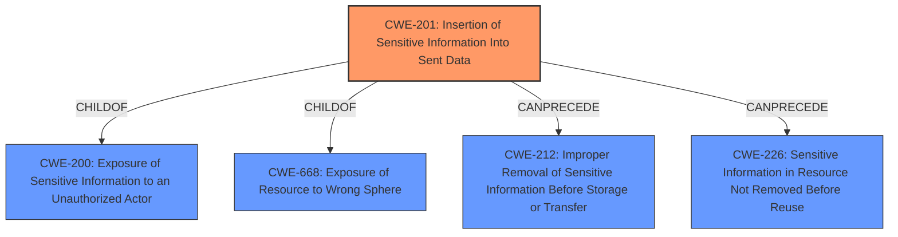

# Analysis for CVE-2025-32080

# Summary
| CWE ID | CWE Name | Confidence | CWE Abstraction Level | CWE Vulnerability Mapping Label | CWE-Vulnerability Mapping Notes |
|---|---|---|---|---|---|
| CWE-201 | Insertion of Sensitive Information Into Sent Data | 0.9 | Base | Allowed | Primary CWE. The vulnerability allows the leakage of user data (e.g., IP address, current page) to external resources by sending sensitive information. |
| CWE-668 | Exposure of Resource to Wrong Sphere | 0.6 | Class | Discouraged | Secondary Candidate. The vulnerability exposes user information to external resources, which can be seen as exposing a resource to the wrong sphere. However, CWE-201 is a more precise match. |
| CWE-359 | Exposure of Private Personal Information to an Unauthorized Actor | 0.6 | Base | Allowed | Secondary Candidate. The vulnerability leads to the exposure of private personal information (IP address, current page) to unauthorized actors. However, CWE-201 focuses on the mechanism of sending sensitive data, making it a better fit. |

## Evidence and Confidence

*   **Confidence Score:** 0.9
*   **Evidence Strength:** HIGH

## Relationship Analysis
The primary CWE, CWE-201, is related to other CWEs through various relationships:
  - It is a Base level CWE, providing a good level of specificity.
  - CWE-201 can precede CWE-226 (Sensitive Information in Resource Not Removed Before Reuse) and CWE-212 (Improper Removal of Sensitive Information Before Storage or Transfer), suggesting that sensitive information can be sent and then improperly handled.
  - It can also be related to CWE-202 (Exposure of Sensitive Information Through Data Element) and CWE-209 (Generation of Error Message Containing Sensitive Information), representing alternative ways sensitive information can be exposed.
  - It is a child of CWE-668 (Exposure of Resource to Wrong Sphere) and CWE-200 (Exposure of Sensitive Information to an Unauthorized Actor), but the parent CWEs are too high-level.

## Vulnerability Chain
The vulnerability chain starts with the **insufficient sanitization** of user-provided data in lazy-loaded images, which leads to the **insertion of sensitive information (IP address, current page) into GET requests (CWE-201)**. The final impact is the **exposure of sensitive information to external resources**, potentially violating user privacy.

## Summary of Analysis
The analysis is based on the provided vulnerability description and CVE reference links. The root cause is the **insufficient sanitization** of user-provided data, allowing the injection of malicious `span` tags with crafted `data-src` attributes. This leads to the **transmission of sensitive information (IP address, current page) to attacker-controlled resources (CWE-201)**.

The retriever results and relationship analysis support the selection of CWE-201 as the primary CWE. While CWE-200, CWE-668, and CWE-359 were considered, they are either too high-level or do not fully capture the mechanism of the vulnerability. CWE-201 accurately represents the weakness of inserting sensitive data into sent data. The evidence from the CVE reference link content summary is: "The vulnerability stems from the ability of users to construct `span` tags with the class `lazy-image-placeholder` and `data-src` attributes...allowing bypassing sanitization and making arbitrary GET requests, potentially leaking user information (like IP addresses or the current page)."

The selection of CWE-201 is at the optimal level of specificity, as it directly addresses the core issue of inserting sensitive information into sent data. Other CWEs, such as CWE-200 and CWE-668, are more general and represent the impact of the vulnerability rather than the root cause.

Other CWEs considered but not used:
- CWE-200: Exposure of Sensitive Information to an Unauthorized Actor - While the ultimate impact is exposure, this CWE is too high-level and doesn't describe the mechanism.
- CWE-668: Exposure of Resource to Wrong Sphere - This is also too high-level and doesn't describe the specific weakness.
- CWE-359: Exposure of Private Personal Information to an Unauthorized Actor - Similar to CWE-200, this describes the impact, but not the root cause.
- CWE-532: Insertion of Sensitive Information into Log File - This is specific to log files, which is not the case here.
- CWE-434: Unrestricted Upload of File with Dangerous Type - This is not related to file uploads.
- CWE-73: External Control of File Name or Path - This is not related to file paths.