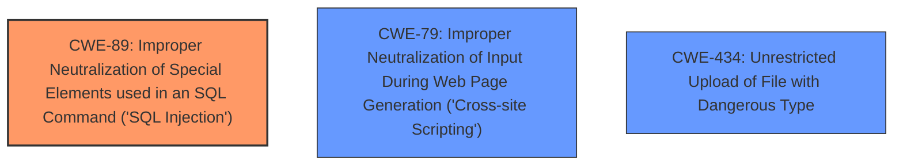

# Raw Analyzer Response for CVE-2025-3220

# Summary
| CWE ID | CWE Name | Confidence | CWE Abstraction Level | CWE Vulnerability Mapping Label | CWE-Vulnerability Mapping Notes |
|---|---|---|---|---|---|
| CWE-89 | Improper Neutralization of Special Elements used in an SQL Command ('SQL Injection') | 1.0 | Base | Allowed | Primary CWE |
| CWE-79 | Improper Neutralization of Input During Web Page Generation ('Cross-site Scripting') | 0.3 | Base | Allowed | Secondary Candidate |
| CWE-434 | Unrestricted Upload of File with Dangerous Type | 0.1 | Base | Allowed | Secondary Candidate |

## Evidence and Confidence

*   **Confidence Score:** 0.9
*   **Evidence Strength:** HIGH

## Relationship Analysis
The primary relationship that impacts the decision is the direct identification of **SQL Injection** as the root cause. Other relationships, such as those for XSS or file upload, are considered but ultimately deemed less relevant due to the explicit nature of the injection vulnerability. The abstraction level is maintained at the Base level (CWE-89) to represent the specific flaw rather than a broader category.

## Vulnerability Chain
The vulnerability chain starts with **improper** input validation, leading to **SQL Injection**, which then results in unauthorized database access and data manipulation. The primary CWE is the **SQL Injection** itself, as it is the direct result of the **lack** of proper input sanitization.

## Summary of Analysis
The analysis is strongly based on the provided evidence, specifically the key phrase "**sql injection**" and the "CVE Reference Links Content Summary" section which explicitly states a SQL injection vulnerability exists due to **insufficient** user input validation.

The graph relationships influenced the decision by highlighting potential related CWEs such as XSS and unrestricted file upload, but these were ultimately discarded as the primary issue is clearly SQL injection.

CWE-89 is selected as it accurately represents the vulnerability and is at the appropriate level of specificity (Base). The selection is also supported by the retriever results which gives CWE-89 the highest score.

Relevant CWE Information:

# Enhanced Context (25 CWEs)
The following CWEs were identified as potentially relevant to this vulnerability:

## CWE-89: Improper Neutralization of Special Elements used in an SQL Command ('SQL Injection')
**Abstraction Level**: Base
**Similarity Score**: 0.79
**Source**: dense

**Description**:
The product constructs all or part of an SQL command using externally-influenced input from an upstream component, but it does not neutralize or incorrectly neutralizes special elements that could modify the intended SQL command when it is sent to a downstream component. Without sufficient removal or quoting of SQL syntax in user-controllable inputs, the generated SQL query can cause those inputs to be interpreted as SQL instead of ordinary user data.

**Mapping Guidance**:
- Usage: Allowed
- Rationale: This CWE entry is at the Base level of abstraction, which is a preferred level of abstraction for mapping to the root causes of vulnerabilities.

**Technical Explanation**: The vulnerability description explicitly states that the manipulation of the 'Category' argument leads to **SQL Injection** in the `/dashboard.php` file. The "CVE Reference Links Content Summary" confirms that the **root cause** is the **lack** of appropriate cleaning or validation of the 'category' parameter before its use in SQL queries. This aligns directly with the CWE-89 description.
**Security Implications**: Successful exploitation could lead to unauthorized database access, sensitive data leakage, data tampering, and even system compromise.
**Relationship**: CWE-89 is a base-level CWE, providing a specific description of the **SQL Injection** vulnerability.
**Primary/Secondary**: Primary CWE due to direct evidence of **SQL Injection**.
**MITRE Mapping Guidance**: The mapping guidance for CWE-89 allows its use, and it is at the preferred Base level of abstraction.

## CWE-79: Improper Neutralization of Input During Web Page Generation ('Cross-site Scripting')
**Abstraction Level**: Base
**Similarity Score**: 0.75
**Source**: dense

**Description**:
The product does not neutralize or incorrectly neutralizes user-controllable input before it is placed in output that is used as a web page that is served to other users.

**Mapping Guidance**:
- Usage: Allowed
- Rationale: This CWE entry is at the Base level of abstraction, which is a preferred level of abstraction for mapping to the root causes of vulnerabilities.

**Technical Explanation**: While **SQL Injection** is explicitly mentioned, there is no direct evidence of XSS. However, **improper** input neutralization could potentially lead to XSS if the injected data is reflected in web pages.
**Security Implications**: If XSS is possible, it could lead to arbitrary script execution in the victim's browser.
**Relationship**: CWE-79 is a base-level CWE.
**Primary/Secondary**: Secondary candidate due to potential but unconfirmed XSS risk.
**MITRE Mapping Guidance**: The mapping guidance for CWE-79 allows its use.

## CWE-434: Unrestricted Upload of File with Dangerous Type
**Abstraction Level**: Base
**Similarity Score**: 0.79
**Source**: dense

**Description**:
The product allows the upload or transfer of dangerous file types that are automatically processed within its environment.

**Mapping Guidance**:
- Usage: Allowed
- Rationale: This CWE entry is at the Base level of abstraction, which is a preferred level of abstraction for mapping to the root causes of vulnerabilities.

**Technical Explanation**: There is no evidence to suggest that this vulnerability involves unrestricted file uploads.
**Security Implications**: N/A
**Relationship**: CWE-434 is a base-level CWE.
**Primary/Secondary**: Secondary candidate due to no evidence of file upload being present.
**MITRE Mapping Guidance**: The mapping guidance for CWE-434 allows its use. However, it is not applicable based on current evidence.

## CWEs Considered but Not Used:
- CWE-74, CWE-95, CWE-96, CWE-116, CWE-425, CWE-472, CWE-639, CWE-1336, CWE-306, CWE-352, CWE-117, and CWE-73: These CWEs were considered but not used due to a **lack** of direct evidence supporting their relevance to the specific vulnerability. The description focuses primarily on **SQL Injection**, making other CWEs less likely to be applicable. They are related to other types of injection, authentication issues, or file handling, which do not align with the provided information.