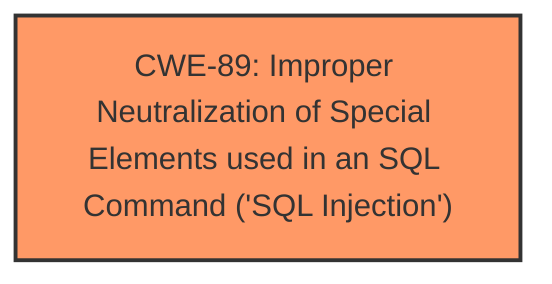

# Enhanced Analysis for CVE-2025-3239

# Summary
| CWE ID | CWE Name | Confidence | CWE Abstraction Level | CWE Vulnerability Mapping Label | CWE-Vulnerability Mapping Notes |
|---|---|---|---|---|---|
| CWE-89 | Improper Neutralization of Special Elements used in an SQL Command ('SQL Injection') | 1.0 | Base | Allowed | Primary CWE: The vulnerability description explicitly states that the manipulation of the argument `editid` leads to **SQL Injection**. |

## Evidence and Confidence

*   **Confidence Score:** 1.0
*   **Evidence Strength:** HIGH

## Relationship Analysis
The primary relationship considered was the parent-child relationship within the CWE structure. Since the vulnerability is explicitly described as **SQL Injection**, CWE-89, which is a Base level CWE, is the most specific and appropriate choice. There are no other relevant relationships to consider in this case.



## Vulnerability Chain
The vulnerability chain is straightforward:

1.  **Root Cause:** **SQL Injection** (**CWE-89**) due to improper neutralization of the `editid` argument.
2.  **Impact:** Remote attacker can manipulate SQL queries.

## Summary of Analysis
The vulnerability description clearly states that the manipulation of the `editid` argument in `/admin/edit-guard-detail.php` leads to **SQL Injection**. This aligns directly with CWE-89, which is defined as "Improper Neutralization of Special Elements used in an SQL Command ('SQL Injection')." The evidence is strong and directly supports this classification. The retriever results also list CWE-89 as the top match with a score of 1.0. The other CWEs were considered but are not applicable because the description explicitly indicates **SQL Injection**.

Relevant CWE Information:

# Enhanced Context (25 CWEs)
The following CWEs were identified as potentially relevant to this vulnerability:

## CWE-89: Improper Neutralization of Special Elements used in an SQL Command ('SQL Injection')
**Abstraction Level**: Base
**Similarity Score**: 0.77
**Source**: dense

**Description**:
The product constructs all or part of an SQL command using externally-influenced input from an upstream component, but it does not neutralize or incorrectly neutralizes special elements that could modify the intended SQL command when it is sent to a downstream component. Without sufficient removal or quoting of SQL syntax in user-controllable inputs, the generated SQL query can cause those inputs to be interpreted as SQL instead of ordinary user data.

**Mapping Guidance**:
- Usage: Allowed
- Rationale: This CWE entry is at the Base level of abstraction, which is a preferred level of abstraction for mapping to the root causes of vulnerabilities.


## CWE Relationship Analysis

Current CWEs represent these abstraction levels: .


### Vulnerability Chain Analysis

**Chain starting from CWE-89:**
- 89 (Improper Neutralization of Special Elements used in an SQL Command ('SQL Injection')) - ROOT


### CWE Relationship Diagram

```mermaid
graph TD
    classDef primary fill:#f96,stroke:#333,stroke-width:2px
    classDef secondary fill:#69f,stroke:#333
    classDef tertiary fill:#9e9,stroke:#333
```