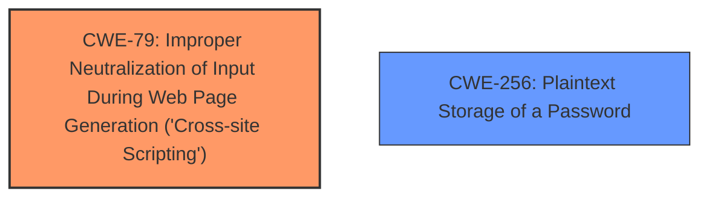

# Analysis for CVE-2025-32390

# Summary
| CWE ID | CWE Name | Confidence | CWE Abstraction Level | CWE Vulnerability Mapping Label | CWE-Vulnerability Mapping Notes |
|---|---|---|---|---|---|
| CWE-79 | Improper Neutralization of Input During Web Page Generation ('Cross-site Scripting') | 1.0 | Base | Allowed | Primary CWE: The root cause is **overly permissive HTML editing being allowed on the KB articles**, leading to **HTML Injection**. |
| CWE-256 | Plaintext Storage of a Password | 0.7 | Base | Allowed | Secondary Candidate: Credentials are captured in plain text. |

## Evidence and Confidence

*   **Confidence Score:** 0.9
*   **Evidence Strength:** HIGH

## Relationship Analysis
The primary relationship is that CWE-79 is a base level weakness that directly addresses the improper neutralization of input, leading to cross-site scripting. CWE-256 is included because the impact of the **HTML Injection** is the capture of credentials in plain text.

## Vulnerability Chain
The vulnerability chain starts with **overly permissive HTML editing**, which allows for **HTML injection (CWE-79)**. This leads to a crafted login page that captures credentials in plain text **(CWE-256)**.

## Summary of Analysis
The analysis is based on the vulnerability description and the CVE reference links content summary, both of which point to **HTML Injection** as the main weakness. The root cause is **overly permissive HTML editing**. The most relevant CWE is CWE-79, which directly addresses this weakness. Credentials being captured in plain text is a consequence of the injection and is classified as CWE-256.

The evidence for CWE-79 is:
*   "**overly permissive HTML editing being allowed on the KB articles**"
*   "**HTML Injection** in Knowledge Base (KB) articles leads to complete page defacement imitating the login page."
*   "Authenticated users with the read knowledge article privilege can browse to the KB article and if they submit their credentials, they get captured in plain text."

The evidence for CWE-256 is:
*   "...they submit their credentials, they get captured in plain text."

CWE-79 is selected because it is at the base level of abstraction and accurately represents the **HTML Injection** vulnerability. CWE-256 is included because it describes the impact of the vulnerability (credentials captured in plain text).

Other CWEs considered but not used:

*   CWE-74 (Improper Neutralization of Special Elements in Output Used by a Downstream Component ('Injection')): This is a more general injection CWE. Because the specific type of injection is **HTML Injection**, CWE-79 is more specific and appropriate.
*   CWE-863 (Incorrect Authorization), CWE-862 (Missing Authorization), CWE-285 (Improper Authorization): While there is a privilege to read KB articles, the vulnerability is not due to an authorization issue. It is due to **improper neutralization of input**.
*   CWE-1336 (Improper Neutralization of Special Elements Used in a Template Engine): Not directly related to the stated **HTML Injection**
*   CWE-116 (Improper Encoding or Escaping of Output): While encoding/escaping could mitigate XSS, the primary issue is the lack of proper neutralization.
*   CWE-522 (Insufficiently Protected Credentials): This is related to storing credentials, but the primary vulnerability isn't about storage, it's the capture in plain text.
*   CWE-352 (Cross-Site Request Forgery (CSRF)): Not applicable, as the vulnerability is not related to CSRF.
*   CWE-184 (Incomplete List of Disallowed Inputs): The problem is not an incomplete list, but rather that HTML editing is **overly permissive**.