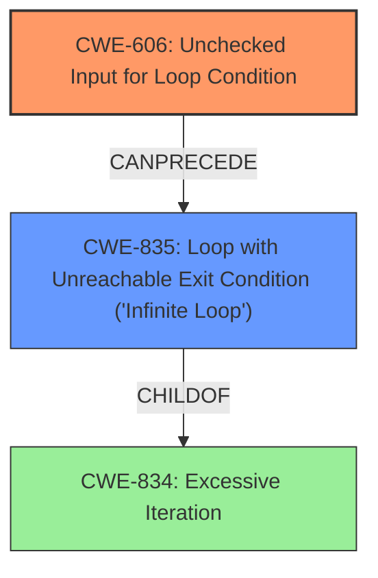

# Analysis Report for CVE-2025-32399

# Vulnerability Analysis Report: CVE-2025-32399

## Description

An **Unchecked Input for Loop Condition** in RT-Labs P-Net version 1.0.1 or earlier allows an attacker to cause IO devices that use the library to enter an infinite loop by sending a malicious RPC packet.

## Vulnerability Description Key Phrases

- **Rootcause:** Unchecked Input for Loop Condition
- **Impact:** cause IO devices that use the library to enter an infinite loop
- **Vector:** malicious RPC packet
- **Attacker:** attacker
- **Product:** RT-Labs P-Net
- **Version:** 1.0.1 or earlier

## Analysis (with Relationship Data)

# Summary
| CWE ID | CWE Name | Confidence | CWE Abstraction Level | CWE Vulnerability Mapping Label | CWE-Vulnerability Mapping Notes |
|---|---|---|---|---|---|
| CWE-606 | Unchecked Input for Loop Condition | 1.0 | Base | Allowed | Primary CWE |
| CWE-835 | Loop with Unreachable Exit Condition ('Infinite Loop') | 0.7 | Base | Allowed | Secondary Candidate |

## Evidence and Confidence

*   **Confidence Score:** 0.9
*   **Evidence Strength:** HIGH

## Relationship Analysis
The primary relationship influencing the decision is that CWE-606 can precede CWE-835. CWE-606 represents the **unchecked input**, which then leads to CWE-835, the **infinite loop**. While CWE-834 (Excessive Iteration) is also relevant, CWE-835 is more specific because the vulnerability leads to a loop that cannot be exited.



## Vulnerability Chain
The vulnerability chain starts with the **Unchecked Input for Loop Condition (CWE-606)**. This leads directly to the creation of a **Loop with Unreachable Exit Condition ('Infinite Loop') (CWE-835)**. The root cause is the missing input validation, and the direct impact is the infinite loop.

CWE-606 (Root Cause) -> CWE-835 (Impact)

## Summary of Analysis
The analysis is strongly based on the provided evidence, specifically: "An **Unchecked Input for Loop Condition** in RT-Labs P-Net version 1.0.1 or earlier allows an attacker to cause IO devices that use the library to enter an infinite loop by sending a malicious RPC packet." The **rootcause** is explicitly stated as "Unchecked Input for Loop Condition," which directly corresponds to CWE-606. The impact, "cause IO devices... to enter an infinite loop," aligns with CWE-835.

The relationship between CWE-606 and CWE-835, as highlighted in the relationship analysis (CANPRECEDE), further strengthens this selection. CWE-606 is the root cause, leading to the effect described by CWE-835.

CWE-606 is selected as the primary CWE because it is the **rootcause** weakness described in the vulnerability. CWE-835 is added as a secondary CWE because it is a direct consequence of CWE-606. Both CWEs are at the Base level of abstraction, which is the preferred level.

Other CWEs Considered:
*   CWE-834: Excessive Iteration - While related to loops, CWE-835 is more specific because it explicitly mentions an unreachable exit condition which is what's happening here.
*   CWE-703 and CWE-755: Improper Handling of Exceptional Conditions - These are too general. The vulnerability is more specific than simply mishandling an exceptional condition.
*   CWE-1284: Improper Validation of Specified Quantity in Input - While input validation is involved, CWE-606 directly addresses the loop condition context of the **unchecked input**.

# Enhanced Context (25 CWEs)
The following CWEs were identified as potentially relevant to this vulnerability:

## CWE-606: Unchecked Input for Loop Condition
**Abstraction Level**: Base
**Similarity Score**: 0.76
**Source**: dense

**Description**:
The product does not properly check inputs that are used for loop conditions, potentially leading to a denial of service or other consequences because of excessive looping.

**Mapping Guidance**:
- Usage: Allowed
- Rationale: This CWE entry is at the Base level of abstraction, which is a preferred level of abstraction for mapping to the root causes of vulnerabilities.


## CWE-835: Loop with Unreachable Exit Condition ('Infinite Loop')
**Abstraction Level**: Base
**Similarity Score**: 0.74
**Source**: dense

**Description**:
The product contains an iteration or loop with an exit condition that cannot be reached, i.e., an infinite loop.

**Mapping Guidance**:
- Usage: Allowed
- Rationale: This CWE entry is at the Base level of abstraction, which is a preferred level of abstraction for mapping to the root causes of vulnerabilities.


## CWE-824: Access of Uninitialized Pointer
**Abstraction Level**: Base
**Similarity Score**: 0.73
**Source**: dense

**Description**:
The product accesses or uses a pointer that has not been initialized.

**Mapping Guidance**:
- Usage: Allowed
- Rationale: This CWE entry is at the Base level of abstraction, which is a preferred level of abstraction for mapping to the root causes of vulnerabilities.


## CWE-703: Improper Check or Handling of Exceptional Conditions
**Abstraction Level**: Pillar
**Similarity Score**: 0.72
**Source**: dense

**Description**:
The product does not properly anticipate or handle exceptional conditions that rarely occur during normal operation of the product.

**Mapping Guidance**:
- Usage: Discouraged
- Rationale: This CWE entry is extremely high-level, a Pillar.


## CWE-755: Improper Handling of Exceptional Conditions
**Abstraction Level**: Class
**Similarity Score**: 0.71
**Source**: dense

**Description**:
The product does not handle or incorrectly handles an exceptional condition.

**Mapping Guidance**:
- Usage: Discouraged
- Rationale: This CWE entry is a level-1 Class (i.e., a child of a Pillar). It might have lower-level children that would be more appropriate


## CWE-191: Integer Underflow (Wrap or Wraparound)
**Abstraction Level**: Base
**Similarity Score**: 0.71
**Source**: dense

**Description**:
The product subtracts one value from another, such that the result is less than the minimum allowable integer value, which produces a value that is not equal to the correct result.

**Mapping Guidance**:
- Usage: Allowed
- Rationale: This CWE entry is at the Base level of abstraction, which is a preferred level of abstraction for mapping to the root causes of vulnerabilities.


## CWE-193: Off-by-one Error
**Abstraction Level**: Base
**Similarity Score**: 0.71
**Source**: dense

**Description**:
A product calculates or uses an incorrect maximum or minimum value that is 1 more, or 1 less, than the correct value.

**Mapping Guidance**:
- Usage: Allowed
- Rationale: This CWE entry is at the Base level of abstraction, which is a preferred level of abstraction for mapping to the root causes of vulnerabilities.


## CWE-754: Improper Check for Unusual or Exceptional Conditions
**Abstraction Level**: Class
**Similarity Score**: 0.70
**Source**: dense

**Description**:
The product does not check or incorrectly checks for unusual or exceptional conditions that are not expected to occur frequently during day to day operation of the product.

**Mapping Guidance**:
- Usage: Allowed-with-Review
- Rationale: This CWE entry is a Class and might have Base-level children that would be more appropriate


## CWE-252: Unchecked Return Value
**Abstraction Level**: Base
**Similarity Score**: 0.70
**Source**: dense

**Description**:
The product does not check the return value from a method or function, which can prevent it from detecting unexpected states and conditions.

**Mapping Guidance**:
- Usage: Allowed
- Rationale: This CWE entry is at the Base level of abstraction, which is a preferred level of abstraction for mapping to the root causes of vulnerabilities.


## CWE-1286: Improper Validation of Syntactic Correctness of Input
**Abstraction Level**: Base
**Similarity Score**: 0.70
**Source**: dense

**Description**:
The product receives input that is expected to be well-formed - i.e., to comply with a certain syntax - but it does not validate or incorrectly validates that the input complies with the syntax.

**Mapping Guidance**:
- Usage: Allowed
- Rationale: This CWE entry is at the Base level of abstraction, which is a preferred level of abstraction for mapping to the root causes of vulnerabilities.


## CWE-835: Loop with Unreachable Exit Condition ('Infinite Loop')
**Abstraction Level**: Base
**Similarity Score**: 791.15
**Source**: sparse

**Description**:
The product contains an iteration or loop with an exit condition that cannot be reached, i.e., an infinite loop.

**Mapping Guidance**:
- Usage: Allowed
- Rationale: This CWE


## CWE Relationship Analysis

Current CWEs represent these abstraction levels: .


### Vulnerability Chain Analysis

**Chain starting from CWE-1284:**
- 1284 (Improper Validation of Specified Quantity in Input) - ROOT


**Chain starting from CWE-834:**
- 834 (Excessive Iteration) - ROOT


### CWE Relationship Diagram

```mermaid
graph TD
    classDef primary fill:#f96,stroke:#333,stroke-width:2px
    classDef secondary fill:#69f,stroke:#333
    classDef tertiary fill:#9e9,stroke:#333
```


*Report generated on 2025-07-14 19:31:52*
