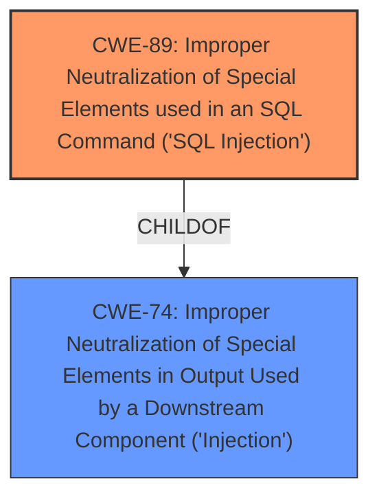

# Raw Analyzer Response for CVE-2025-3240

# Summary
| CWE ID | CWE Name | Confidence | CWE Abstraction Level | CWE Vulnerability Mapping Label | CWE-Vulnerability Mapping Notes |
|---|---|---|---|---|---|
| CWE-89 | Improper Neutralization of Special Elements used in an SQL Command ('SQL Injection') | 1.0 | Base | Allowed | Primary CWE |

## Evidence and Confidence

*   **Confidence Score:** 1.0
*   **Evidence Strength:** HIGH

## Relationship Analysis
The primary relationship identified is that CWE-89 is a base-level CWE that directly addresses the **SQL Injection** vulnerability described. While other CWEs like CWE-74 (Improper Neutralization of Special Elements in Output Used by a Downstream Component ('Injection')) are related as a broader class, CWE-89 provides the most specific and accurate classification. The retriever results and vulnerability description both strongly support this selection.

## Vulnerability Chain
The vulnerability chain starts with the lack of proper input validation on the `searchdata` parameter in `/admin/search.php`. This leads to the direct use of unsanitized input in SQL queries, resulting in **SQL Injection** (CWE-89). The impact includes unauthorized database access, sensitive data leakage, data tampering, system control, and service interruption.

## Summary of Analysis
The analysis indicates a clear case of **SQL Injection** vulnerability (CWE-89) in the PHPGurukul Online Fire Reporting System 1.2. The vulnerability occurs due to the lack of proper input validation of the `searchdata` parameter in the `/admin/search.php` file, allowing attackers to inject malicious SQL code.

The evidence is substantial, including the vulnerability description highlighting **sql injection** as the **weakness**, and the CVE Reference Links Content Summary explicitly stating that a SQL injection vulnerability exists due to insufficient user input validation of the `searchdata` parameter. The provided payloads and attack vector details further reinforce this assessment.

The retriever results also strongly support CWE-89 as the primary CWE, with a score of 1.000. The mapping guidance for CWE-89 allows its use, as it is a base-level CWE suitable for root cause analysis.

Other CWEs considered include CWE-74 (Improper Neutralization of Special Elements in Output Used by a Downstream Component ('Injection')), which is a more general class of injection vulnerabilities. However, since the specific type of injection is **SQL Injection**, CWE-89 is the more appropriate and specific choice.

Relevant CWE Information:

# Enhanced Context (25 CWEs)

## CWE-89: Improper Neutralization of Special Elements used in an SQL Command ('SQL Injection')
**Abstraction Level**: Base
**Similarity Score**: 0.79
**Source**: dense

**Description**:
The product constructs all or part of an SQL command using externally-influenced input from an upstream component, but it does not neutralize or incorrectly neutralizes special elements that could modify the intended SQL command when it is sent to a downstream component. Without sufficient removal or quoting of SQL syntax in user-controllable inputs, the generated SQL query can cause those inputs to be interpreted as SQL instead of ordinary user data.

**Mapping Guidance**:
- Usage: Allowed
- Rationale: This CWE entry is at the Base level of abstraction, which is a preferred level of abstraction for mapping to the root causes of vulnerabilities.

## CWE-89: Improper Neutralization of Special Elements used in an SQL Command ('SQL Injection')
**Abstraction Level**: Base
**Similarity Score**: 1106.07
**Source**: sparse

**Description**:
The product constructs all or part of an SQL command using externally-influenced input from an upstream component, but it does not neutralize or incorrectly neutralizes special elements that could modify the intended SQL command when it is sent to a downstream component. Without sufficient removal or quoting of SQL syntax in user-controllable inputs, the generated SQL query can cause those inputs to be interpreted as SQL instead of ordinary user data.

**Mapping Guidance**:
- Usage: Allowed
- Rationale: This CWE entry is at the Base level of abstraction, which is a preferred level of abstraction for mapping to the root causes of vulnerabilities.