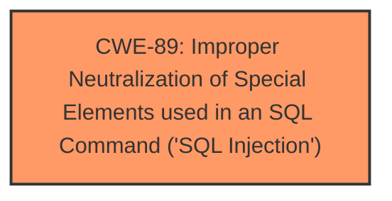

# Raw Analyzer Response for CVE-2025-3242

# Summary
| CWE ID | CWE Name | Confidence | CWE Abstraction Level | CWE Vulnerability Mapping Label | CWE-Vulnerability Mapping Notes |
|---|---|---|---|---|---|
| CWE-89 | Improper Neutralization of Special Elements used in an SQL Command ('SQL Injection') | 1.0 | Base | Primary | Allowed |

## Evidence and Confidence

*   **Confidence Score:** 1.0
*   **Evidence Strength:** HIGH

## Relationship Analysis
The primary relationship that influenced the selection was the direct match of the vulnerability description to **CWE-89** CWE Description. There are no parent-child, chain, or peer relationships that significantly alter the assessment, as the description clearly indicates an **SQL Injection** vulnerability. The Base abstraction level of **CWE-89** is appropriate.

## Vulnerability Chain
The vulnerability chain consists of a single element:
1.  **Root Cause:** **CWE-89** - Improper Neutralization of Special Elements used in an SQL Command ('SQL Injection')

The manipulation of the argument `id/searchdata` leads directly to **SQL Injection** due to the lack of proper neutralization.

## Summary of Analysis
The initial analysis strongly points towards **CWE-89** as the primary weakness. The vulnerability description explicitly states that the manipulation of the argument `id/searchdata` leads to **sql injection**. This aligns directly with the definition of **CWE-89**, which involves constructing SQL commands using externally-influenced input without proper neutralization.

The evidence provided is: "The manipulation of the argument id/searchdata leads to **sql injection**".

The retriever results also list **CWE-89** as the top candidate with a score of 1.0. The abstraction level is Base, which is the preferred level.

The relationship analysis doesn't introduce any conflicting information. The focus remains on the direct presence of **SQL Injection** due to improper neutralization.

Therefore, **CWE-89** is the most appropriate and specific CWE for this vulnerability.

Relevant CWE Information:

# Enhanced Context (25 CWEs)

## CWE-89: Improper Neutralization of Special Elements used in an SQL Command ('SQL Injection')
**Abstraction Level**: Base
**Similarity Score**: 0.76
**Source**: dense

**Description**:
The product constructs all or part of an SQL command using externally-influenced input from an upstream component, but it does not neutralize or incorrectly neutralizes special elements that could modify the intended SQL command when it is sent to a downstream component. Without sufficient removal or quoting of SQL syntax in user-controllable inputs, the generated SQL query can cause those inputs to be interpreted as SQL instead of ordinary user data.

**Mapping Guidance**:
- Usage: Allowed
- Rationale: This CWE entry is at the Base level of abstraction, which is a preferred level of abstraction for mapping to the root causes of vulnerabilities.