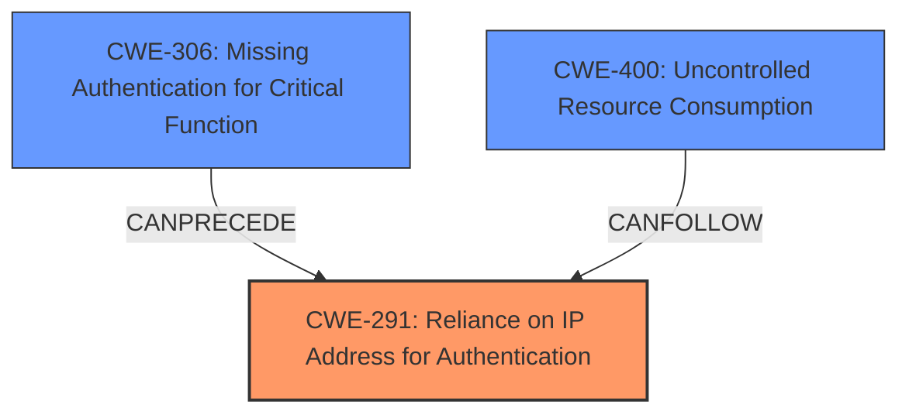

# Analysis Report for CVE-2025-32470

# Vulnerability Analysis Report: CVE-2025-32470

## Description

A remote unauthenticated attacker may be able to change the IP adress of the device, and therefore affecting the availability of the device.

## Vulnerability Description Key Phrases

- **Impact:** affecting the availability, availability
- **Attacker:** remote unauthenticated attacker

## Analysis (with Relationship Data)

# Summary
| CWE ID  | CWE Name                                                                          | Confidence | CWE Abstraction Level | CWE Vulnerability Mapping Label | CWE-Vulnerability Mapping Notes |
| :-------- | :-------------------------------------------------------------------------------- | :--------- | :-------------------- | :------------------------------ | :------------------------------ |
| CWE-291   | Reliance on IP Address for Authentication                                         | 0.75       | Variant               | Primary                         | Allowed                       |
| CWE-306   | Missing Authentication for Critical Function                                      | 0.50       | Base                  | Secondary                       | Allowed                       |
| CWE-400   | Uncontrolled Resource Consumption                                                 | 0.25       | Class                 | Secondary                       | Discouraged                   |

## Evidence and Confidence

*   **Confidence Score:** 0.60
*   **Evidence Strength:** LOW

## Relationship Analysis

The primary relationship that influenced the selection of CWE-291 is its direct relevance to the vulnerability description, indicating a reliance on IP addresses for authentication. This is further supported by its Variant level of abstraction, which provides a specific classification. CWE-306 could be a related weakness, as it addresses the absence of authentication for a critical function, potentially allowing the attacker to change the IP address. CWE-400 is a higher level class that is related to the impact of the vulnerability where the attacker is affecting the availability of the device.



## Vulnerability Chain

The vulnerability chain starts with a **missing authentication** (CWE-306) or a **reliance on IP Address for Authentication** (CWE-291), leading to the ability of an unauthenticated attacker to change the IP address. This ultimately results in an impact on the device's availability, which could be categorized as **uncontrolled resource consumption** (CWE-400), although this is more of an impact than a root cause.

## Summary of Analysis

The analysis is primarily based on the provided vulnerability description, which indicates that an unauthenticated attacker can change the IP address of a device, affecting its availability.

CWE-291 (Reliance on IP Address for Authentication) is selected as the primary CWE because the vulnerability description explicitly mentions the ability to change the IP address and affects the availability of the device. This matches the CWE's description of using an IP address for authentication. The confidence is lower since there is no CVE reference link to validate the rootcause.

CWE-306 (Missing Authentication for Critical Function) is considered as a secondary CWE. The vulnerability description states that the attacker is unauthenticated, which suggests that a critical function (changing the IP address) lacks proper authentication. This could be a prerequisite for CWE-291, but there is insufficient evidence.

CWE-400 (Uncontrolled Resource Consumption) is considered as a secondary CWE because the vulnerability description mentions that the impact is affecting the availability of the device, which aligns with the definition of CWE-400. However, CWE-400 is a general class and is often misused. The connection here is not strong.

Other CWEs were considered but not chosen:

*   CWE-1390 (Weak Authentication), CWE-285 (Improper Authorization), CWE-863 (Incorrect Authorization), CWE-290 (Authentication Bypass by Spoofing), CWE-284 (Improper Access Control), and CWE-119 (Improper Restriction of Operations within the Bounds of a Memory Buffer) were not selected because they did not directly align with the vulnerability description and its root cause.
*   CWE-410 (Insufficient Resource Pool) was not selected as there was no mention of the exhaustion of resources.

Relevant CWE Information:


## CWE Relationship Analysis

Current CWEs represent these abstraction levels: .


### Vulnerability Chain Analysis

**Chain starting from CWE-1390:**
- 1390 (Weak Authentication) - ROOT


**Chain starting from CWE-863:**
- 863 (Incorrect Authorization) - ROOT


### CWE Relationship Diagram

```mermaid
graph TD
    classDef primary fill:#f96,stroke:#333,stroke-width:2px
    classDef secondary fill:#69f,stroke:#333
    classDef tertiary fill:#9e9,stroke:#333
```


*Report generated on 2025-07-14 19:35:20*
