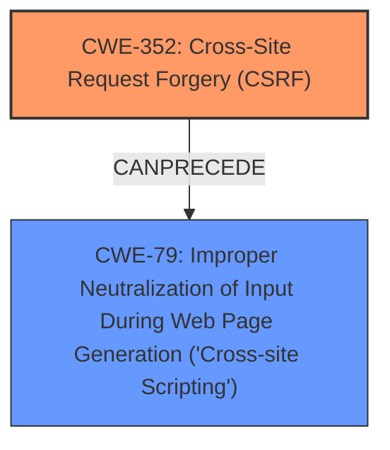

# Analysis Report for CVE-2025-32480

# Vulnerability Analysis Report: CVE-2025-32480

## Description

Cross-Site Request Forgery (CSRF) vulnerability in dalziel Windows Live Writer allows Stored XSS. This issue affects Windows Live Writer from n/a through 0.1.

## Vulnerability Description Key Phrases

- **Rootcause:** improper CSRF protection
- **Weakness:** Cross-Site Scripting, stored XSS
- **Product:** dalziel Windows Live Writer
- **Version:** through 0.1

## Analysis (with Relationship Data)

# Summary
| CWE ID | CWE Name | Confidence | CWE Abstraction Level | CWE Vulnerability Mapping Label | CWE-Vulnerability Mapping Notes |
|---|---|---|---|---|---|
| CWE-352 | Cross-Site Request Forgery (CSRF) | 0.9 | Compound | Primary | Allowed |
| CWE-79 | Improper Neutralization of Input During Web Page Generation ('Cross-site Scripting') | 0.8 | Base | Secondary | Allowed |

## Evidence and Confidence

*   **Confidence Score:** 0.85
*   **Evidence Strength:** HIGH

## Relationship Analysis
The primary weakness is identified as CWE-352, Cross-Site Request Forgery (CSRF), a compound weakness. The secondary weakness is CWE-79, Improper Neutralization of Input During Web Page Generation ('Cross-site Scripting'), a base weakness. CWE-79 can be a result of successful exploitation of CWE-352 if the forged request injects malicious script.



## Vulnerability Chain
The vulnerability chain starts with a **missing or improper CSRF protection** (CWE-352). An attacker leverages this to forge requests, potentially injecting malicious scripts that are not properly neutralized by the application. This leads to stored Cross-Site Scripting (XSS) (CWE-79).

## Summary of Analysis
The vulnerability description explicitly mentions both Cross-Site Request Forgery (CSRF) and Stored XSS. The "CVE Reference Links Content Summary" section confirms the CSRF vulnerability as the root cause. The "Vulnerability Description Key Phrases" also point to "**improper CSRF protection**" as the rootcause and "**Cross-Site Scripting, stored XSS**" as a weakness.

CWE-352 is selected as the primary CWE because the vulnerability description and summary explicitly mentions that the WordPress Windows Live Writer Plugin is vulnerable to Cross Site Request Forgery (CSRF). The exploitation of CSRF allows for stored XSS.

CWE-79 is selected as a secondary CWE because the description states that the CSRF vulnerability leads to stored XSS. If the forged request contains a malicious script, then the server is not properly neutralizing the input to prevent the script from being stored and executed.

The retriever results also lists CWE-79, CWE-352, CWE-80, CWE-116 and CWE-89 as potential matches.
- CWE-79: Improper Neutralization of Input During Web Page Generation ('Cross-site Scripting') is a base CWE and a good match to the stored XSS weakness.
- CWE-352: Cross-Site Request Forgery (CSRF) is a compound CWE and a good match to the CSRF vulnerability.
- CWE-80: Improper Neutralization of Script-Related HTML Tags in a Web Page (Basic XSS) is a more specific variant of CWE-79, however, the description doesn't specify that only script-related HTML tags are being improperly neutralized, so CWE-79 is a better fit.
- CWE-116: Improper Encoding or Escaping of Output is a class CWE and is too general.
- CWE-89: Improper Neutralization of Special Elements used in an SQL Command ('SQL Injection') is not applicable because the description mentions XSS and not SQL Injection.

The selected CWEs are at the optimal level of specificity. CWE-352 is a compound weakness that accurately describes the CSRF vulnerability. CWE-79 is a base weakness that accurately describes the stored XSS vulnerability, and is more specific than its parent class CWEs.

Relevant CWE Information:

# Enhanced Context (25 CWEs)
The following CWEs were identified as potentially relevant to this vulnerability:

## CWE-352: Cross-Site Request Forgery (CSRF)
**Abstraction Level**: Compound
**Similarity Score**: 0.75
**Source**: dense

**Description**:
The web application does not, or can not, sufficiently verify whether a well-formed, valid, consistent request was intentionally provided by the user who submitted the request.

**Mapping Guidance**:
- Usage: Allowed
- Rationale: This is a well-known Composite of multiple weaknesses that must all occur simultaneously, although it is attack-oriented in nature.

## CWE-80: Improper Neutralization of Script-Related HTML Tags in a Web Page (Basic XSS)
**Abstraction Level**: Variant
**Similarity Score**: 0.75
**Source**: dense

**Description**:
The product receives input from an upstream component, but it does not neutralize or incorrectly neutralizes special characters such as "<", ">", and "&" that could be interpreted as web-scripting elements when they are sent to a downstream component that processes web pages.

**Mapping Guidance**:
- Usage: Allowed
- Rationale: This CWE entry is at the Variant level of abstraction, which is a preferred level of abstraction for mapping to the root causes of vulnerabilities.

## CWE-116: Improper Encoding or Escaping of Output
**Abstraction Level**: Class
**Similarity Score**: 0.72
**Source**: dense

**Description**:
The product prepares a structured message for communication with another component, but encoding or escaping of the data is either missing or done incorrectly. As a result, the intended structure of the message is not preserved.

**Mapping Guidance**:
- Usage: Allowed-with-Review
- Rationale: This CWE entry is a Class and might have Base-level children that would be more appropriate

## CWE-79: Improper Neutralization of Input During Web Page Generation ('Cross-site Scripting')
**Abstraction Level**: Base
**Similarity Score**: 0.72
**Source**: dense

**Description**:
The product does not neutralize or incorrectly neutralizes user-controllable input before it is placed in output that is used as a web page that is served to other users.

**Mapping Guidance**:
- Usage: Allowed
- Rationale: This CWE entry is at the Base level of abstraction, which is a preferred level of abstraction for mapping to the root causes of vulnerabilities.

## CWE-472: External Control of Assumed-Immutable Web Parameter
**Abstraction Level**: Base
**Similarity Score**: 0.72
**Source**: dense

**Description**:
The web application does not sufficiently verify inputs that are assumed to be immutable but are actually externally controllable, such as hidden form fields.

**Mapping Guidance**:
- Usage: Allowed
- Rationale: This CWE entry is at the Base level of abstraction, which is a preferred level of abstraction for mapping to the root causes of vulnerabilities.

## CWE-425: Direct Request ('Forced Browsing')
**Abstraction Level**: Base
**Similarity Score**: 0.71
**Source**: dense

**Description**:
The web application does not adequately enforce appropriate authorization on all restricted URLs, scripts, or files.

**Mapping Guidance**:
- Usage: Allowed
- Rationale: This CWE entry is at the Base level of abstraction, which is a preferred level of abstraction for mapping to the root causes of vulnerabilities.

## CWE-918: Server-Side Request Forgery (SSRF)
**Abstraction Level**: Base
**Similarity Score**: 0.71
**Source**: dense

**Description**:
The web server receives a URL or similar request from an upstream component and retrieves the contents of this URL, but it does not sufficiently ensure that the request is being sent to the expected destination.

**Mapping Guidance**:
- Usage: Allowed
- Rationale: This CWE entry is at the Base level of abstraction, which is a preferred level of abstraction for mapping to the root causes of vulnerabilities.

## CWE-93: Improper Neutralization of CRLF Sequences ('CRLF Injection')
**Abstraction Level**: Base
**Similarity Score**: 0.70
**Source**: dense

**Description**:
The product uses CRLF (carriage return line feeds) as a special element, e.g. to separate lines or records, but it does not neutralize or incorrectly neutralizes CRLF sequences from inputs.

**Mapping Guidance**:
- Usage: Allowed
- Rationale: This CWE entry is at the Base level of abstraction, which is a preferred level of abstraction for mapping to the root causes of vulnerabilities.

## CWE-434: Unrestricted Upload of File with Dangerous Type
**Abstraction Level**: Base
**Similarity Score**: 0.70
**Source**: dense

**Description**:
The product allows the upload or transfer of dangerous file types that are automatically processed within its environment.

**Mapping Guidance**:
- Usage: Allowed
- Rationale: This CWE entry is at the Base level of abstraction, which is a preferred level of abstraction for mapping to the root causes of vulnerabilities.

## CWE-113: Improper Neutralization of CRLF Sequences in HTTP Headers ('HTTP Request/Response Splitting')
**Abstraction Level**: Variant
**Similarity


## CWE Relationship Analysis

Current CWEs represent these abstraction levels: .


### Vulnerability Chain Analysis

**Chain starting from CWE-89:**
- 89 (Improper Neutralization of Special Elements used in an SQL Command ('SQL Injection')) - ROOT


**Chain starting from CWE-116:**
- 116 (Improper Encoding or Escaping of Output) - ROOT


### CWE Relationship Diagram

```mermaid
graph TD
    classDef primary fill:#f96,stroke:#333,stroke-width:2px
    classDef secondary fill:#69f,stroke:#333
    classDef tertiary fill:#9e9,stroke:#333
```


*Report generated on 2025-07-14 19:37:44*
