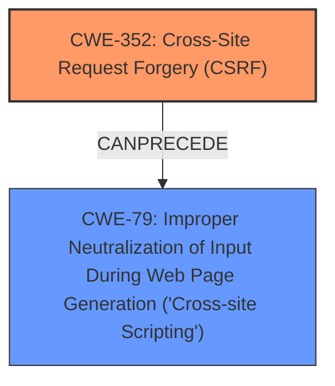

# Raw Analyzer Response for CVE-2025-32497

# Summary
| CWE ID | CWE Name | Confidence | CWE Abstraction Level | CWE Vulnerability Mapping Label | CWE-Vulnerability Mapping Notes |
|---|---|---|---|---|---|
| CWE-352 | Cross-Site Request Forgery (CSRF) | 0.9 | Compound | Primary | Allowed |
| CWE-79 | Improper Neutralization of Input During Web Page Generation ('Cross-site Scripting') | 0.8 | Base | Secondary | Allowed |

## Evidence and Confidence

*   **Confidence Score:** 0.85
*   **Evidence Strength:** HIGH

## Relationship Analysis
The primary weakness is CWE-352 [Cross-Site Request Forgery (CSRF)], which allows an attacker to induce users into performing actions they do not intend to. The resulting action, in this case, is stored Cross-Site Scripting (XSS), which corresponds to CWE-79 [Improper Neutralization of Input During Web Page Generation ('Cross-site Scripting')]. CWE-352 can precede CWE-79 because the CSRF vulnerability allows the attacker to inject malicious scripts.

## Vulnerability Chain
The vulnerability chain starts with **CWE-352 [Cross-Site Request Forgery (CSRF)]** as the root cause. This allows an attacker to inject malicious code without the user's consent, which then leads to **CWE-79 [Improper Neutralization of Input During Web Page Generation ('Cross-site Scripting')]** due to the application's failure to neutralize the injected input properly. The final impact is stored XSS, where the malicious script is stored on the server and executed when other users access the affected page.

## Summary of Analysis
The initial assessment identified **CWE-352 [Cross-Site Request Forgery (CSRF)]** as the primary weakness, with **CWE-79 [Improper Neutralization of Input During Web Page Generation ('Cross-site Scripting')]** as a secondary weakness resulting from the CSRF. The vulnerability description indicates that a **Cross-Site Request Forgery** (CSRF) vulnerability allows for Stored **XSS**. The CVE Reference Links Content Summary reinforces this by stating the **root cause** of the vulnerability is CSRF. The "Retriever Results" also suggests CWE-79 and CWE-352 as top candidates.

The relationship graph highlights that CWE-352 can precede CWE-79, aligning with the vulnerability's description. The primary focus is on the root cause, which is the CSRF vulnerability (CWE-352).

The selected CWEs are at the optimal level of specificity because CWE-352 accurately describes the **root cause**, and CWE-79 describes the resulting **XSS** vulnerability.

Relevant CWE Information:
- **CWE-352 [Cross-Site Request Forgery (CSRF)]**: The web application does not sufficiently verify whether a request was intentionally provided by the user. In this case, a **CSRF** vulnerability exists.
- **CWE-79 [Improper Neutralization of Input During Web Page Generation ('Cross-site Scripting')]**: The product does not neutralize user-controllable input before it is placed in output that is used as a web page. The CSRF leads to Stored **XSS** due to improper neutralization.

CWEs considered but not used:
- CWE-89 [Improper Neutralization of Special Elements used in an SQL Command ('SQL Injection')] and CWE-918 [Server-Side Request Forgery (SSRF)]: These were considered due to their presence in the Retriever Results but were discarded as they do not align with the vulnerability description, which specifically mentions CSRF and XSS.
- CWE-601 [URL Redirection to Untrusted Site ('Open Redirect')]: This was considered because it appeared in the retriever results, but it does not align with the vulnerability description. The vulnerability is not related to URL redirection.
- CWE-116 [Improper Encoding or Escaping of Output]: While related to XSS, it's a class-level CWE, and CWE-79 is more specific and better describes the **improper neutralization**.
- CWE-80 [Improper Neutralization of Script-Related HTML Tags in a Web Page (Basic XSS)]: This is a variant of XSS but not as general as CWE-79. The description does not point to neutralizing script-related HTML tags specifically.
- CWE-494 [Download of Code Without Integrity Check]: This CWE is irrelevant as there is no downloading of code in the vulnerability description.