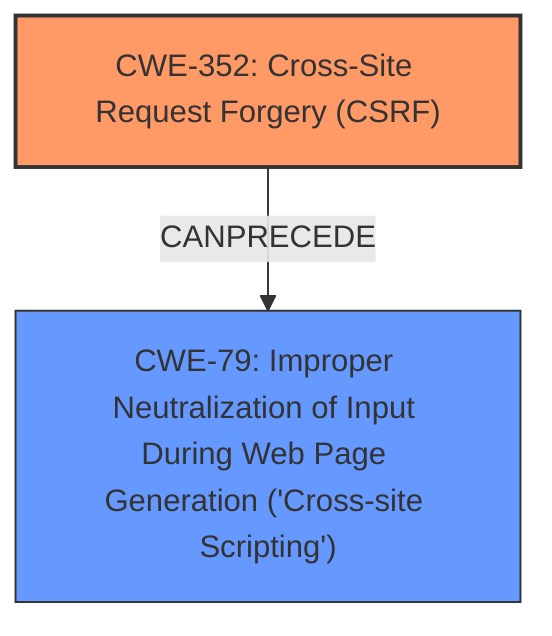

# Enhanced Analysis for CVE-2025-32518

# Summary
| CWE ID | CWE Name | Confidence | CWE Abstraction Level | CWE Vulnerability Mapping Label | CWE-Vulnerability Mapping Notes |
|---|---|---|---|---|---|
| CWE-352 | Cross-Site Request Forgery (CSRF) | 1.0 | Compound | Primary | Allowed |
| CWE-79 | Improper Neutralization of Input During Web Page Generation ('Cross-site Scripting') | 0.7 | Base | Secondary | Allowed |

## Evidence and Confidence

*   **Confidence Score:** 0.85
*   **Evidence Strength:** HIGH

## Relationship Analysis
The primary weakness is **CWE-352 [Cross-Site Request Forgery (CSRF)]**, a compound weakness that allows an attacker to induce users into performing actions against their will. The resulting impact is Stored XSS, which is **CWE-79 [Improper Neutralization of Input During Web Page Generation ('Cross-site Scripting')]**. **CWE-79** is a base CWE that results from improper neutralization of user-controlled input. **CWE-352** can **CAN PRECEDE** **CWE-79** if a CSRF attack is used to inject malicious script.



## Vulnerability Chain
The vulnerability chain begins with the **CWE-352 [Cross-Site Request Forgery (CSRF)]** vulnerability, where the application **does not sufficiently verify** the origin of the request. This allows an attacker to inject malicious input. The injected input is then improperly handled by the application, leading to **CWE-79 [Improper Neutralization of Input During Web Page Generation ('Cross-site Scripting')]**, which results in Stored XSS. The root cause is the **missing CSRF protection**, and the impact is the ability to inject and execute arbitrary scripts in the context of the user.

## Summary of Analysis
The primary vulnerability is **CWE-352 [Cross-Site Request Forgery (CSRF)]** because the application does not properly validate the origin of requests, allowing an attacker to perform actions on behalf of a user without their consent. The vulnerability description clearly states "**Cross-Site Request Forgery (CSRF)** vulnerability...allows Stored XSS." The **CVE Reference Links Content Summary** also indicates that the **root cause of vulnerability** is "Cross Site Request Forgery (CSRF) vulnerability." This directly supports the selection of **CWE-352** as the primary weakness. The retriever results also list **CWE-352** as the top combined result with a high similarity score.

The secondary vulnerability is **CWE-79 [Improper Neutralization of Input During Web Page Generation ('Cross-site Scripting')]**. The vulnerability description states that the CSRF vulnerability "allows Stored XSS." The **CVE Reference Links Content Summary** shows this attack allows a malicious actor to force higher privileged users to execute unwanted actions. This means that the attacker is able to inject code, which is then executed by the user's browser. This aligns with the description of **CWE-79**, which states that "The product does not neutralize or incorrectly neutralizes user-controllable input before it is placed in output that is used as a web page that is served to other users."

The relationship between **CWE-352** and **CWE-79** is that the CSRF vulnerability allows the attacker to inject malicious input, which then leads to the XSS vulnerability. **CWE-352** **CAN PRECEDE** **CWE-79**.

The selected CWEs are at the optimal level of specificity because they accurately represent the root cause and impact of the vulnerability. **CWE-352** is a compound CWE, which is appropriate because it represents a combination of multiple weaknesses. **CWE-79** is a base CWE, which is also appropriate because it represents a specific type of vulnerability.


## CWE Relationship Analysis

Current CWEs represent these abstraction levels: .


### Vulnerability Chain Analysis

**Chain starting from CWE-352:**
- 352 (Cross-Site Request Forgery (CSRF)) - ROOT


**Chain starting from CWE-79:**
- 79 (Improper Neutralization of Input During Web Page Generation ('Cross-site Scripting')) - ROOT


### CWE Relationship Diagram

```mermaid
graph TD
    classDef primary fill:#f96,stroke:#333,stroke-width:2px
    classDef secondary fill:#69f,stroke:#333
    classDef tertiary fill:#9e9,stroke:#333
```