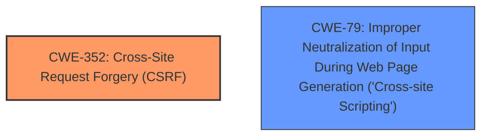

# Enhanced Analysis for CVE-2025-32546

# Summary
| CWE ID | CWE Name | Confidence | CWE Abstraction Level | CWE Vulnerability Mapping Label | CWE-Vulnerability Mapping Notes |
|---|---|---|---|---|---|
| CWE-352 | Cross-Site Request Forgery (CSRF) | 1.0 | Compound | Primary | Allowed |
| CWE-79 | Improper Neutralization of Input During Web Page Generation ('Cross-site Scripting') | 1.0 | Base | Secondary | Allowed |

## Evidence and Confidence

*   **Confidence Score:** 1.0
*   **Evidence Strength:** HIGH

## Relationship Analysis
The primary vulnerability is identified as CWE-352 [Cross-Site Request Forgery (CSRF)], which is a compound weakness. The vulnerability description also mentions Reflected XSS, which maps to CWE-79 [Improper Neutralization of Input During Web Page Generation ('Cross-site Scripting')]. CWE-79 is related to CWE-352 in that XSS can sometimes be used as part of a CSRF attack.



## Vulnerability Chain
The vulnerability chain starts with a **lack of CSRF protection**, leading to CWE-352 [Cross-Site Request Forgery (CSRF)]. The presence of a Reflected XSS vulnerability (CWE-79 [Improper Neutralization of Input During Web Page Generation ('Cross-site Scripting')]) in the application can then be exploited to facilitate the CSRF attack.

## Summary of Analysis
The primary vulnerability is a **lack of CSRF protection**, resulting in CWE-352 [Cross-Site Request Forgery (CSRF)]. The vulnerability description mentions "Reflected XSS", which clearly indicates CWE-79 [Improper Neutralization of Input During Web Page Generation ('Cross-site Scripting')]. The "CVE Reference Links Content Summary" confirms this, stating "Weaknesses/vulnerabilities present: Cross-Site Request Forgery (CSRF) - specifically, a **lack of CSRF protection**." The presence of a Reflected XSS vulnerability (CWE-79 [Improper Neutralization of Input During Web Page Generation ('Cross-site Scripting')]) in the application can then be exploited to facilitate the CSRF attack.

The evidence supports the selection of CWE-352 [Cross-Site Request Forgery (CSRF)] as the primary weakness and CWE-79 [Improper Neutralization of Input During Web Page Generation ('Cross-site Scripting')] as a secondary weakness. Both CWEs are at the appropriate level of specificity, with CWE-352 being a compound weakness and CWE-79 being a base weakness.

Other CWEs considered but not used:

*   CWE-89 [Improper Neutralization of Special Elements used in an SQL Command ('SQL Injection')]: Not applicable as there is no mention of SQL injection in the vulnerability description.
*   CWE-918 [Server-Side Request Forgery (SSRF)]: Not applicable as there is no mention of server-side request forgery in the vulnerability description.
*   CWE-434 [Unrestricted Upload of File with Dangerous Type]: Not applicable as there is no mention of file uploads in the vulnerability description.
*   CWE-601 [URL Redirection to Untrusted Site ('Open Redirect')]: Not applicable as there is no mention of URL redirection in the vulnerability description.
*   CWE-116 [Improper Encoding or Escaping of Output]: While related to XSS, CWE-79 is a more specific match.
*   CWE-790 [Improper Filtering of Special Elements]: While related to XSS, CWE-79 is a more specific match.
*   CWE-471 [Modification of Assumed-Immutable Data (MAID)]: Not applicable as it does not relate to the described weaknesses.


## CWE Relationship Analysis

Current CWEs represent these abstraction levels: .


### Vulnerability Chain Analysis

**Chain starting from CWE-89:**
- 89 (Improper Neutralization of Special Elements used in an SQL Command ('SQL Injection')) - ROOT


**Chain starting from CWE-471:**
- 471 (Modification of Assumed-Immutable Data (MAID)) - ROOT


### CWE Relationship Diagram

```mermaid
graph TD
    classDef primary fill:#f96,stroke:#333,stroke-width:2px
    classDef secondary fill:#69f,stroke:#333
    classDef tertiary fill:#9e9,stroke:#333
```