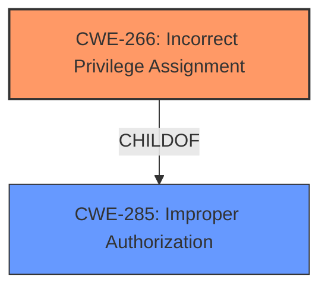

# Raw Analyzer Response for CVE-2025-3255

# Summary
| CWE ID | CWE Name | Confidence | CWE Abstraction Level | CWE Vulnerability Mapping Label | CWE-Vulnerability Mapping Notes |
|---|---|---|---|---|---|
| CWE-266 | Incorrect Privilege Assignment | 0.8 | Base | Allowed | Primary CWE |
| CWE-285 | Improper Authorization | 0.6 | Class | Discouraged | Secondary Candidate |

## Evidence and Confidence

*   **Confidence Score:** 0.7
*   **Evidence Strength:** MEDIUM

## Relationship Analysis
The primary CWE, CWE-266 Incorrect Privilege Assignment, is a base-level CWE. CWE-285 Improper Authorization is a class-level CWE and a parent of CWE-266. I selected CWE-266 because it more specifically describes the vulnerability compared to its broader parent, CWE-285. There are no significant chain relationships to consider in this case.

## Vulnerability Chain
The vulnerability chain starts with an **incorrect privilege assignment** (CWE-266), which leads to **improper access controls**. The impact is unauthorized access to functionality within the application.

## Summary of Analysis
The initial analysis focused on identifying the root cause of the vulnerability, which is the **improper access controls**. The vulnerability description clearly states "**improper access controls**" resulting from manipulating the ID argument. This points to a privilege or authorization issue.

CWE-266 Incorrect Privilege Assignment best fits the description because it directly addresses the **incorrect assignment** of privileges leading to unintended access. CWE-285 Improper Authorization is a broader category that could apply, but CWE-266 provides a more specific classification.

The evidence is based on the "**improper access controls**" statement in the vulnerability description. While the CVE Reference Links Content Summary is "UNRELATED," the explicit mention of **improper access controls** provides sufficient justification for selecting CWE-266 as the primary CWE.

Other CWEs Considered:

*   CWE-79 and CWE-89 were not selected because the vulnerability does not involve cross-site scripting or SQL injection.
*   CWE-306 Missing Authentication for Critical Function was considered but is less accurate than CWE-266, which focuses on privilege assignment rather than missing authentication.
*   CWE-425 Direct Request ('Forced Browsing') was considered, but the description focuses more on the lack of authorization checks on URLs, while the provided vulnerability focuses on the **incorrect assignment** of privileges.

CWE-266 is at the optimal level of specificity because it directly reflects the **root cause** described in the vulnerability.

Relevant CWE Information:

# Enhanced Context (25 CWEs)
The following CWEs were identified as potentially relevant to this vulnerability:

## CWE-266: Incorrect Privilege Assignment
**Abstraction Level**: Base
**Similarity Score**: 0.72
**Source**: dense

**Description**:
A product incorrectly assigns a privilege to a particular actor, creating an unintended sphere of control for that actor.

**Mapping Guidance**:
- Usage: Allowed
- Rationale: This CWE entry is at the Base level of abstraction, which is a preferred level of abstraction for mapping to the root causes of vulnerabilities.