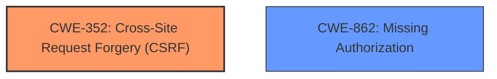

# Raw Analyzer Response for CVE-2025-32624

# Summary
| CWE ID | CWE Name | Confidence | CWE Abstraction Level | CWE Vulnerability Mapping Label | CWE-Vulnerability Mapping Notes |
|---|---|---|---|---|---|
| CWE-352 | Cross-Site Request Forgery (CSRF) | 1.0 | Compound | Primary | Allowed |
| CWE-862 | Missing Authorization | 0.7 | Class | Secondary | Allowed-with-Review |

## Evidence and Confidence

*   **Confidence Score:** 0.9
*   **Evidence Strength:** HIGH

## Relationship Analysis
The primary CWE is CWE-352, which is a compound CWE. The secondary CWE considered is CWE-862, which is a class CWE, due to the **missing authorization**.

## Vulnerability Chain
The vulnerability chain starts with **Missing Authorization**, leading to the **Cross-Site Request Forgery (CSRF)**.
  - Root Cause: **Missing Authorization**
  - Weakness: **Cross-Site Request Forgery (CSRF)**
  - Impact: Malicious actor could force higher privileged users to execute unwanted actions

## Summary of Analysis
The vulnerability is a **Cross-Site Request Forgery (CSRF)** due to a **Missing Authorization**. The primary CWE is CWE-352, which is a compound CWE. The secondary CWE is CWE-862, which is a class CWE, due to the **missing authorization**.

The vulnerability description states "**Missing Authorization vulnerability** in czater Czater.pl live chat i telefon allows **Cross Site Request Forgery**."

The "CVE Reference Links Content Summary" section confirms this analysis.

The retriever results also list CWE-352 and CWE-862 as top candidates.

CWE-352 is a compound CWE, which means it is a combination of multiple weaknesses. In this case, the weakness is a **Cross-Site Request Forgery (CSRF)**.

CWE-862 is a class CWE, which means it is a general category for a type of weakness. In this case, the weakness is **Missing Authorization**.

Both CWEs are at the appropriate level of specificity.

Relevant CWE Information:

# Enhanced Context (25 CWEs)
The following CWEs were identified as potentially relevant to this vulnerability:

## CWE-352: Cross-Site Request Forgery (CSRF)
**Abstraction Level**: Compound

**Description**:
The web application does not, or can not, sufficiently verify whether a well-formed, valid, consistent request was intentionally provided by the user who submitted the request.

**Mapping Guidance**:
- Usage: Allowed
- Rationale: This is a well-known Composite of multiple weaknesses that must all occur simultaneously, although it is attack-oriented in nature.

## CWE-862: Missing Authorization
**Abstraction Level**: Class

**Description**:
The product performs an authorization check when an actor attempts to access a resource or perform an action, but it does not correctly perform the check.

**Mapping Guidance**:
- Usage: Allowed-with-Review
- Rationale: This CWE entry is a Class and might have Base-level children that would be more appropriate