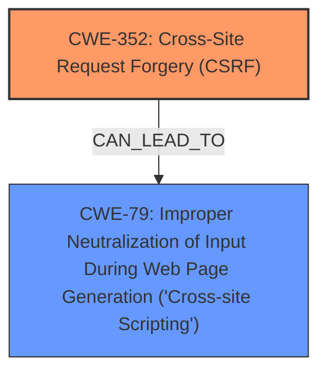

# Analysis for CVE-2025-32645

# Summary
| CWE ID    | CWE Name                                                                   | Confidence | CWE Abstraction Level | CWE Vulnerability Mapping Label | CWE-Vulnerability Mapping Notes |
| --------- | -------------------------------------------------------------------------- | ---------- | --------------------- | ------------------------------- | ------------------------------- |
| CWE-352   | Cross-Site Request Forgery (CSRF)                                          | 0.9        | Compound              | Primary                         | Allowed                         |
| CWE-79    | Improper Neutralization of Input During Web Page Generation ('Cross-site Scripting') | 0.8        | Base                  | Secondary                       | Allowed                         |

## Evidence and Confidence

*   **Confidence Score:** 0.85
*   **Evidence Strength:** MEDIUM

## Relationship Analysis

The primary weakness is CWE-352 [Cross-Site Request Forgery (CSRF)], which requires user interaction to perform an action on the web application. CWE-79 [Improper Neutralization of Input During Web Page Generation ('Cross-site Scripting')] is a secondary weakness, as the CSRF may be exploited to inject malicious scripts. CWE-352 is a compound weakness, composed of multiple other weaknesses related to request validation and session management. CWE-79, on the other hand, is a base-level weakness describing improper neutralization of input.

## Vulnerability Chain

The vulnerability chain starts with the **Cross-Site Request Forgery (CSRF)** vulnerability, which allows an attacker to induce a user to perform actions against a web application that they are currently authenticated to. The CSRF vulnerability can then be exploited to inject malicious input, leading to Stored **XSS**, because the input is not properly neutralized.

## Summary of Analysis

The vulnerability description clearly states that the "Cross-Site Request Forgery (CSRF) vulnerability in Hiren Patel Custom Posts Order allows Stored **XSS**". This indicates that an attacker can use CSRF to inject malicious code into the system, resulting in stored **XSS**.

CWE-352 [Cross-Site Request Forgery (CSRF)] is selected as the primary CWE because the vulnerability description explicitly mentions CSRF as the initial attack vector. The weakness "cross-site scripting" led to CWE-352 as the top match.

CWE-79 [Improper Neutralization of Input During Web Page Generation ('Cross-site Scripting')] is selected as a secondary CWE because the CSRF vulnerability leads to stored **XSS**, which occurs due to improper neutralization of input. The weakness "XSS" led to CWE-79 as the top match.

The selected CWEs are at the optimal level of specificity. CWE-352 is a compound weakness that accurately represents the CSRF vulnerability, while CWE-79 is a base-level weakness that describes the improper neutralization of input leading to stored **XSS**. The evidence, combined with the retriever results, confirms that these CWEs are the most appropriate for this vulnerability.