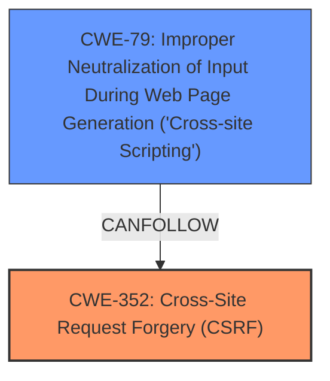

# Raw Analyzer Response for CVE-2025-32655

# Summary
| CWE ID    | CWE Name                                                                     | Confidence | CWE Abstraction Level | CWE Vulnerability Mapping Label | CWE-Vulnerability Mapping Notes |
| :-------- | :--------------------------------------------------------------------------- | :--------- | :---------------------- | :------------------------------ | :------------------------------ |
| CWE-352   | Cross-Site Request Forgery (CSRF)                                            | 0.9        | Compound                | Primary                         | Allowed                         |
| CWE-79   | Improper Neutralization of Input During Web Page Generation ('Cross-site Scripting') | 0.9        | Base                 | Secondary                         | Allowed                         |

## Evidence and Confidence

*   **Confidence Score:** 0.9
*   **Evidence Strength:** MEDIUM

## Relationship Analysis

The primary relationship is that the **Cross-Site Request Forgery (CSRF)** vulnerability allows for Stored **Cross-Site Scripting (XSS)**. **CWE-352** is a compound weakness, while **CWE-79** is a base weakness. The analysis focuses on identifying the root cause, **CWE-352**, and the subsequent impact, **CWE-79**.

## Vulnerability Chain

The vulnerability chain starts with the **Cross-Site Request Forgery (CSRF)** vulnerability, which allows an attacker to trick a user into performing actions they did not intend to. In this case, it leads to Stored **Cross-Site Scripting (XSS)**.

*   **Root Cause:** **CWE-352** **Cross-Site Request Forgery (CSRF)**. The application doesn't sufficiently verify the requests, opening the door for malicious actions.
*   **Weakness:** **CWE-79** **Improper Neutralization of Input During Web Page Generation ('Cross-site Scripting')**. The **CSRF** vulnerability is leveraged to inject malicious scripts that are then stored and executed in the context of other users.

## Summary of Analysis

The initial analysis identifies **CWE-352** **Cross-Site Request Forgery (CSRF)** as the primary root cause, since the application does not sufficiently verify if a request was intentionally provided by the user. The **CSRF** vulnerability leads to Stored **Cross-Site Scripting (XSS)**, represented by **CWE-79** **Improper Neutralization of Input During Web Page Generation ('Cross-site Scripting')**, where user-controllable input is not properly neutralized before being placed in a web page.

The decision to select **CWE-352** and **CWE-79** is based on the vulnerability description which explicitly states that a **Cross-Site Request Forgery (CSRF)** vulnerability allows for Stored **XSS**.

The selected CWEs are at the optimal level of specificity, as **CWE-352** is a Compound weakness that accurately describes the **CSRF** issue, and **CWE-79** is a Base weakness that accurately describes the **XSS** issue.

Relevant CWE Information:
**CWE-352** **Cross-Site Request Forgery (CSRF)**: The web application does not, or cannot, sufficiently verify whether a well-formed, valid, consistent request was intentionally provided by the user who submitted the request.
**CWE-79** **Improper Neutralization of Input During Web Page Generation ('Cross-site Scripting')**: The product does not neutralize or incorrectly neutralizes user-controllable input before it is placed in output that is used as a web page that is served to other users.