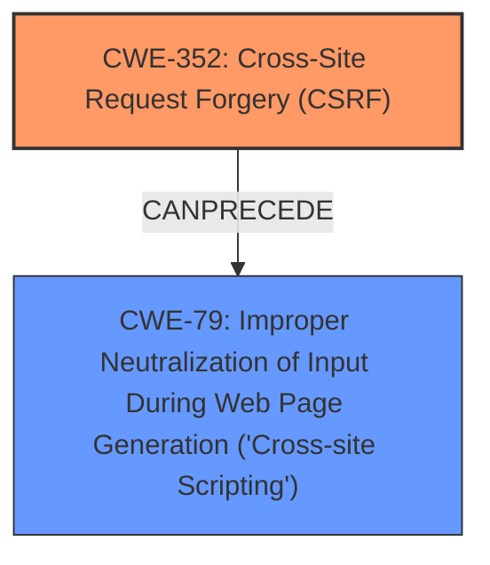

# Raw Analyzer Response for CVE-2025-32659

# Summary
| CWE ID | CWE Name | Confidence | CWE Abstraction Level | CWE Vulnerability Mapping Label | CWE-Vulnerability Mapping Notes |
|---|---|---|---|---|---|
| CWE-352 | Cross-Site Request Forgery (CSRF) | 0.9 | Compound | Primary | Allowed |
| CWE-79 | Improper Neutralization of Input During Web Page Generation ('Cross-site Scripting') | 0.9 | Base | Secondary | Allowed |

## Evidence and Confidence

*   **Confidence Score:** 0.9
*   **Evidence Strength:** HIGH

## Relationship Analysis
The primary weakness is identified as CWE-352 [Cross-Site Request Forgery (CSRF)], which can allow an attacker to induce users into performing actions they do not intend to. The secondary weakness is CWE-79 [Improper Neutralization of Input During Web Page Generation ('Cross-site Scripting')], which results from the CSRF. There is no direct relationship in the graph data between the two, but the vulnerability description indicates that the CSRF leads to Stored XSS.

## Vulnerability Chain
The vulnerability chain starts with a **Cross-Site Request Forgery** (CWE-352), which then leads to Stored **XSS** (CWE-79) due to the **improper neutralization of input** during web page generation. The chain is: CWE-352 -> CWE-79. The root cause is the CSRF, and the impact is the stored XSS.

## Summary of Analysis
The vulnerability description explicitly states that there is a Cross-Site Request Forgery (CSRF) vulnerability that allows Stored XSS. The CVE Reference Links Content Summary confirms the CSRF and its impact, which allows malicious actors to force higher privileged users to execute unwanted actions. The **rootcause** is the **Cross-Site Request Forgery** and the **weakness** is the **XSS**.

Based on this information:
*   **CWE-352 [Cross-Site Request Forgery (CSRF)]** is the primary weakness because the vulnerability description names it explicitly. The reference links further confirm that it allows malicious actors to perform unwanted actions.
*   **CWE-79 [Improper Neutralization of Input During Web Page Generation ('Cross-site Scripting')]** is the secondary weakness. The vulnerability description says the CSRF leads to stored XSS.

The retriever results also suggest CWE-79 and CWE-352 as the top candidates, which aligns with the vulnerability description. The other CWEs were not chosen because they didn't align closely with the vulnerability description.

Relevant CWE Information:

# Enhanced Context (25 CWEs)
The following CWEs were identified as potentially relevant to this vulnerability:

## CWE-352: Cross-Site Request Forgery (CSRF)
**Abstraction Level**: Compound
**Similarity Score**: 0.76
**Source**: dense

**Description**:
The web application does not, or can not, sufficiently verify whether a well-formed, valid, consistent request was intentionally provided by the user who submitted the request.

**Mapping Guidance**:
- Usage: Allowed
- Rationale: This is a well-known Composite of multiple weaknesses that must all occur simultaneously, although it is attack-oriented in nature.

## CWE-79: Improper Neutralization of Input During Web Page Generation ('Cross-site Scripting')
**Abstraction Level**: Base
**Similarity Score**: 0.72
**Source**: dense

**Description**:
The product does not neutralize or incorrectly neutralizes user-controllable input before it is placed in output that is used as a web page that is served to other users.

**Mapping Guidance**:
- Usage: Allowed
- Rationale: This CWE entry is at the Base level of abstraction, which is a preferred level of abstraction for mapping to the root causes of vulnerabilities.