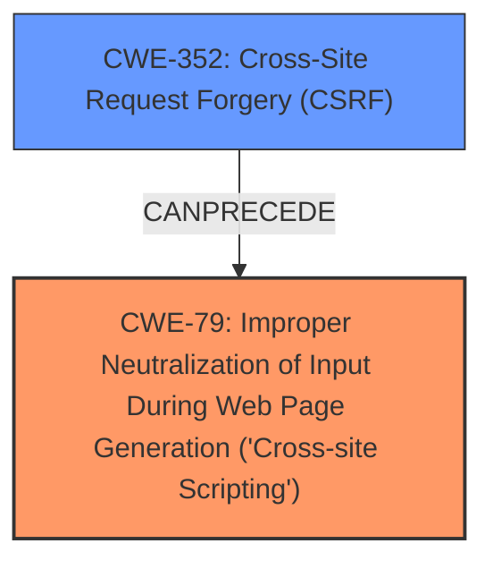

# Raw Analyzer Response for CVE-2025-32664

# Summary
| CWE ID | CWE Name | Confidence | CWE Abstraction Level | CWE Vulnerability Mapping Label | CWE-Vulnerability Mapping Notes |
|---|---|---|---|---|---|
| CWE-79 | Improper Neutralization of Input During Web Page Generation ('Cross-site Scripting') | 1.0 | Base | Allowed | Primary CWE. The description explicitly mentions a stored **XSS** vulnerability. |
| CWE-352 | Cross-Site Request Forgery (CSRF) | 1.0 | Compound | Allowed | Secondary CWE. The description explicitly mentions a Cross-Site Request Forgery (CSRF) vulnerability. |

## Evidence and Confidence

*   **Confidence Score:** 1.0
*   **Evidence Strength:** HIGH

## Relationship Analysis
The primary relationship impacting the decision is that CWE-79 [Improper Neutralization of Input During Web Page Generation ('Cross-site Scripting')] is a Base level CWE, which is preferred for root cause mapping. CWE-352 [Cross-Site Request Forgery (CSRF)] is a compound CWE, which indicates a combination of multiple weaknesses. There is a potential chain of events where a successful CSRF attack (CWE-352) could lead to stored XSS (CWE-79) by tricking an authenticated user into performing actions that inject malicious scripts.

## Vulnerability Chain
The vulnerability chain starts with CWE-352 [Cross-Site Request Forgery (CSRF)], allowing an attacker to force a user into performing unwanted actions. This leads to CWE-79 [Improper Neutralization of Input During Web Page Generation ('Cross-site Scripting')], where the forced actions inject malicious scripts into the web page, resulting in stored XSS. The CSRF is the root cause and the XSS is the resulting vulnerability.

## Summary of Analysis
The analysis is based on the explicit mention of both Cross-Site Request Forgery (CSRF) and Stored Cross-Site Scripting (**XSS**) in the vulnerability description.

The evidence is strong as it directly states: "Cross-Site Request Forgery (CSRF) vulnerability in ashokbasnet Nepali Date Utilities allows Stored **XSS**."

The graph relationships confirm that CWE-352 [Cross-Site Request Forgery (CSRF)] can precede CWE-79 [Improper Neutralization of Input During Web Page Generation ('Cross-site Scripting')], indicating a possible attack vector.

The selected CWEs are at the optimal level of specificity, with CWE-79 [Improper Neutralization of Input During Web Page Generation ('Cross-site Scripting')] being a Base CWE and CWE-352 [Cross-Site Request Forgery (CSRF)] being a compound CWE accurately representing the combination of weaknesses.

Other CWEs Considered but Not Used:

*   CWE-80: Improper Neutralization of Script-Related HTML Tags in a Web Page (Basic XSS): While related to XSS, CWE-79 is more general and appropriate as it covers the root cause of improper neutralization.
*   CWE-93: Improper Neutralization of CRLF Sequences ('CRLF Injection'): Not relevant as the vulnerability description doesn't mention CRLF injection.
*   CWE-89: Improper Neutralization of Special Elements used in an SQL Command ('SQL Injection'): Not relevant as the vulnerability description doesn't mention SQL injection.
*   CWE-434: Unrestricted Upload of File with Dangerous Type: Not relevant as the vulnerability description doesn't involve file uploads.
*   CWE-918: Server-Side Request Forgery (SSRF): Not relevant as the vulnerability description doesn't mention SSRF.
*   CWE-116: Improper Encoding or Escaping of Output: While encoding issues might contribute to XSS, CWE-79 is more directly related to the **improper neutralization** of input, which is the core of the XSS vulnerability.
*   CWE-184: Incomplete List of Disallowed Inputs: While input validation is important, the primary issue here is the **improper neutralization** of input, making CWE-79 a more direct fit.