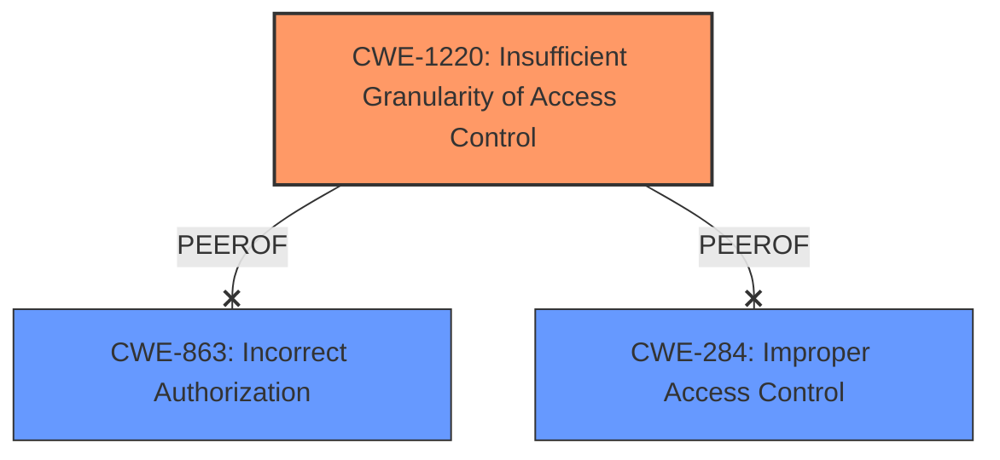

# Analysis Report for CVE-2025-32703

# Vulnerability Analysis Report: CVE-2025-32703

## Description

**Insufficient granularity of access control** in Visual Studio allows an authorized attacker to disclose information locally.

## Vulnerability Description Key Phrases

- **Rootcause:** Insufficient granularity of access control
- **Product:** Visual Studio
- **Impact:** disclose information, information disclosure
- **Attacker:** authorized attacker

## Analysis (with Relationship Data)

# Summary

| CWE ID    | CWE Name                                                    | Confidence | CWE Abstraction Level | CWE Vulnerability Mapping Label | CWE-Vulnerability Mapping Notes |
| :-------- | :---------------------------------------------------------- | :--------- | :-------------------- | :------------------------------ | :------------------------------ |
| CWE-1220 | Insufficient Granularity of Access Control                   | 0.85       | Base                  | Primary CWE                    | Allowed                      |

## Evidence and Confidence

*   **Confidence Score:** 0.85
*   **Evidence Strength:** HIGH

## Relationship Analysis

The primary CWE, CWE-1220, is at the Base level, which is the preferred level of abstraction. The Retriever Results show that CWE-1220 has a high similarity score. Other CWEs like CWE-863 (Incorrect Authorization) and CWE-284 (Improper Access Control) were considered but deemed less specific. The vulnerability description explicitly states "Insufficient granularity of access control", which directly aligns with CWE-1220.



## Vulnerability Chain

The chain of events is as follows:
1.  **Root Cause:** **Insufficient granularity of access control** (CWE-1220).
2.  **Impact:** Information Disclosure.

## Summary of Analysis

The initial analysis identified CWE-1220 as the most appropriate CWE due to the explicit mention of "**Insufficient granularity of access control**" in the vulnerability description. The Retriever Results further supported this by ranking CWE-1220 with the highest similarity score. Other candidate CWEs, such as CWE-863 (Incorrect Authorization) and CWE-284 (Improper Access Control), were considered, but they are less specific and do not accurately reflect the root cause. The final decision is strongly based on the evidence provided and the relationships between the CWEs. CWE-1220 is at the optimal level of specificity.

Relevant CWE Information:

# Enhanced Context (25 CWEs)

## CWE-1220: Insufficient Granularity of Access Control
**Abstraction Level**: Base
**Similarity Score**: 0.75
**Source**: dense

**Description**:
The product implements access controls via a policy or other feature with the intention to disable or restrict accesses (reads and/or writes) to assets in a system from untrusted agents. However, implemented access controls lack required granularity, which renders the control policy too broad because it allows accesses from unauthorized agents to the security-sensitive assets.

**Mapping Guidance**:
- Usage: Allowed
- Rationale: This CWE entry is at the Base level of abstraction, which is a preferred level of abstraction for mapping to the root causes of vulnerabilities.

The vulnerability description matches the CWE description as the Visual Studio access controls lack the required granularity. This allows an authorized attacker to disclose information locally.

## CWE-1296: Incorrect Chaining or Granularity of Debug Components
**Abstraction Level**: base
**Similarity Score**: 2.47
**Source**: graph

**Description**:
CWE-1296: Incorrect Chaining or Granularity of Debug Components

**Mapping Guidance**:
- Usage: Allowed
- Rationale: This CWE entry is at the Base level of abstraction, which is a preferred level of abstraction for mapping to the root causes of vulnerabilities.

This CWE was considered but deemed not applicable as the vulnerability description does not mention debug components.

## CWE-1254: Incorrect Comparison Logic Granularity
**Abstraction Level**: base
**Similarity Score**: 2.47
**Source**: graph

**Description**:
CWE-1254: Incorrect Comparison Logic Granularity

**Mapping Guidance**:
- Usage: Allowed
- Rationale: This CWE entry is at the Base level of abstraction, which is a preferred level of abstraction for mapping to the root causes of vulnerabilities.

This CWE was considered but deemed not applicable as the vulnerability description does not mention comparison logic.

## CWE-284: Improper Access Control
**Abstraction Level**: Class
**Similarity Score**: 1147.14
**Source**: sparse

**Description**:
The product does not perform an authorization check or incorrectly performs one.

**Mapping Guidance**:
- Usage: Discouraged
- Rationale: CWE-284 is high-level and lower-level CWEs can frequently be used instead. It is a level-1 Class (i.e., a child of a Pillar).

This CWE was considered but is too general. CWE-1220 is a more specific description of the vulnerability.

## CWE-863: Incorrect Authorization
**Abstraction Level**: Class
**Similarity Score**: 1147.14
**Source**: sparse

**Description**:
The product performs an authorization check when an actor attempts to access a resource or perform an action, but it does not correctly perform the check.

**Mapping Guidance**:
- Usage: Allowed-with-Review
- Rationale: This CWE entry is a Class and might have Base-level children that would be more appropriate

This CWE was considered but deemed not as accurate as CWE-1220. The description explicitly mentions "Insufficient granularity of access control".

## CWE-451: User Interface (UI) Misrepresentation of Critical Information
**Abstraction Level**: Class
**Similarity Score**: 1147.14
**Source**: sparse

**Description**:
The software displays information to the user in a way that is likely to be confusing or misleading, and the user is likely to make a security decision based on the misrepresentation.

**Mapping Guidance**:
- Usage: Allowed-with-Review
- Rationale: This CWE entry is a Class and might have Base-level children that would be more appropriate

This CWE was considered but it is not applicable because the vulnerability is not related to UI misrepresentation.

## CWE-472: External Control of Assumed-Immutable Web Parameter
**Abstraction Level**: Class
**Similarity Score**: 1147.14
**Source**: sparse

**Description**:
The web application does not sufficiently verify inputs that are assumed to be immutable but are actually externally controllable, such as hidden form fields.

**Mapping Guidance**:
- Usage: Allowed-with-Review
- Rationale: This CWE entry is a Class and might have Base-level children that would be more appropriate

This CWE was considered but it is not applicable because it is related to web applications and not general software.

## CWE-20: Improper Input Validation
**Abstraction Level**: Class
**Similarity Score**: 1147.14
**Source**: sparse

**Description**:
The product does not validate or incorrectly validates input that is provided by an actor.

**Mapping Guidance**:
- Usage: Allowed-with-Review
- Rationale: This CWE entry is a Class and might have Base-level children that would be more appropriate

This CWE was considered, but it is too general and does not relate to access control.

## CWE-520: .NET Misconfiguration: Use of Impersonation
**Abstraction Level**: Class
**Similarity Score**: 1147.14
**Source**: sparse

**Description**:
The .NET application uses impersonation but does not properly configure it to prevent privilege escalation or other security issues.

**Mapping Guidance**:
- Usage: Allowed-with-Review
- Rationale: This CWE entry is a Class and might have Base-level children that would be more appropriate

This CWE was considered, but it is too specific to .NET applications and misconfiguration issues.

## CWE-781: Improper Address Validation in IOCTL with METHOD_NEITHER I/O Control Code
**Abstraction Level**: Class
**Similarity Score**: 1147.14
**Source**: sparse

**Description**:
The IOCTL does not properly validate address passed as input.

**Mapping Guidance**:
- Usage: Allowed-with-Review
- Rationale: This CWE entry is a Class and might have Base-level children that would be more appropriate

This CWE was considered, but it is too specific to IOCTL and address validation.


## CWE Relationship Analysis

Current CWEs represent these abstraction levels: .


### Vulnerability Chain Analysis

**Chain starting from CWE-863:**
- 863 (Incorrect Authorization) - ROOT


**Chain starting from CWE-1220:**
- 1220 (Insufficient Granularity of Access Control) - ROOT


### CWE Relationship Diagram

```mermaid
graph TD
    classDef primary fill:#f96,stroke:#333,stroke-width:2px
    classDef secondary fill:#69f,stroke:#333
    classDef tertiary fill:#9e9,stroke:#333
```


*Report generated on 2025-07-14 19:54:42*
