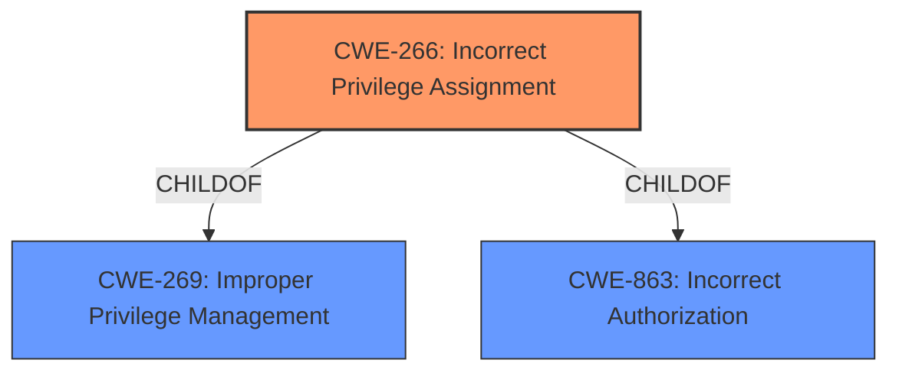

# Enhanced Analysis for CVE-2025-3278

# Summary
| CWE ID | CWE Name | Confidence | CWE Abstraction Level | CWE Vulnerability Mapping Label | CWE-Vulnerability Mapping Notes |
|---|---|---|---|---|---|
| **CWE-266** | Incorrect Privilege Assignment | 0.9 | Base | Primary CWE | Allowed |
| CWE-863 | Incorrect Authorization | 0.6 | Class | Secondary Candidate | Allowed-with-Review |
| CWE-269 | Improper Privilege Management | 0.4 | Class | Secondary Candidate | Discouraged |

## Evidence and Confidence

*   **Confidence Score:** 0.9
*   **Evidence Strength:** HIGH

## Relationship Analysis
The primary relationship influencing the CWE selection is the parent-child relationship. CWE-266 (Incorrect Privilege Assignment) is a more specific child of the broader CWE-269 (Improper Privilege Management) and CWE-863 (Incorrect Authorization). Since the vulnerability involves the **incorrect assignment** of administrator privileges during user registration, CWE-266 is a more precise fit than its parents. The guidance also specifically says not to use CWE-269.



## Vulnerability Chain
The vulnerability chain begins with the **incorrect privilege assignment** (**CWE-266**) during user registration, which allows an unauthenticated attacker to create an account with administrator privileges, leading to privilege escalation.

## Summary of Analysis
The initial assessment and final conclusion strongly favor CWE-266 (Incorrect Privilege Assignment) as the primary CWE. This determination is based on direct evidence from the vulnerability description, which explicitly states that the plugin allows users to set their own role during registration, leading to administrator privilege escalation. This aligns perfectly with the definition of CWE-266, which involves the incorrect assignment of privileges to an actor.

The relationship graph also supports this decision, showing that CWE-266 is a more specific child of the broader CWEs like CWE-269 and CWE-863. The abstraction level of CWE-266 (Base) is also optimal, as it provides a detailed representation of the weakness.

The evidence from the vulnerability description is compelling: "This is due to the plugin allowing users who are registering new accounts to set their own role or by supplying user_register_role field. This makes it possible for unauthenticated attackers to gain elevated privileges by creating an account with the administrator role."

The selection of CWE-266 is at the optimal level of specificity because it directly addresses the root cause of the vulnerability: the **incorrect assignment** of privileges during user registration. While CWE-863 and CWE-269 are related, they are too general and do not accurately capture the specific nature of the weakness.

Relevant CWE Information:

# Enhanced Context (25 CWEs)
The following CWEs were identified as potentially relevant to this vulnerability:

## CWE-266: Incorrect Privilege Assignment
**Abstraction Level**: Base
**Similarity Score**: 0.79
**Source**: dense

**Description**:
A product **incorrectly assigns a privilege** to a particular actor, creating an unintended sphere of control for that actor.

**Mapping Guidance**:
- Usage: Allowed
- Rationale: This CWE entry is at the Base level of abstraction, which is a preferred level of abstraction for mapping to the root causes of vulnerabilities.

**Vulnerability Details:**
The UrbanGo Membership plugin for WordPress is vulnerable to privilege escalation in versions up to, and including, 1.0.4. This is due to the plugin **allowing users who are registering new accounts to set their own role or by supplying user_register_role field.** This makes it possible for unauthenticated attackers to gain elevated privileges by creating an account with the administrator role.

**Explanation:**
The vulnerability description indicates that the plugin allows users to set their own role during registration, which directly leads to **incorrect privilege assignment.** This aligns perfectly with the description of CWE-266, which involves the **incorrect assignment of a privilege** to an actor. The impact is privilege escalation, which is a direct consequence of the **incorrect assignment.**

**Security Implications:**
Unauthenticated attackers can create accounts with administrator privileges, leading to complete control over the WordPress site.

**Relationship Analysis:**
CWE-266 is a base-level CWE, representing a specific type of privilege management issue. It is more specific than its parent CWEs, such as CWE-269 (Improper Privilege Management) and CWE-863 (Incorrect Authorization).

**Mapping Guidance Analysis:**
The mapping guidance for CWE-266 allows its usage and rationale states that it is at the Base level of abstraction, which is a preferred level of abstraction for mapping to the root causes of vulnerabilities.

CWE-863: Incorrect Authorization
**Abstraction Level**: Class
**Similarity Score**: 1402.77
**Source**: sparse

**Description**:
The product performs an authorization check when an actor attempts to access a resource or perform an action, but it does not correctly perform the check.

**Vulnerability Details:**
The UrbanGo Membership plugin for WordPress is vulnerable to privilege escalation in versions up to, and including, 1.0.4. This is due to the plugin **allowing users who are registering new accounts to set their own role or by supplying user_register_role field.** This makes it possible for unauthenticated attackers to gain elevated privileges by creating an account with the administrator role.

**Explanation:**
While the vulnerability does involve an authorization issue, the root cause is the **incorrect assignment** of privileges rather than a faulty authorization check. The plugin is not performing a check correctly; it is **allowing** users to set their own roles, which bypasses any authorization mechanism.

**Security Implications:**
Unauthenticated attackers can create accounts with administrator privileges, leading to complete control over the WordPress site.

**Relationship Analysis:**
CWE-863 is a class-level CWE, representing a general category of authorization issues. It is less specific than CWE-266, which directly addresses the **incorrect assignment** of privileges.

**Mapping Guidance Analysis:**
The mapping guidance for CWE-863 allows its usage with review, suggesting that more specific child CWEs may be more appropriate.

CWE-269: Improper Privilege Management
**Abstraction Level**: Class
**Similarity Score**: 1340.07
**Source**: sparse

**Description**:
The product does not properly assign, modify, track, or check privileges for an actor, creating an unintended sphere of control for that actor.

**Vulnerability Details:**
The UrbanGo Membership plugin for WordPress is vulnerable to privilege escalation in versions up to, and including, 1.0.4. This is due to the plugin **allowing users who are registering new accounts to set their own role or by supplying user_register_role field.** This makes it possible for unauthenticated attackers to gain elevated privileges by creating an account with the administrator role.

**Explanation:**
The vulnerability involves improper privilege management, but the specific issue is the **incorrect assignment** of privileges during user registration. CWE-269 is a broader category that encompasses various privilege management issues, while CWE-266 is a more specific and accurate representation of the root cause.

**Security Implications:**
Unauthenticated attackers can create accounts with administrator privileges, leading to complete control over the WordPress site.

**Relationship Analysis:**
CWE-269 is a class-level CWE, representing a general category of privilege management issues. It is less specific than CWE-266, which directly addresses the **incorrect assignment** of privileges.

**Mapping Guidance Analysis:**
The mapping guidance for CWE-269 discourages its usage, suggesting that it is commonly misused and can be conflated with privilege escalation, which is a technical impact rather than a root cause.

**Other CWEs Considered But Not Used:**

*   CWE-862 (Missing Authorization): While related, the core issue is not a complete absence of authorization but rather an incorrect privilege assignment.
*   CWE-352 (Cross-Site Request Forgery (CSRF)): CSRF is not directly involved in this vulnerability.
*   CWE-472 (External Control of Assumed-Immutable Web Parameter): While the user role is being externally controlled, the root cause is the incorrect assignment of that role, making CWE-266 a better fit.
*   CWE-285 (Improper Authorization): Similar to CWE-863, the issue is not a faulty authorization check but an incorrect privilege assignment.
*   CWE-306 (Missing Authentication for Critical Function): Authentication is not the primary issue; the problem is that even after (or during) authentication, users can assign themselves administrator privileges.
* CWE-434 (Unrestricted Upload of File with Dangerous


## CWE Relationship Analysis

Current CWEs represent these abstraction levels: .


### Vulnerability Chain Analysis

**Chain starting from CWE-863:**
- 863 (Incorrect Authorization) - ROOT


**Chain starting from CWE-862:**
- 862 (Missing Authorization) - ROOT


### CWE Relationship Diagram

```mermaid
graph TD
    classDef primary fill:#f96,stroke:#333,stroke-width:2px
    classDef secondary fill:#69f,stroke:#333
    classDef tertiary fill:#9e9,stroke:#333
```