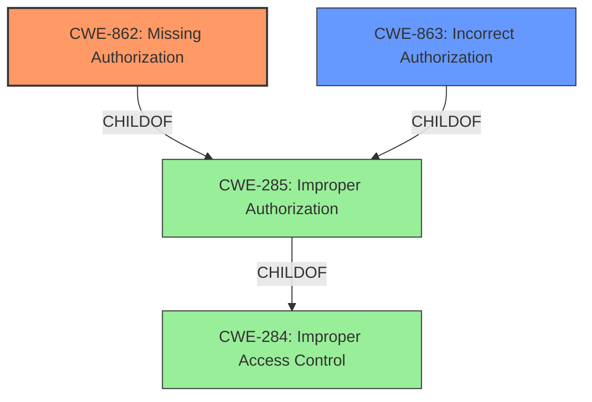

# Analysis for CVE-2025-32796

# Summary
| CWE ID  | CWE Name                        | Confidence | CWE Abstraction Level | CWE Vulnerability Mapping Label | CWE-Vulnerability Mapping Notes |
| :-------- | :------------------------------ | :--------- | :-------------------- | :------------------------------ | :------------------------------ |
| CWE-862   | Missing Authorization         | 0.9        | Class                 | Allowed-with-Review           | Primary CWE                   |
| CWE-863   | Incorrect Authorization         | 0.7        | Class                 | Allowed-with-Review           | Secondary Candidate             |

## Evidence and Confidence

*   **Confidence Score:** 0.8
*   **Evidence Strength:** HIGH

## Relationship Analysis

The primary CWE is CWE-862, which represents the **missing authorization** check. However, CWE-863 (Incorrect Authorization) is considered because there might be a flawed authorization check instead of a completely missing one. Both CWE-862 and CWE-863 are children of CWE-285 (Improper Authorization) and represent different ways in which authorization can fail. Selecting CWE-862 provides a more specific classification, assuming no authorization check exists.

## Vulnerability Chain

The vulnerability chain starts with the **missing authorization** check (CWE-862), which allows normal users to enable or disable apps through the API. This leads to unauthorized changes and potential disruption of the app's functionality and availability.

## Summary of Analysis

The initial assessment identified the **access control flaw** as the root cause, allowing normal users to perform actions that should be restricted to administrators. The analysis leans towards CWE-862 because the description states that normal users can enable or disable apps through the API even though the UI button for this action is disabled, implying that no authorization check exists for the API endpoint. The provided evidence is strong, especially the "CVE Reference Links Content Summary" section, which details the affected API endpoints and the required attacker capabilities.

The selection of CWE-862 is made because the core issue is that the application **does not perform an authorization check** when an actor attempts to access a resource or perform an action. This aligns with the definition of CWE-862.

Other CWEs considered but not used:

*   CWE-863 (**Incorrect Authorization**) was considered, but the description leans more towards a **missing authorization** check rather than an incorrect one.
*   CWE-285 (**Improper Authorization**) is a more general category and less specific than CWE-862.
*   CWE-306 (**Missing Authentication for Critical Function**) is not applicable because the vulnerability occurs after authentication, focusing on authorization.
*   CWE-284 (**Improper Access Control**) is too broad and less descriptive than CWE-862.

The final decision is based on the evidence provided, which points to a **missing authorization** check, making CWE-862 the most appropriate and specific classification.