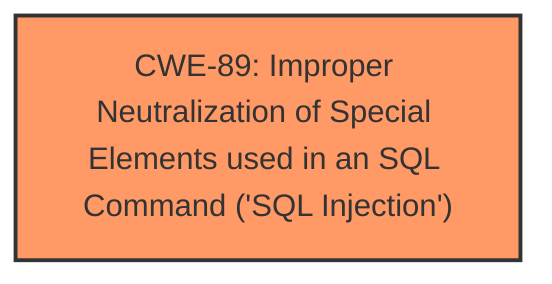

# Enhanced Analysis for CVE-2025-3296

# Summary
| CWE ID | CWE Name | Confidence | CWE Abstraction Level | CWE Vulnerability Mapping Label | CWE-Vulnerability Mapping Notes |
|---|---|---|---|---|---|
| CWE-89 | Improper Neutralization of Special Elements used in an SQL Command ('SQL Injection') | 1.0 | Base | Allowed | Primary CWE: The vulnerability is due to the manipulation of the argument ID leading to SQL injection. |

## Evidence and Confidence

*   **Confidence Score:** 1.0
*   **Evidence Strength:** HIGH

## Relationship Analysis
The primary relationship to consider is the parent-child relationship. CWE-89 is a base-level CWE, and no more specific child CWE is identified that would be a better fit. There are no chain relationships identified as relevant. The abstraction level is appropriate as Base.



## Vulnerability Chain
The vulnerability chain starts with the **improper neutralization** of input, specifically the ID argument in the `delete_customer` function, which leads directly to **SQL injection**.

## Summary of Analysis
The vulnerability description explicitly states that the manipulation of the argument ID leads to **SQL injection**. The retriever results strongly support CWE-89 as the primary CWE. The description matches the CWE-89 description perfectly: "The product constructs all or part of an SQL command using externally-influenced input from an upstream component, but it does not neutralize or incorrectly neutralizes special elements that could modify the intended SQL command." The evidence is strong, and the confidence is high.

CWE-79, CWE-99, CWE-117, CWE-434, CWE-1336, CWE-266, CWE-341, CWE-96 and CWE-73 were considered, but rejected because the vulnerability description clearly points to SQL Injection as the root cause, and none of the other CWEs are applicable.


## CWE Relationship Analysis

Current CWEs represent these abstraction levels: .


### Vulnerability Chain Analysis

**Chain starting from CWE-89:**
- 89 (Improper Neutralization of Special Elements used in an SQL Command ('SQL Injection')) - ROOT


**Chain starting from CWE-99:**
- 99 (Improper Control of Resource Identifiers ('Resource Injection')) - ROOT


### CWE Relationship Diagram

```mermaid
graph TD
    classDef primary fill:#f96,stroke:#333,stroke-width:2px
    classDef secondary fill:#69f,stroke:#333
    classDef tertiary fill:#9e9,stroke:#333
```