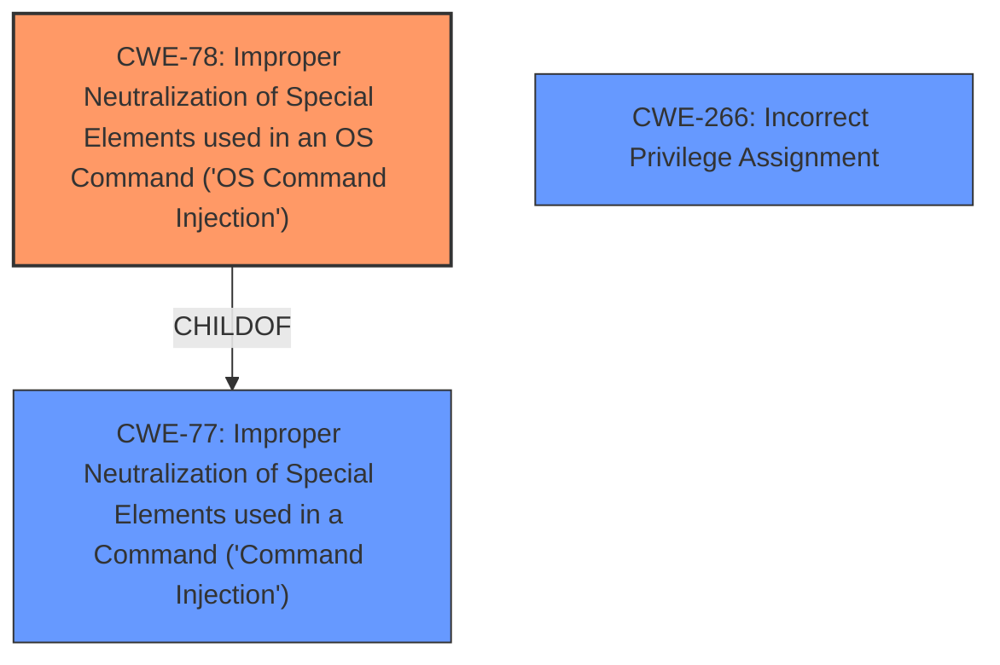

# Analysis Report for CVE-2025-33025

# Vulnerability Analysis Report: CVE-2025-33025

## Description

A vulnerability has been identified in RUGGEDCOM ROX MX5000 (All versions < V2.16.5), RUGGEDCOM ROX MX5000RE (All versions < V2.16.5), RUGGEDCOM ROX RX1400 (All versions < V2.16.5), RUGGEDCOM ROX RX1500 (All versions < V2.16.5), RUGGEDCOM ROX RX1501 (All versions < V2.16.5), RUGGEDCOM ROX RX1510 (All versions < V2.16.5), RUGGEDCOM ROX RX1511 (All versions < V2.16.5), RUGGEDCOM ROX RX1512 (All versions < V2.16.5), RUGGEDCOM ROX RX1524 (All versions < V2.16.5), RUGGEDCOM ROX RX1536 (All versions < V2.16.5), RUGGEDCOM ROX RX5000 (All versions < V2.16.5). The traceroute tool in the web interface of affected devices is vulnerable to **command injection** due to **missing server side input sanitation**. This could allow an authenticated remote attacker to execute arbitrary code with root privileges.

## Vulnerability Description Key Phrases

- **Component:** traceroute tool in web interface
- **Rootcause:** missing server side input sanitation
- **Weakness:** command injection
- **Product:** RUGGEDCOM ROX MX5000, RUGGEDCOM ROX MX5000RE, RUGGEDCOM ROX RX1400, RUGGEDCOM ROX RX1500, RUGGEDCOM ROX RX1501, RUGGEDCOM ROX RX1510, RUGGEDCOM ROX RX1511, RUGGEDCOM ROX RX1512, RUGGEDCOM ROX RX1524, RUGGEDCOM ROX RX1536, RUGGEDCOM ROX RX5000
- **Impact:** execute arbitrary code with root privileges
- **Attacker:** authenticated remote attacker
- **Version:** All versions < V2.16.5

## Analysis (with Relationship Data)

# Summary
| CWE ID | CWE Name | Confidence | CWE Abstraction Level | CWE Vulnerability Mapping Label | CWE-Vulnerability Mapping Notes |
|---|---|---|---|---|---|
| CWE-78 | Improper Neutralization of Special Elements used in an OS Command ('OS Command Injection') | 1.0 | Base | Primary | Allowed |
| CWE-266 | Incorrect Privilege Assignment | 0.6 | Base | Secondary | Allowed |

## Evidence and Confidence

*   **Confidence Score:** 0.9
*   **Evidence Strength:** HIGH

## Relationship Analysis
The primary relationship that influenced the decision was the parent-child relationship between CWE-77 and CWE-78. CWE-78 is a specific type of command injection that occurs at the OS level, which aligns with the vulnerability description. The relationship between privileges and permissions as it pertains to the impact of code execution with root privileges lead to the consideration of CWE-266 as a secondary factor.



## Vulnerability Chain
The vulnerability chain starts with **missing server side input sanitation**, leading to **command injection**, and ultimately resulting in the ability to execute arbitrary code with root privileges.

## Summary of Analysis
The primary selection of CWE-78 is strongly supported by the vulnerability description which explicitly states a **command injection** vulnerability in the traceroute tool due to **missing server side input sanitation**. The impact of arbitrary code execution with root privileges further reinforces this selection.

The decision to map CWE-78 is based on direct evidence from the vulnerability description, which explicitly mentions **command injection** due to **missing server side input sanitation**. The description states: "The traceroute tool in the web interface of affected devices is vulnerable to **command injection** due to **missing server side input sanitation**." This statement clearly aligns with the definition of CWE-78, which involves the improper neutralization of special elements used in an OS command, allowing an attacker to inject arbitrary commands.

The secondary consideration of CWE-266, while not explicitly detailed, stems from the impact described: "This could allow an authenticated remote attacker to execute arbitrary code with root privileges." This implies that the attacker, through the command injection, is gaining unauthorized privileges, which is related to incorrect privilege assignment. The high CVSS score also suggests a significant security impact due to the vulnerability.

The retriever results also support the selection of CWE-78, with high similarity scores. The graph relationships show that CWE-78 is a child of CWE-77, making it a more specific and appropriate choice given the available information.

The final selection of CWE-78 as the primary CWE is based on its direct relevance to the vulnerability description and the supporting evidence from the retriever results and graph relationships. The CWE is at the optimal level of specificity, providing a clear and accurate representation of the weakness.

Relevant CWE Information:

# Enhanced Context (25 CWEs)
The following CWEs were identified as potentially relevant to this vulnerability:

## CWE-280: Improper Handling of Insufficient Permissions or Privileges 
**Abstraction Level**: Base
**Similarity Score**: 0.79
**Source**: dense

**Description**:
The product does not handle or incorrectly handles when it has insufficient privileges to access resources or functionality as specified by their permissions. This may cause it to follow unexpected code paths that may leave the product in an invalid state.

**Mapping Guidance**:
- Usage: Allowed
- Rationale: This CWE entry is at the Base level of abstraction, which is a preferred level of abstraction for mapping to the root causes of vulnerabilities.


## CWE-267: Privilege Defined With Unsafe Actions
**Abstraction Level**: Base
**Similarity Score**: 0.79
**Source**: dense

**Description**:
A particular privilege, role, capability, or right can be used to perform unsafe actions that were not intended, even when it is assigned to the correct entity.

**Mapping Guidance**:
- Usage: Allowed
- Rationale: This CWE entry is at the Base level of abstraction, which is a preferred level of abstraction for mapping to the root causes of vulnerabilities.


## CWE-74: Improper Neutralization of Special Elements in Output Used by a Downstream Component ('Injection')
**Abstraction Level**: Class
**Similarity Score**: 0.79
**Source**: dense

**Description**:
The product constructs all or part of a command, data structure, or record using externally-influenced input from an upstream component, but it does not neutralize or incorrectly neutralizes special elements that could modify how it is parsed or interpreted when it is sent to a downstream component.

**Mapping Guidance**:
- Usage: Discouraged
- Rationale: CWE-74 is high-level and often misused when lower-level weaknesses are more appropriate.


## CWE-41: Improper Resolution of Path Equivalence
**Abstraction Level**: Base
**Similarity Score**: 0.78
**Source**: dense

**Description**:
The product is vulnerable to file system contents disclosure through path equivalence. Path equivalence involves the use of special characters in file and directory names. The associated manipulations are intended to generate multiple names for the same object.

**Mapping Guidance**:
- Usage: Allowed
- Rationale: This CWE entry is at the Base level of abstraction, which is a preferred level of abstraction for mapping to the root causes of vulnerabilities.


## CWE-668: Exposure of Resource to Wrong Sphere
**Abstraction Level**: Class
**Similarity Score**: 0.78
**Source**: dense

**Description**:
The product exposes a resource to the wrong control sphere, providing unintended actors with inappropriate access to the resource.

**Mapping Guidance**:
- Usage: Discouraged
- Rationale: CWE-668 is high-level and is often misused as a catch-all when lower-level CWE IDs might be applicable. It is sometimes used for low-information vulnerability reports [REF-1287]. It is a level-1 Class (i.e., a child of a Pillar). It is not useful for trend analysis.


## CWE-266: Incorrect Privilege Assignment
**Abstraction Level**: Base
**Similarity Score**: 0.78
**Source**: dense

**Description**:
A product incorrectly assigns a privilege to a particular actor, creating an unintended sphere of control for that actor.

**Mapping Guidance**:
- Usage: Allowed
- Rationale: This CWE entry is at the Base level of abstraction, which is a preferred level of abstraction for mapping to the root causes of vulnerabilities.


## CWE-345: Insufficient Verification of Data Authenticity
**Abstraction Level**: Class
**Similarity Score**: 0.78
**Source**: dense

**Description**:
The product does not sufficiently verify the origin or authenticity of data, in a way that causes it to accept invalid data.

**Mapping Guidance**:
- Usage: Discouraged
- Rationale: This CWE entry is a level-1 Class (i.e., a child of a Pillar). It might have lower-level children that would be more appropriate


## CWE-755: Improper Handling of Exceptional Conditions
**Abstraction Level**: Class
**Similarity Score**: 0.77
**Source**: dense

**Description**:
The product does not handle or incorrectly handles an exceptional condition.

**Mapping Guidance**:
- Usage: Discouraged
- Rationale: This CWE entry is a level-1 Class (i.e., a child of a Pillar). It might have lower-level children that would be more appropriate


## CWE-274: Improper Handling of Insufficient Privileges
**Abstraction Level**: Base
**Similarity Score**: 0.77
**Source**: dense

**Description**:
The product does not handle or incorrectly handles when it has insufficient privileges to perform an operation, leading to resultant weaknesses.

**Mapping Guidance**:
- Usage: Discouraged
- Rationale: This CWE entry could be deprecated in a future version of CWE.


## CWE-23: Relative Path Traversal
**Abstraction Level**: Base
**Similarity Score**: 0.77
**Source**: dense

**Description**:
The product uses external input to construct a pathname that should be within a restricted directory, but it does not properly neutralize sequences such as ".." that can resolve to a location that is outside of that directory.

**Mapping Guidance**:
- Usage: Allowed
- Rationale: This CWE entry is at the Base level of abstraction, which is a preferred level of abstraction for mapping to the root causes of vulnerabilities.


## CWE-269: Improper Privilege Management
**Abstraction Level**: Class
**Similarity Score**: 2173.56
**Source**: sparse

**Description**:
The product does not properly assign, modify, track, or check privileges for an actor, creating an unintended sphere of control for that actor.

**Mapping Guidance**:
- Usage: Discouraged


## CWE Relationship Analysis

Current CWEs represent these abstraction levels: .


### Vulnerability Chain Analysis

**Chain starting from CWE-274:**
- 274 (Improper Handling of Insufficient Privileges) - ROOT


**Chain starting from CWE-280:**
- 280 (Improper Handling of Insufficient Permissions or Privileges ) - ROOT


### CWE Relationship Diagram

```mermaid
graph TD
    classDef primary fill:#f96,stroke:#333,stroke-width:2px
    classDef secondary fill:#69f,stroke:#333
    classDef tertiary fill:#9e9,stroke:#333
```


*Report generated on 2025-07-14 20:09:11*
