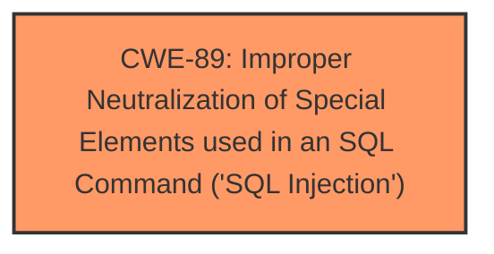

# Raw Analyzer Response for CVE-2025-3306

# Summary
| CWE ID | CWE Name | Confidence | CWE Abstraction Level | CWE Vulnerability Mapping Label | CWE-Vulnerability Mapping Notes |
|---|---|---|---|---|---|
| CWE-89 | Improper Neutralization of Special Elements used in an SQL Command ('SQL Injection') | 1.0 | Base | Allowed | Primary CWE. The vulnerability is an SQL injection due to **insufficient input validation**. |

## Evidence and Confidence

*   **Confidence Score:** 1.0
*   **Evidence Strength:** HIGH

## Relationship Analysis
The primary relationship that influenced the decision was the direct match of the vulnerability description to the CWE-89 description. While other CWEs were considered, none as closely matched the described **SQL Injection** vulnerability.

## Vulnerability Chain
The vulnerability chain is straightforward:
1.  **Root Cause:** **Insufficient user input validation** of the 'fullname' parameter in the '/don.php' file. (CWE-89)
2.  **Impact:** Unauthorized database access, sensitive data leakage, data tampering, comprehensive system control, and service interruption.

## Summary of Analysis
The analysis is based on the provided evidence, which clearly indicates an **SQL injection** vulnerability. The "CVE Reference Links Content Summary" explicitly states the root cause as insufficient user input validation of the 'fullname' parameter, leading to the ability to inject malicious SQL queries.

The retriever results strongly support CWE-89 as the primary candidate, with a score of 1.0. The description of CWE-89 perfectly aligns with the vulnerability description: "The product constructs all or part of an SQL command using externally-influenced input...but it does not neutralize or incorrectly neutralizes special elements..."

The other CWEs from **Complete CWE Specifications** were considered but not used because they did not accurately represent the root cause of the vulnerability. For example, CWE-79 (Cross-site Scripting) is related to web page generation, not direct SQL command construction. CWE-434 (Unrestricted Upload of File with Dangerous Type) is about file uploads, which is not relevant to this vulnerability.

The selection of CWE-89 is at the optimal level of specificity, as it directly addresses the **SQL injection** vulnerability, which is a base-level weakness.