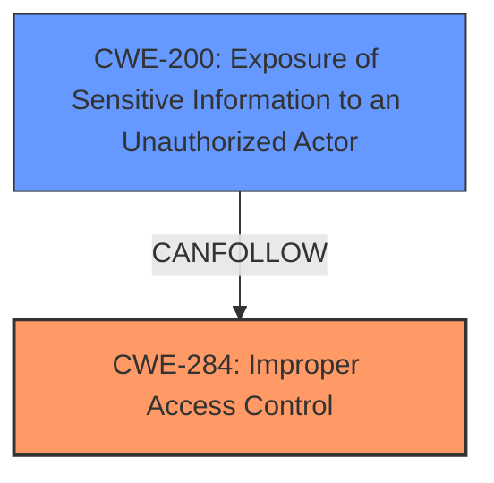

# Analysis Report for CVE-2025-33072

# Vulnerability Analysis Report: CVE-2025-33072

## Description

**Improper access control** in Azure allows an unauthorized attacker to disclose information over a network.

## Vulnerability Description Key Phrases

- **Rootcause:** Improper access control
- **Impact:** disclose information
- **Vector:** network
- **Attacker:** unauthorized attacker
- **Product:** Azure

## Analysis (with Relationship Data)

# Summary
| CWE ID  | CWE Name                                                      | Confidence | CWE Abstraction Level | CWE Vulnerability Mapping Label | CWE-Vulnerability Mapping Notes |
| :-------- | :------------------------------------------------------------ | :--------- | :---------------------- | :------------------------------ | :------------------------------ |
| CWE-284   | Improper Access Control                                       | 0.75       | Pillar                  | Primary CWE                     | Discouraged                   |
| CWE-200   | Exposure of Sensitive Information to an Unauthorized Actor  | 0.5        | Class                   | Secondary Candidate             | Discouraged                   |

## Evidence and Confidence

*   **Confidence Score:** 0.7
*   **Evidence Strength:** MEDIUM

## Relationship Analysis
The primary CWE is CWE-284, which is a high-level category. The vulnerability description indicates a general **improper access control** issue, but lacks specific details to pinpoint the root cause. CWE-200 could be a possible result of the **improper access control**.



## Vulnerability Chain
The vulnerability chain begins with **improper access control** (CWE-284), leading to the disclosure of sensitive information (CWE-200). The chain is: Improper Access Control -> Information Disclosure

## Summary of Analysis
The initial assessment focused on the **improper access control** aspect of the vulnerability, aligning with the provided description. The analysis considered several CWEs, ultimately settling on CWE-284 as the primary weakness due to the lack of specific details regarding the root cause.

The decision to use CWE-284 is based on the fact that the vulnerability description states **"Improper access control"** without specifying the type of access control issue (authentication, authorization, etc.). Since a more specific CWE cannot be determined, CWE-284 is used as the primary CWE as advised in the guidance.

The choice of CWE-284 is influenced by the guidance provided, which states that CWE-284 should be used when the root cause of the access control failure is unclear. The evidence in the vulnerability description directly supports this classification: **"Improper access control"**.

Relevant CWE Information:

## CWE-284: Improper Access Control
**Abstraction Level**: Pillar
**Description**: The product does not adequately control access to resources or functions, allowing unintended users to perform actions or access data that they should not be allowed to.
**Mapping Guidance**: Discouraged - Use a more specific child CWE like 285, 862, 863, or 306 is appropriate.

## CWE-200: Exposure of Sensitive Information to an Unauthorized Actor
**Abstraction Level**: Class
**Description**: The product exposes sensitive information to an actor that is not explicitly authorized to have that information. The sensitive information could be stored in a file, database, or other location.
**Mapping Guidance**: Discouraged - It is better to use a more specific CWE.

# Detailed Analysis

## CWE-284: Improper Access Control

*   **Explanation:** The vulnerability description explicitly mentions **"Improper access control"**. This indicates a failure in the system's access control mechanisms, allowing unauthorized access to resources or functionalities.
*   **Security Implications:** **Improper access control** can lead to unauthorized data access, modification, or deletion, potentially compromising the confidentiality, integrity, and availability of the system.
*   **Relationship:** CWE-284 is a high-level category. More specific CWEs such as CWE-285 (Improper Authorization), CWE-306 (Missing Authentication for Critical Function), CWE-862 (Missing Authorization), and CWE-863 (Incorrect Authorization) could be applicable if more details were available.
*   **Usage:** Allowed-with-Review: CWE-284 is a high-level category that should be avoided if a more specific child CWE is available. In this case, the limited information makes it the most appropriate choice.
*   **Confidence:** 0.75

## CWE-200: Exposure of Sensitive Information to an Unauthorized Actor
*   **Explanation:** The vulnerability description notes that the **improper access control** leads to the disclosure of information. This aligns with CWE-200, where sensitive information is exposed to an unauthorized actor.
*   **Security Implications:** Exposure of sensitive information can lead to privacy violations, identity theft, financial loss, and reputational damage.
*   **Relationship:** CWE-200 is a class-level weakness. It can be a consequence of **improper access control** (CWE-284).
*   **Usage:** Discouraged. It is better to use a more specific CWE.
*   **Confidence:** 0.5

## Other CWEs Considered and Rejected

*   **CWE-285, CWE-306, CWE-862, CWE-863:** These CWEs relate to specific types of access control failures (authorization, authentication). Since the vulnerability description lacks specific details, these CWEs were not selected.
*   **CWE-639: Authorization Bypass Through User-Controlled Key**: This CWE is about modifying a key value to gain access to another user's data, but it is not applicable given that there is no evidence about user keys in the description.
*   **CWE-321: Use of Hard-coded Cryptographic Key**: This vulnerability is about hard-coded keys, which is not present in the description.
*   **CWE-1220: Insufficient Granularity of Access Control**: This is about a more specific issue of granularity, but the description does not have enough detail to select this.
*   **CWE-613: Insufficient Session Expiration**: This is about session expiration, which is not present in the description.


## CWE Relationship Analysis

Current CWEs represent these abstraction levels: .


### Vulnerability Chain Analysis

**Chain starting from CWE-863:**
- 863 (Incorrect Authorization) - ROOT


**Chain starting from CWE-321:**
- 321 (Use of Hard-coded Cryptographic Key) - ROOT


### CWE Relationship Diagram

```mermaid
graph TD
    classDef primary fill:#f96,stroke:#333,stroke-width:2px
    classDef secondary fill:#69f,stroke:#333
    classDef tertiary fill:#9e9,stroke:#333
```


*Report generated on 2025-07-14 20:11:36*
