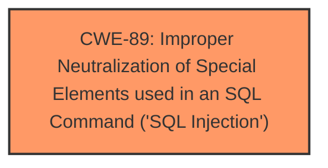

# Analysis Report for CVE-2025-3312

# Vulnerability Analysis Report: CVE-2025-3312

## Description

A vulnerability, which was classified as critical, has been found in PHPGurukul Men Salon Management System 1.0. This issue affects some unknown processing of the file /admin/add-customer-services.php. The manipulation of the argument sids[] leads to **sql injection**. The attack may be initiated remotely. The exploit has been disclosed to the public and may be used.

## Vulnerability Description Key Phrases

- **Weakness:** sql injection
- **Vector:** manipulation of the argument sids[]
- **Product:** PHPGurukul Men Salon Management System
- **Version:** 1
- **Component:** /admin/add-customer-services.php

## Analysis (with Relationship Data)

# Summary
| CWE ID | CWE Name | Confidence | CWE Abstraction Level | CWE Vulnerability Mapping Label | CWE-Vulnerability Mapping Notes |
|---|---|---|---|---|---|
| CWE-89 | Improper Neutralization of Special Elements used in an SQL Command ('SQL Injection') | 1.0 | Base | Allowed | Primary CWE. The vulnerability stems from insufficient user input validation of the `sids[]` parameter, allowing attackers to inject malicious SQL queries. |

## Evidence and Confidence

*   **Confidence Score:** 1.0
*   **Evidence Strength:** HIGH

## Relationship Analysis
The primary identified CWE is CWE-89, which is at the Base level of abstraction. This is a good level of specificity. There are no parent-child relationships that were particularly relevant in this case. The focus is on the **improper neutralization** that leads directly to **SQL injection**.



## Vulnerability Chain
The vulnerability chain starts with **insufficient input validation** of the `sids[]` parameter, which allows for **SQL injection**. This leads to potential unauthorized database access, sensitive data leakage, data tampering, comprehensive system control, and even service interruption.

## Summary of Analysis
The analysis is based on the provided evidence, particularly the "CVE Reference Links Content Summary," which explicitly states that the root cause is insufficient user input validation of the `sids[]` parameter, allowing attackers to inject malicious SQL queries. The payload example reinforces this. The description matches the definition of CWE-89 perfectly, so it is the best fit.

The other CWEs were considered, but rejected because they didn't fit the root cause as well as CWE-89:
*   CWE-79 (Cross-Site Scripting): This CWE is related to web page generation, which is not the case here. The vulnerability lies in the SQL query construction.
*   CWE-434 (Unrestricted Upload of File with Dangerous Type): This CWE is not relevant since the vulnerability is not related to file uploads.

The selection of CWE-89 is at the optimal level of specificity, as it directly addresses the **SQL injection** vulnerability caused by **improper neutralization**.

Relevant CWE Information:


## CWE Relationship Analysis

Current CWEs represent these abstraction levels: .


### Vulnerability Chain Analysis

**Chain starting from CWE-89:**
- 89 (Improper Neutralization of Special Elements used in an SQL Command ('SQL Injection')) - ROOT


**Chain starting from CWE-79:**
- 79 (Improper Neutralization of Input During Web Page Generation ('Cross-site Scripting')) - ROOT


### CWE Relationship Diagram

```mermaid
graph TD
    classDef primary fill:#f96,stroke:#333,stroke-width:2px
    classDef secondary fill:#69f,stroke:#333
    classDef tertiary fill:#9e9,stroke:#333
```


*Report generated on 2025-07-14 20:13:19*
