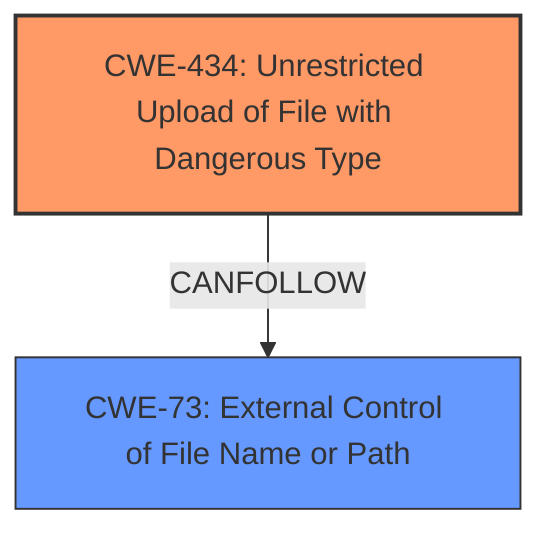

# Analysis for CVE-2025-3324

# Summary
| CWE ID | CWE Name | Confidence | CWE Abstraction Level | CWE Vulnerability Mapping Label | CWE-Vulnerability Mapping Notes |
|---|---|---|---|---|---|
| CWE-434 | Unrestricted Upload of File with Dangerous Type | 0.9 | Base | Allowed | Primary CWE |

## Evidence and Confidence

*   **Confidence Score:** 0.9
*   **Evidence Strength:** MEDIUM

## Relationship Analysis
The primary relationship influencing the decision is the direct match of the vulnerability description to the CWE-434 description. There are peer and follow-on relationships with other file-related CWEs like CWE-73, but the core issue is allowing unrestricted uploads, which is the direct definition of CWE-434. The abstraction level is Base, which is preferred.

## Vulnerability Chain
The vulnerability chain starts with the **unrestricted upload** due to the **manipulation of the argument File**, leading to a critical impact. The root cause is the **lack of restrictions** on file uploads, and the impact is the potential execution of dangerous files.

## Summary of Analysis
The analysis is based on the vulnerability description stating that the **manipulation of the argument File leads to unrestricted upload.** This aligns directly with CWE-434, which describes the product allowing the upload or transfer of dangerous file types. The retriever results also list CWE-434 as a top candidate.

The selection of CWE-434 is at the optimal level of specificity because it precisely captures the nature of the vulnerability: **unrestricted upload** of potentially dangerous files. Other CWEs, such as CWE-73 (External Control of File Name or Path), could be relevant in a secondary context if the file name or path were also externally controlled, but the primary issue is the lack of restrictions on the file type itself.

Relevant CWE Information:

# Enhanced Context (25 CWEs)
The following CWEs were identified as potentially relevant to this vulnerability:

## CWE-434: Unrestricted Upload of File with Dangerous Type
**Abstraction Level**: Base
**Similarity Score**: 0.78
**Source**: dense

**Description**:
The product allows the upload or transfer of dangerous file types that are automatically processed within its environment.

**Mapping Guidance**:
- Usage: Allowed
- Rationale: This CWE entry is at the Base level of abstraction, which is a preferred level of abstraction for mapping to the root causes of vulnerabilities.

# Vulnerability Description
A vulnerability, which was classified as critical, has been found in godcheese/code-projects Nimrod 0.8. Affected by this issue is some unknown functionality of the file FileRestController.java. The **manipulation of the argument File leads to unrestricted upload**. The attack may be launched remotely. The exploit has been disclosed to the public and may be used.

### Vulnerability Description Key Phrases
- **impact:** unrestricted upload
- **vector:** manipulation of the argument File
- **product:** godcheese/code-projects Nimrod
- **version:** 0.8
- **component:** FileRestController.java

## CVE Reference Links Content Summary
UNRELATED

## Retriever Results

### Top Combined Results

| Rank | CWE ID | Name | Abstraction | Usage  | Retrievers | Individual Scores |
|------|--------|------|-------------|-------|------------|-------------------|
| 1 | 89 | Improper Neutralization of Special Elements used in an SQL Command ('SQL Injection') | Base | Allowed | sparse | 0.146 |
| 2 | 79 | Improper Neutralization of Input During Web Page Generation ('Cross-site Scripting') | Base | Allowed | sparse | 0.139 |
| 3 | 434 | Unrestricted Upload of File with Dangerous Type | Base | Allowed | sparse | 0.125 |
| 4 | 1336 | Improper Neutralization of Special Elements Used in a Template Engine | Base | Allowed | sparse | 0.115 |
| 5 | 117 | Improper Output Neutralization for Logs | Base | Allowed | sparse | 0.111 |
| 6 | 306 | Missing Authentication for Critical Function | Base | Allowed | sparse | 0.111 |
| 7 | 705 | Incorrect Control Flow Scoping | Class | Allowed-with-Review | sparse | 0.110 |
| 8 | 334 | Small Space of Random Values | Base | Allowed | sparse | 0.110 |
| 9 | 790 | Improper Filtering of Special Elements | Class | Allowed-with-Review | dense | 0.586 |
| 10 | 22 | Improper Limitation of a Pathname to a Restricted Directory ('Path Traversal') | Base | Allowed | graph | 0.002 |

CWE-89, CWE-79, CWE-1336, and CWE-117 were considered but deemed less relevant. CWE-89 ('SQL Injection'), CWE-79 ('Cross-site Scripting'), and CWE-1336 (Improper Neutralization of Special Elements Used in a Template Engine) imply a failure to neutralize specific elements, which is not directly stated in the vulnerability description. CWE-117 (Improper Output Neutralization for Logs) concerns log outputs, which is not the primary issue described.