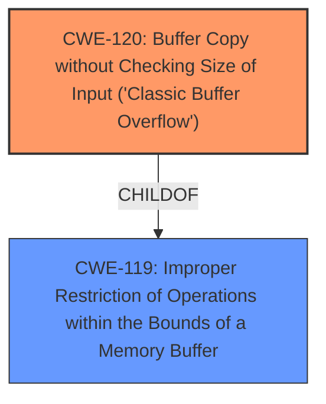

# Analysis for CVE-2025-3328

# Summary
| CWE ID | CWE Name | Confidence | CWE Abstraction Level | CWE Vulnerability Mapping Label | CWE-Vulnerability Mapping Notes |
|---|---|---|---|---|---|
| CWE-120 | Buffer Copy without Checking Size of Input ('Classic Buffer Overflow') | 1.00 | Base | Allowed-with-Review | Primary CWE |

## Evidence and Confidence

*   **Confidence Score:** 1.00
*   **Evidence Strength:** HIGH

## Relationship Analysis
The primary CWE selected is CWE-120, which is a Base level CWE. CWE-120 has a parent CWE of CWE-119, which is a Class level CWE. While CWE-119 broadly describes memory buffer issues, CWE-120 is more specific to buffer copies without size checking, aligning directly with the vulnerability description. The Retriever Results listed CWE-120 after CWE-119 which also influences the selection of the CWE.

## Vulnerability Chain
The vulnerability chain starts with the **improper buffer copy operation without checking the size of the input** (CWE-120). This leads to a **buffer overflow**, allowing an attacker to potentially overwrite memory and execute arbitrary code.

## Summary of Analysis
The vulnerability description explicitly mentions a **buffer overflow** caused by manipulating the `ssid` or `timeZone` arguments in the `form_fast_setting_wifi_set` function. The **root cause** is the **lack of size checking when copying data into a buffer**, which corresponds directly to CWE-120 "Buffer Copy without Checking Size of Input ('Classic Buffer Overflow')". The retriever results also suggested CWE-120 as one of the top candidates.

Relevant CWE Information:

# Enhanced Context (25 CWEs)
The following CWEs were identified as potentially relevant to this vulnerability:

## CWE-120: Buffer Copy without Checking Size of Input ('Classic Buffer Overflow')
**Abstraction Level**: base
**Similarity Score**: 3.65
**Source**: graph

**Description**:
CWE-120: Buffer Copy without Checking Size of Input ('Classic Buffer Overflow')

**Mapping Guidance**:
- Usage: Allowed-with-Review
- Rationale: There are some indications that this CWE ID might be misused and selected simply because it mentions "buffer overflow" - an increasingly vague term. This CWE entry is only appropriate for "Buffer Copy" operations (not buffer reads), in which where there is no "Checking [the] Size of Input", and (by implication of the copy) writing past the end of the buffer.

**Relationships**:
- PARENTOF -> CWE-785
- CANFOLLOW -> CWE-456
- CANFOLLOW -> CWE-416
- CANFOLLOW -> CWE-231
- CANFOLLOW -> CWE-170

I considered CWE-119 "Improper Restriction of Operations within the Bounds of a Memory Buffer" but it is too high level and doesn't describe the specific error. CWE-120 is preferred because it is a base level CWE.