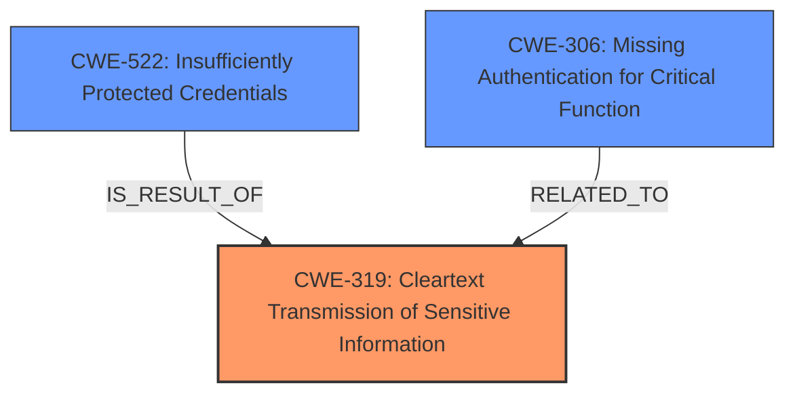

# Raw Analyzer Response for CVE-2025-3329

# Summary
| CWE ID | CWE Name | Confidence | CWE Abstraction Level | CWE Vulnerability Mapping Label | CWE-Vulnerability Mapping Notes |
|---|---|---|---|---|---|
| CWE-319 | Cleartext Transmission of Sensitive Information | 1.0 | Base | Allowed | Primary CWE. The vulnerability description explicitly states "**cleartext transmission** of sensitive information".|
| CWE-522 | Insufficiently Protected Credentials | 0.7 | Class | Allowed-with-Review | Secondary Candidate. The CVE Reference indicates the system relies on cookies for authentication and lacks encryption, which leads to credentials being insufficiently protected. |
| CWE-306 | Missing Authentication for Critical Function | 0.5 | Base | Allowed | Secondary Candidate. The CVE Reference indicates the system lacks encryption and is therefore vulnerable to unauthorized access. |

## Evidence and Confidence

*   **Confidence Score:** 0.9
*   **Evidence Strength:** HIGH

## Relationship Analysis
The primary relationship that influenced the CWE selection is the direct match between the vulnerability description's key phrase "**cleartext transmission**" and CWE-319. Further supporting evidence in the CVE Reference Links content summary confirms the **lack of encryption** as a root cause, making CWE-319 the most appropriate primary classification.

CWE-522 and CWE-306 are related to CWE-319. While CWE-319 describes the **cleartext transmission**, CWE-522 addresses the broader issue of **insufficiently protected credentials**, which is the result of cleartext transmission in this case. CWE-306 describes the **missing authentication** and is a related vulnerability due to **lack of encryption** allowing unauthorized access.

## Vulnerability Chain
The vulnerability chain begins with the **cleartext transmission** of sensitive information (CWE-319), leading to **insufficiently protected credentials** (CWE-522). The **lack of encryption** allows attackers to intercept network traffic and gain **unauthorized access** to the system (CWE-306).

## Summary of Analysis
The initial analysis correctly identified CWE-319 as the primary weakness based on the vulnerability description stating the **cleartext transmission** of sensitive information. The CVE Reference Links content summary strengthens this classification by explicitly mentioning the **lack of encryption**.

The relationship analysis and vulnerability chain identification further refine the understanding of the vulnerability. While CWE-522 and CWE-306 are relevant, they represent secondary weaknesses resulting from the primary issue of cleartext transmission.

The selected CWEs are at the optimal level of specificity because CWE-319 directly addresses the root cause, while CWE-522 and CWE-306 describe the consequences of the **cleartext transmission**.

CWE-79 (Improper Neutralization of Input During Web Page Generation ('Cross-site Scripting')), CWE-89 (Improper Neutralization of Special Elements used in an SQL Command ('SQL Injection')), and CWE-927 (Use of Implicit Intent for Sensitive Communication) were considered but rejected because they do not directly relate to the **cleartext transmission** vulnerability described. The description focuses on the **lack of encryption** in the transmission of sensitive information, not on input validation or intent handling.

**CWE-319**: Cleartext Transmission of Sensitive Information is selected as the primary CWE because the vulnerability description explicitly mentions the **cleartext transmission** of sensitive information. The CVE Reference Links content summary confirms this weakness by highlighting the **lack of encryption**. This allows unauthorized actors to sniff the communication channel and intercept sensitive data.
**CWE-522**: Insufficiently Protected Credentials is a secondary CWE because the CVE Reference Links content summary indicates the system relies on cookies for authentication but lacks encryption. This makes the credentials susceptible to interception and unauthorized retrieval.
**CWE-306**: Missing Authentication for Critical Function is a secondary CWE because the CVE Reference Links content summary points out the **lack of encryption** that can lead to unauthorized access of the system without credentials.