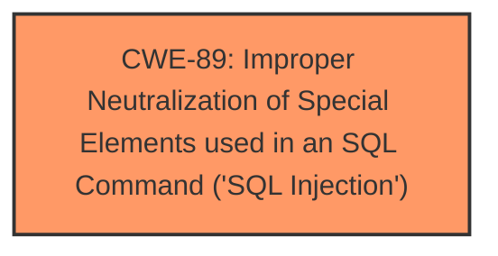

# Analysis Report for CVE-2025-3341

# Vulnerability Analysis Report: CVE-2025-3341

## Description

A vulnerability, which was classified as critical, was found in codeprojects Online Restaurant Management System 1.0. This affects an unknown part of the file /admin/reservation_view.php. The manipulation of the argument ID leads to **sql injection**. It is possible to initiate the attack remotely. The exploit has been disclosed to the public and may be used.

## Vulnerability Description Key Phrases

- **Weakness:** sql injection
- **Vector:** manipulation of ID argument
- **Product:** codeprojects Online Restaurant Management System
- **Version:** 1.0
- **Component:** /admin/reservation_view.php

## Analysis (with Relationship Data)

# Summary
| CWE ID  | CWE Name                                                                                      | Confidence | CWE Abstraction Level | CWE Vulnerability Mapping Label | CWE-Vulnerability Mapping Notes |
| :-------- | :--------------------------------------------------------------------------------------------- | :---------- | :---------------------- | :------------------------------ | :------------------------------- |
| CWE-89  | Improper Neutralization of Special Elements used in an SQL Command ('SQL Injection') | 1         | Base                    | Allowed                       | Primary CWE                     |

## Evidence and Confidence

*   **Confidence Score:** 1
*   **Evidence Strength:** HIGH

## Relationship Analysis
The primary relationship identified is that CWE-89 stands alone as the root cause of the vulnerability. The analysis focuses on the direct identification of SQL Injection as the core issue. No other CWEs are necessary to fully describe the vulnerability based on the evidence.



## Vulnerability Chain
The vulnerability chain consists of a single point:

1.  **Root Cause:** CWE-89 - Improper Neutralization of Special Elements used in an SQL Command ('SQL Injection') due to insufficient input validation of the 'id' parameter.
   - This leads directly to unauthorized database access and potential data tampering.

## Summary of Analysis
The primary vulnerability is clearly SQL Injection (CWE-89). The vulnerability description explicitly states this, and the CVE reference content summary confirms it. The root cause is the **insufficient user input validation** of the 'id' parameter in `/admin/reservation_view.php`. The application directly uses this parameter in SQL queries without proper cleaning or validation. The retriever results also strongly suggest CWE-89 as the primary candidate. Other CWEs were considered but discarded because they did not directly address the root cause.

Relevant CWE Information:

# Enhanced Context (25 CWEs)
The following CWEs were identified as potentially relevant to this vulnerability:

## CWE-89: Improper Neutralization of Special Elements used in an SQL Command ('SQL Injection')
**Abstraction Level**: Base
**Similarity Score**: 0.80
**Source**: dense

**Description**:
The product constructs all or part of an SQL command using externally-influenced input from an upstream component, but it does not neutralize or incorrectly neutralizes special elements that could modify the intended SQL command when it is sent to a downstream component. Without sufficient removal or quoting of SQL syntax in user-controllable inputs, the generated SQL query can cause those inputs to be interpreted as SQL instead of ordinary user data.

**Mapping Guidance**:
- Usage: Allowed
- Rationale: This CWE entry is at the Base level of abstraction, which is a preferred level of abstraction for mapping to the root causes of vulnerabilities.

## CWE-89: Improper Neutralization of Special Elements used in an SQL Command ('SQL Injection')
**Abstraction Level**: Base
**Similarity Score**: 1158.64
**Source**: sparse

**Description**:
The product constructs all or part of an SQL command using externally-influenced input from an upstream component, but it does not neutralize or incorrectly neutralizes special elements that could modify the intended SQL command when it is sent to a downstream component. Without sufficient removal or quoting of SQL syntax in user-controllable inputs, the generated SQL query can cause those inputs to be interpreted as SQL instead of ordinary user data.

**Mapping Guidance**:
- Usage: Allowed
- Rationale: This CWE entry is at the Base level of abstraction, which is a preferred level of abstraction for mapping to the root causes of vulnerabilities.

### Other CWEs Considered but Not Used:

*   **CWE-79 Improper Neutralization of Input During Web Page Generation ('Cross-site Scripting')**: While this is a common web vulnerability, it does not fit the specific context of this issue, which is directly related to SQL queries.
*   **CWE-434 Unrestricted Upload of File with Dangerous Type**: This CWE is irrelevant as the vulnerability does not involve file uploads.
*   **CWE-74 Improper Neutralization of Special Elements in Output Used by a Downstream Component ('Injection')**: This is a more general injection issue, and CWE-89 is more specific to the **SQL Injection** at hand.
*   **CWE-1336 Improper Neutralization of Special Elements Used in a Template Engine**: This is not related to template engine usage.
*   **CWE-117 Improper Output Neutralization for Logs**: This is related to logging, which isn't explicitly mentioned in the description.
*   **CWE-425 Direct Request ('Forced Browsing')**: This is related to authorization bypass, which isn't the primary issue.
*   **CWE-471 Modification of Assumed-Immutable Data (MAID)**: This is not relevant since the vulnerability is due to improper neutralization in an SQL query, not modification of data.
*   **CWE-352 Cross-Site Request Forgery (CSRF)**: This is a different type of web vulnerability and is not relevant to the described issue.
*   **CWE-96 Improper Neutralization of Directives in Statically Saved Code ('Static Code Injection')**: This is about injecting code into static files, which does not match the vulnerability.
*   **CWE-94 Improper Control of Generation of Code ('Code Injection')**: This is a more general code injection issue, and CWE-89 is more specific to **SQL Injection**.


## CWE Relationship Analysis

Current CWEs represent these abstraction levels: .


### Vulnerability Chain Analysis

**Chain starting from CWE-89:**
- 89 (Improper Neutralization of Special Elements used in an SQL Command ('SQL Injection')) - ROOT


**Chain starting from CWE-471:**
- 471 (Modification of Assumed-Immutable Data (MAID)) - ROOT


### CWE Relationship Diagram

```mermaid
graph TD
    classDef primary fill:#f96,stroke:#333,stroke-width:2px
    classDef secondary fill:#69f,stroke:#333
    classDef tertiary fill:#9e9,stroke:#333
```


*Report generated on 2025-07-14 20:21:07*
