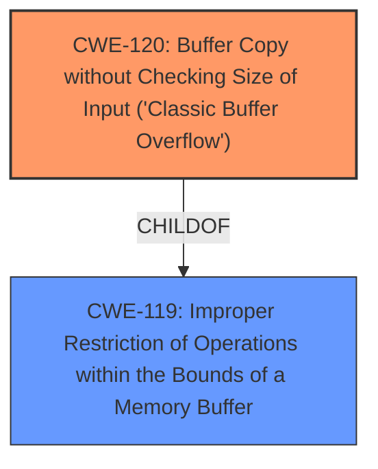

# Analysis for CVE-2025-3378

# Summary
| CWE ID  | CWE Name  | Confidence | CWE Abstraction Level | CWE Vulnerability Mapping Label | CWE-Vulnerability Mapping Notes |
|---|---|---|---|---|---|
| CWE-120 | Buffer Copy without Checking Size of Input ('Classic Buffer Overflow') | 1.0 | Base | Allowed-with-Review | Primary CWE |
| CWE-119 | Improper Restriction of Operations within the Bounds of a Memory Buffer | 0.7 | Class | Discouraged | Secondary Candidate |

## Evidence and Confidence

*   **Confidence Score:** 0.9
*   **Evidence Strength:** HIGH

## Relationship Analysis
The primary CWE selected is CWE-120, which is a Base level CWE and a child of CWE-119. CWE-119 is a more general class that describes improper restrictions within memory buffers. While CWE-119 is listed as the top retriever result, CWE-120 provides a more specific description of the vulnerability as a classic buffer overflow due to a lack of size checking during a buffer copy operation. Therefore, selecting CWE-120 provides more specificity.

## Vulnerability Chain
The vulnerability chain starts with the **lack of input validation** on the size of the input received in the `EPRT` command. This leads to a **buffer overflow** when the server copies the input data into a buffer without checking its size. The impact of this overflow is the potential for arbitrary code execution, allowing an attacker to overwrite the execution flow and inject malicious code.

## Summary of Analysis
The initial analysis focused on identifying the root cause of the vulnerability, which the provided text clearly states is a **buffer overflow** due to **missing input validation**. The `EPRT` command handler in PCMan FTP Server 2.0.7 does not properly validate the size of the input, allowing an attacker to send a crafted command with a payload larger than the allocated buffer. This leads to a classic buffer overflow scenario (CWE-120), where the attacker can overwrite the execution flow and potentially execute arbitrary code.

The selection of CWE-120 is based on both the vulnerability description and the "CVE Reference Links Content Summary," which explicitly mentions the lack of input validation and the buffer overflow. The retriever results also list CWE-120 with a high score.

The decision to choose CWE-120 over the more general CWE-119 is based on the principle of selecting the most specific CWE that accurately describes the vulnerability. While CWE-119 broadly covers improper restrictions within memory buffers, CWE-120 specifically addresses the scenario of a buffer copy operation without checking the size of the input.

Other CWEs Considered but Not Used:

*   CWE-119: Considered as a more general parent of CWE-120, but the more specific CWE-120 was more appropriate.
*   CWE-121: Stack-based Buffer Overflow, more specific that CWE-120, but not clear that this is stack based.
*   CWE-190, CWE-193, CWE-128, CWE-1339: These relate to numeric or arithmetic errors which were not related to the primary root cause of the vulnerability.
*   CWE-89, CWE-79, CWE-434: These relate to other kinds of vulnerabilities (SQL Injection, XSS, Unrestricted Upload) and do not match the vulnerability description.
*   CWE-125: Out-of-bounds Read, not a read, but a write.
*   CWE-705: Incorrect Control Flow Scoping, not the rootcause.
*   CWE-434: Unrestricted Upload of File with Dangerous Type, doesn't match the vulnerability description.

Relevant CWE Information:

*   CWE-120: Buffer Copy without Checking Size of Input ('Classic Buffer Overflow')
    *   **Technical Explanation:** This CWE describes a scenario where data is copied into a buffer without proper bounds checking, leading to a buffer overflow. In this vulnerability, the PCMan FTP Server copies the input from the EPRT command into a buffer without verifying its size, allowing an attacker to overwrite adjacent memory regions.
    *   **Security Implications and Potential Impact:** The primary security implication is the potential for arbitrary code execution. By overwriting the return address or other critical data on the stack, an attacker can redirect the program's execution flow to their own malicious code.
    *   **Parent-Child Relationships:** CWE-120 is a child of CWE-119 (Improper Restriction of Operations within the Bounds of a Memory Buffer), indicating that it is a more specific type of memory boundary violation.
    *   **MITRE Mapping Guidance:** The MITRE mapping guidance for CWE-120 suggests that it is only appropriate for "Buffer Copy" operations where there is no "Checking [the] Size of Input". This aligns perfectly with the vulnerability description, which explicitly mentions the **lack of input validation**.
    *   **Usage:** Allowed-with-Review

*   CWE-119: Improper Restriction of Operations within the Bounds of a Memory Buffer
    *   **Technical Explanation:** This CWE covers a broad range of memory boundary errors. In this context, it relates to the server's failure to properly restrict the size of data written to the buffer.
    *   **Security Implications and Potential Impact:** Similar to CWE-120, this can lead to memory corruption, potentially causing crashes, denial of service, or arbitrary code execution.
    *   **Parent-Child Relationships:** CWE-119 is a parent of CWE-120, representing a more general class of memory boundary errors.
    *   **Usage:** Discouraged