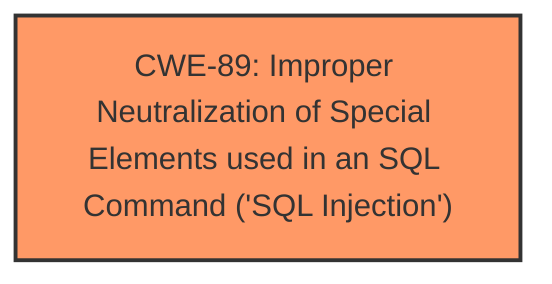

# Raw Analyzer Response for CVE-2025-3402

# Summary
| CWE ID | CWE Name | Confidence | CWE Abstraction Level | CWE Vulnerability Mapping Label | CWE-Vulnerability Mapping Notes |
|---|---|---|---|---|---|
| CWE-89 | Improper Neutralization of Special Elements used in an SQL Command ('SQL Injection') | 1.0 | Base | Primary | Allowed |

## Evidence and Confidence

*   **Confidence Score:** 1.0
*   **Evidence Strength:** HIGH

## Relationship Analysis
The primary identified CWE is CWE-89, which stands alone as the direct root cause. There are no parent-child or chain relationships relevant in this specific case because the provided information directly points to SQL Injection as the primary weakness. The abstraction level is Base, which is appropriate given the specific nature of the vulnerability.

## Vulnerability Chain
The vulnerability chain is straightforward:
1.  **Root Cause:** CWE-89 - Improper Neutralization of Special Elements used in an SQL Command ('SQL Injection') due to the **manipulation of the argument Name**.
2.  **Impact:** Remote attackers can inject SQL commands, potentially leading to unauthorized data access or modification.

## Summary of Analysis
The analysis is strongly based on the provided evidence, specifically the **weakness** being **sql injection** through the **manipulation of the argument Name** in the file `/sysform/042/check.js%70`.

The **Retriever Results** list CWE-89 as the top result with a score of 1.0, confirming that it is the most relevant CWE.

The provided information clearly indicates that the software is vulnerable to SQL injection due to improper neutralization of input. Therefore, selecting CWE-89 is the most accurate and specific classification. The abstraction level is Base, providing sufficient detail for this vulnerability.

Relevant CWE Information:

# Enhanced Context (25 CWEs)
The following CWEs were identified as potentially relevant to this vulnerability:

## CWE-80: Improper Neutralization of Script-Related HTML Tags in a Web Page (Basic XSS)
**Abstraction Level**: Variant
**Similarity Score**: 0.76
**Source**: dense
**Description**:
The product receives input from an upstream component, but it does not neutralize or incorrectly neutralizes special characters such as "<", ">", and "&" that could be interpreted as web-scripting elements when they are sent to a downstream component that processes web pages.
**Why Not Used**: This is related to XSS, which is not the vulnerability being analyzed.

## CWE-89: Improper Neutralization of Special Elements used in an SQL Command ('SQL Injection')
**Abstraction Level**: Base
**Similarity Score**: 0.76
**Source**: dense
**Description**:
The product constructs all or part of an SQL command using externally-influenced input from an upstream component, but it does not neutralize or incorrectly neutralizes special elements that could modify the intended SQL command when it is sent to a downstream component. Without sufficient removal or quoting of SQL syntax in user-controllable inputs, the generated SQL query can cause those inputs to be interpreted as SQL instead of ordinary user data.
**Why Used**: Direct match to the vulnerability being analyzed.

## CWE-74: Improper Neutralization of Special Elements in Output Used by a Downstream Component ('Injection')
**Abstraction Level**: Class
**Similarity Score**: 0.75
**Source**: dense
**Description**:
The product constructs all or part of a command, data structure, or record using externally-influenced input from an upstream component, but it does not neutralize or incorrectly neutralizes special elements that could modify how it is parsed or interpreted when it is sent to a downstream component.
**Why Not Used**: This is a more generic class of injection vulnerabilities, while CWE-89 is a specific type of injection (SQL Injection) which is what the vulnerability description refers to.

## CWE-425: Direct Request ('Forced Browsing')
**Abstraction Level**: Base
**Similarity Score**: 0.74
**Source**: dense
**Description**:
The web application does not adequately enforce appropriate authorization on all restricted URLs, scripts, or files.
**Why Not Used**: This is not related to the vulnerability being analyzed.

## CWE-1236: Improper Neutralization of Formula Elements in a CSV File
**Abstraction Level**: Base
**Similarity Score**: 0.74
**Source**: dense
**Description**:
The product saves user-provided information into a Comma-Separated Value (CSV) file, but it does not neutralize or incorrectly neutralizes special elements that could be interpreted as a command when the file is opened by a spreadsheet product.
**Why Not Used**: This is not related to the vulnerability being analyzed.

## CWE-434: Unrestricted Upload of File with Dangerous Type
**Abstraction Level**: Base
**Similarity Score**: 0.74
**Source**: dense
**Description**:
The product allows the upload or transfer of dangerous file types that are automatically processed within its environment.
**Why Not Used**: This is not related to the vulnerability being analyzed.

## CWE-116: Improper Encoding or Escaping of Output
**Abstraction Level**: Class
**Similarity Score**: 0.74
**Source**: dense
**Description**:
The product prepares a structured message for communication with another component, but encoding or escaping of the data is either missing or done incorrectly. As a result, the intended structure of the message is not preserved.
**Why Not Used**: While encoding issues can contribute to injection vulnerabilities, the description specifies that the vulnerability is **sql injection**.

## CWE-93: Improper Neutralization of CRLF Sequences ('CRLF Injection')
**Abstraction Level**: Base
**Similarity Score**: 0.73
**Source**: dense
**Description**:
The product uses CRLF (carriage return line feeds) as a special element, e.g. to separate lines or records, but it does not neutralize or incorrectly neutralizes CRLF sequences from inputs.
**Why Not Used**: This is not related to the vulnerability being analyzed.

## CWE-79: Improper Neutralization of Input During Web Page Generation ('Cross-site Scripting')
**Abstraction Level**: Base
**Similarity Score**: 0.73
**Source**: dense
**Description**:
The product does not neutralize or incorrectly neutralizes user-controllable input before it is placed in output that is used as a web page that is served to other users.
**Why Not Used**: This is related to XSS, which is not the vulnerability being analyzed.

## CWE-790: Improper Filtering of Special Elements
**Abstraction Level**: Class
**Similarity Score**: 0.73
**Source**: dense
**Description**:
The product receives data from an upstream component, but does not filter or incorrectly filters special elements before sending it to a downstream component.
**Why Not Used**: This is a more generic description of a filtering issue. Since the **weakness** is **sql injection** it is more appropriate to select CWE-89.

## CWE-89: Improper Neutralization of Special Elements used in an SQL Command ('SQL Injection')
**Abstraction Level**: Base
**Similarity Score**: 641.74
**Source**: sparse
**Description**:
The product constructs all or part of an SQL command using externally-influenced input from an upstream component, but it does not neutralize or incorrectly neutralizes special elements that could modify the intended SQL command when it is sent to a downstream component. Without sufficient removal or quoting of SQL syntax in user-controllable inputs, the generated SQL query can cause those inputs to be interpreted as SQL instead of ordinary user data.
**Why Used**: Direct match to the vulnerability being analyzed.

## CWE-116: Improper Encoding or Escaping of Output
**Abstraction Level**: Class
**Similarity Score**: 595.21
**Source**: sparse
**Description**:
The product prepares a structured message for communication with another component, but encoding or escaping of the data is either missing or done incorrectly. As a result, the intended structure of the message is not preserved.
**Why Not Used**: While encoding issues can contribute to injection vulnerabilities, the description specifies that the vulnerability is **sql injection**.

## CWE-79: Improper Neutralization of Input During Web Page Generation ('Cross-site Scripting')
**Abstraction Level**: Base
**Similarity Score**: 586.22
**Source**: sparse
**Description**:
The product does not neutralize or incorrectly neutralizes user-controllable input before it is placed in output that is used as a web page that is served to other users.
**Why Not Used**: This is related to XSS, which is not the vulnerability being analyzed.

## CWE-117: Improper Output Neutralization for Logs
**Abstraction Level**: Base
**Similarity Score**: 548.76
**Source**: sparse
**Description**:
The product does not neutralize or incorrectly neutralizes output that is written to logs.
**Why Not Used**: This is not related to the vulnerability being analyzed.

## CWE-1336: Improper Neutralization of Special Elements Used in a Template Engine
**Abstraction Level**: Base
**Similarity Score**: 538.97
**Source**: sparse