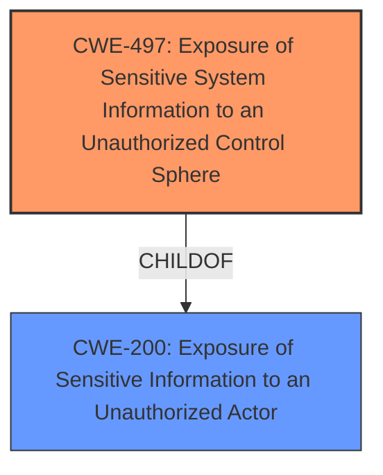

# Enhanced Analysis for CVE-2025-3403

# Summary
| CWE ID | CWE Name | Confidence | CWE Abstraction Level | CWE Vulnerability Mapping Label | CWE-Vulnerability Mapping Notes |
|---|---|---|---|---|---|
| CWE-497 | Exposure of Sensitive System Information to an Unauthorized Control Sphere | 0.8 | Base | Allowed | Primary CWE |
| CWE-200 | Exposure of Sensitive Information to an Unauthorized Actor | 0.6 | Class | Discouraged | Secondary Candidate |

## Evidence and Confidence

*   **Confidence Score:** 0.7
*   **Evidence Strength:** LOW

## Relationship Analysis
The primary CWE selected is CWE-497, which is a Base level CWE. CWE-200 is a Class-level CWE and a parent of CWE-497. The vulnerability description describes **inclusion of sensitive information in source code**, which aligns well with CWE-497.mermaid



## Vulnerability Chain
The chain of events is as follows:
1.  **Root Cause:** CWE-497 (Exposure of Sensitive System Information to an Unauthorized Control Sphere) due to **inclusion of sensitive information in source code**.
2.  Impact: Sensitive information is accessible to unauthorized actors.

## Summary of Analysis
The initial analysis considered CWE-200 due to the phrase "inclusion of sensitive information". However, upon closer inspection, CWE-497, "Exposure of Sensitive System Information to an Unauthorized Control Sphere", is a more precise Base level CWE that better captures the essence of the vulnerability. The vulnerability description explicitly states **inclusion of sensitive information in source code**, making it available to unauthorized users who can view the source code. Since the CVE Reference Links Content Summary is "UNRELATED" there is not much additional evidence to go on.

Relevant CWE Information:

# Enhanced Context (25 CWEs)
The following CWEs were identified as potentially relevant to this vulnerability:

## CWE-497: Exposure of Sensitive System Information to an Unauthorized Control Sphere
**Abstraction Level**: Base
**Similarity Score**: 0.77
**Source**: dense

**Description**:
The product does not properly prevent sensitive system-level information from being accessed by unauthorized actors who do not have the same level of access to the underlying system as the product does.

**Mapping Guidance**:
- Usage: Allowed
- Rationale: This CWE entry is at the Base level of abstraction, which is a preferred level of abstraction for mapping to the root causes of vulnerabilities.
```


## CWE Relationship Analysis

Current CWEs represent these abstraction levels: .


### Vulnerability Chain Analysis

**Chain starting from CWE-200:**
- 200 (Exposure of Sensitive Information to an Unauthorized Actor) - ROOT


**Chain starting from CWE-497:**
- 497 (Exposure of Sensitive System Information to an Unauthorized Control Sphere) - ROOT


### CWE Relationship Diagram

```mermaid
graph TD
    classDef primary fill:#f96,stroke:#333,stroke-width:2px
    classDef secondary fill:#69f,stroke:#333
    classDef tertiary fill:#9e9,stroke:#333
```