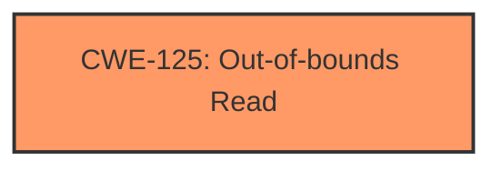

# Analysis for CVE-2025-3406

# Summary
| CWE ID | CWE Name | Confidence | CWE Abstraction Level | CWE Vulnerability Mapping Label | CWE-Vulnerability Mapping Notes |
|---|---|---|---|---|---|
| CWE-125 | Out-of-bounds Read | 1.0 | Base | Primary | Allowed |

## Evidence and Confidence

*   **Confidence Score:** 1.0
*   **Evidence Strength:** HIGH

## Relationship Analysis
The primary relationship that influenced my decision was the direct match of the vulnerability description to the definition of CWE-125. While other CWEs were considered, none had the same level of direct applicability.

## Vulnerability Chain
The vulnerability chain consists of a single step: an **out-of-bounds read** due to manipulation of the argument 'w' in the `stbhw_build_tileset_from_image` function. The root cause is the **improper** handling or validation of the 'w' argument, leading directly to the read.

## Summary of Analysis
The vulnerability description clearly states that the manipulation of the argument 'w' leads to an **out-of-bounds read**. This directly corresponds to CWE-125, "Out-of-bounds Read". The description states: "Affected is the function stbhw_build_tileset_from_image of the component Header Array Handler. The manipulation of the argument w leads to **out-of-bounds read**." The retriever results also list CWE-125 as the top candidate.

The other CWEs were considered but are less directly applicable:
*   CWE-79 (Improper Neutralization of Input During Web Page Generation ('Cross-site Scripting')): Not applicable because the vulnerability is not related to web page generation or cross-site scripting.
*   CWE-191 (Integer Underflow (Wrap or Wraparound)) and CWE-190 (Integer Overflow or Wraparound): While integer issues could potentially be related to the buffer access, the description specifically mentions an **out-of-bounds read**, making CWE-125 a more precise match.
*   CWE-1284 (Improper Validation of Specified Quantity in Input): While this could be a contributing factor, the direct result is the read beyond buffer boundaries, thus CWE-125 is more relevant.
*   CWE-787 (Out-of-bounds Write): While related to out-of-bounds access, the description explicitly states an **out-of-bounds read**, not a write.
*   CWE-908 (Use of Uninitialized Resource): There's no mention of uninitialized resources.

The selection of CWE-125 is at the optimal level of specificity, as it directly describes the observed vulnerability.