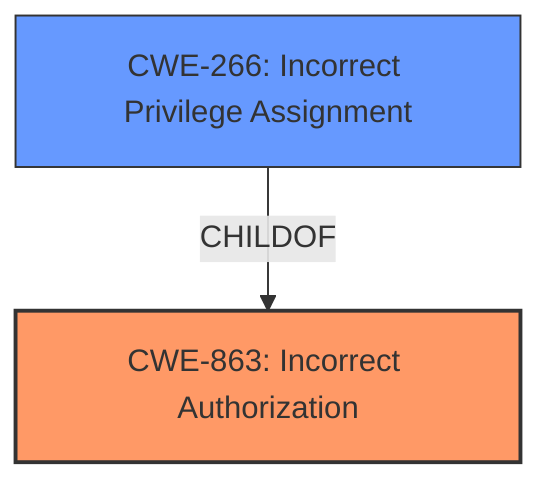

# Raw Analyzer Response for CVE-2025-3418

# Summary
| CWE ID    | CWE Name                                                                  | Confidence | CWE Abstraction Level | CWE Vulnerability Mapping Label | CWE-Vulnerability Mapping Notes |
| :--------- | :------------------------------------------------------------------------ | :--------- | :-------------------- | :------------------------------ | :------------------------------ |
| CWE-863     | Incorrect Authorization                                                   | 0.9        | Class                 | Primary                         | Allowed-with-Review             |
| CWE-266     | Incorrect Privilege Assignment                                            | 0.7        | Base                  | Secondary                       | Allowed                       |

## Evidence and Confidence

*   **Confidence Score:** 0.8
*   **Evidence Strength:** HIGH

## Relationship Analysis
The primary relationship that influenced the CWE selection was the parent-child relationship between CWE-863 (Incorrect Authorization) and more specific base-level CWEs related to privilege management and authorization. The analysis also considered the privilege vs permissions mapping guidance. CWE-863 is selected as the primary because the **plugin not properly restricting user meta values that can be updated through the ajax_edit_save() function**. CWE-266 (Incorrect Privilege Assignment) is a related contributing factor as it can be a child of improper authorization and explains how the authorization leads to privilege escalation.

## Vulnerability Chain
The vulnerability chain starts with **incorrect authorization**, leading to **improper privilege assignment**, and finally resulting in privilege escalation.
  - Root Cause: **Incorrect authorization** in the `ajax_edit_save()` function.
  - Weakness: **Improper privilege assignment** due to missing restrictions on user meta values.
  - Impact: Privilege escalation to administrator level.

## Summary of Analysis
The initial analysis focused on identifying the root cause of the privilege escalation vulnerability in the WPC Admin Columns plugin. The key phrase "**plugin not properly restricting user meta values that can be updated through the ajax_edit_save() function**" pointed towards an authorization issue.

The retriever results highlighted CWE-863 (Incorrect Authorization), CWE-862 (Missing Authorization), and CWE-266 (Incorrect Privilege Assignment) as potential candidates. Given the evidence that the plugin *attempts* to restrict user meta values, but does so improperly, CWE-863 (Incorrect Authorization) was selected as the primary CWE because the **authorization logic is present but flawed**, which is one of the key phrases for that CWE as noted in the privilege vs permissions guidance. CWE-862 was not chosen as there appears to be authorization logic present but the logic is **incorrect**.

CWE-266 (Incorrect Privilege Assignment) was also considered because the ultimate impact is the **privilege escalation**, but it's a result of the **incorrect authorization**, making CWE-863 the more direct root cause. The privilege vs permissions guidance was also used to select the correct CWE based on the vulnerability description. The final decision was to include CWE-266 as a secondary CWE because it is a **privilege issue** where the "**User gets higher privilege role (e.g., admin) by mistake**" which is a key phrase in the guidance.

The selected CWEs are at the optimal level of specificity because they accurately represent the **incorrect authorization** (CWE-863) and resulting **incorrect privilege assignment** (CWE-266) within the application.

# Enhanced Context (25 CWEs)
The following CWEs were identified as potentially relevant to this vulnerability:

## CWE-266: Incorrect Privilege Assignment
**Abstraction Level**: Base
**Similarity Score**: 0.80
**Source**: dense

**Description**:
A product incorrectly assigns a privilege to a particular actor, creating an unintended sphere of control for that actor.

**Mapping Guidance**:
- Usage: Allowed
- Rationale: This CWE entry is at the Base level of abstraction, which is a preferred level of abstraction for mapping to the root causes of vulnerabilities.

**Analysis:** This CWE is relevant because the vulnerability leads to an authenticated user being able to escalate their privileges to that of an administrator, which is an **incorrect assignment of privilege**. This aligns with the CWE description and is a direct consequence of the improper authorization.

## CWE-267: Privilege Defined With Unsafe Actions
**Abstraction Level**: Base
**Similarity Score**: 0.78
**Source**: dense

**Description**:
A particular privilege, role, capability, or right can be used to perform unsafe actions that were not intended, even when it is assigned to the correct entity.

**Mapping Guidance**:
- Usage: Allowed
- Rationale: This CWE entry is at the Base level of abstraction, which is a preferred level of abstraction for mapping to the root causes of vulnerabilities.

**Analysis:** While privilege escalation occurs, the core issue isn't that a defined privilege allows unsafe actions, but rather that an attacker is able to *assign themselves* a higher privilege due to **improper restriction** and **incorrect authorization**. Therefore, this CWE is not as directly applicable.

## CWE-472: External Control of Assumed-Immutable Web Parameter
**Abstraction Level**: Base
**Similarity Score**: 0.78
**Source**: dense

**Description**:
The web application does not sufficiently verify inputs that are assumed to be immutable but are actually externally controllable, such as hidden form fields.

**Mapping Guidance**:
- Usage: Allowed
- Rationale: This CWE entry is at the Base level of abstraction, which is a preferred level of abstraction for mapping to the root causes of vulnerabilities.

**Analysis:** This CWE is not directly relevant. While the user meta values are being updated, the primary issue is not that the parameters are assumed immutable, but that the **authorization** checks are **insufficient**.

## CWE-280: Improper Handling of Insufficient Permissions or Privileges
**Abstraction Level**: Base
**Similarity Score**: 0.77
**Source**: dense

**Description**:
The product does not handle or incorrectly handles when it has insufficient privileges to access resources or functionality as specified by their permissions. This may cause it to follow unexpected code paths that may leave the product in an invalid state.

**Mapping Guidance**:
- Usage: Allowed
- Rationale: This CWE entry is at the Base level of abstraction, which is a preferred level of abstraction for mapping to the root causes of vulnerabilities.

**Analysis:** This CWE is not as relevant because the core of the issue is not about handling insufficient privileges, but about **incorrectly authorizing privilege** changes.

## CWE-274: Improper Handling of Insufficient Privileges
**Abstraction Level**: Base
**Similarity Score**: 0.77
**Source**: dense

**Description**:
The product does not handle or incorrectly handles when it has insufficient privileges to perform an operation, leading to resultant weaknesses.

**Mapping Guidance**:
- Usage: Discouraged
- Rationale: This CWE entry could be deprecated in a future version of CWE.

**Analysis:** Similar to CWE-280, this is less relevant because the focus is not on handling insufficient privileges, but on the broader **incorrect authorization** leading to privilege escalation.

## CWE-425: Direct Request ('Forced Browsing')
**Abstraction Level**: Base
**Similarity Score**: 0.76
**Source**: dense

**Description**:
The web application does not adequately enforce appropriate authorization on all restricted URLs, scripts, or files.

**Mapping Guidance**:
- Usage: Allowed
- Rationale: This CWE entry is at the Base level of abstraction, which is a preferred level of abstraction for mapping to the root causes of vulnerabilities.

**Analysis:** This CWE is not as directly applicable because the issue is not merely the lack of authorization on URLs, but the **incorrect authorization** in the function processing the user meta updates.

## CWE-639: Authorization Bypass Through User-Controlled Key
**Abstraction Level**: Base
**Similarity Score**: 0.76
**Source**: dense

**Description**:
The system's authorization functionality does not prevent one user from gaining access to another user's data or record by modifying the key value identifying the data.

**Mapping Guidance**:
- Usage: Allowed
- Rationale: This CWE entry is at the Base level of abstraction, which is a preferred level of abstraction for mapping to the root causes of vulnerabilities.

**Analysis:** While there's user data being modified, the core issue is not about bypassing authorization to access *another* user's data, but escalating one's *own* privileges. Therefore, this is not a strong match.

## CWE-276: Incorrect Default Permissions
**Abstraction Level**: Base
**Similarity Score**: 0.75
**Source**: dense

**Description**:
During installation, installed file permissions are set to allow anyone to modify those files.

**Mapping Guidance**:
- Usage: Allowed
- Rationale: This CWE entry is at the Base level of abstraction, which is a preferred level of abstraction for mapping to the root causes of vulnerabilities.

**Analysis:** This CWE is not applicable as the issue is not related