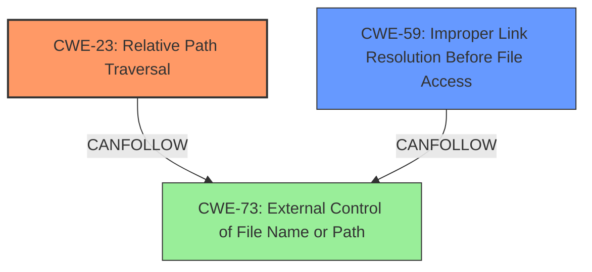

# Raw Analyzer Response for CVE-2025-3445

# Summary

| CWE ID | CWE Name | Confidence | CWE Abstraction Level | CWE Vulnerability Mapping Label | CWE-Vulnerability Mapping Notes |
|---|---|---|---|---|---|
| CWE-23 | Relative Path Traversal | 1.0 | Base | Primary CWE | Allowed |
| CWE-59 | Improper Link Resolution Before File Access ('Link Following') | 0.7 | Base | Secondary Candidate | Allowed |

## Evidence and Confidence

*   **Confidence Score:** 0.9
*   **Evidence Strength:** HIGH

## Relationship Analysis

The primary weakness is **CWE-23 Relative Path Traversal**, which occurs when a program does not properly neutralize sequences like ".." that can resolve to a location outside of a restricted directory. This can lead to the creation or overwriting of files in unintended locations. **CWE-59 Improper Link Resolution Before File Access ('Link Following')** is a closely related CWE and can occur in conjunction with path traversal vulnerabilities when the file path includes symbolic links. The attack involves crafting a ZIP archive with path traversal sequences and/or symbolic links that, when extracted, write files to arbitrary locations due to the **improper pathname limitation**.

## Vulnerability Chain

The vulnerability chain starts with a crafted ZIP file containing path traversal sequences and/or symlinks. Due to the **improper limitation of pathnames**, the archive extraction process writes files to locations outside the intended directory. This leads to the potential for sensitive file overwrite, privilege escalation, and ultimately, code execution.

Crafted ZIP File -> **CWE-23: Relative Path Traversal** or **CWE-59: Improper Link Resolution Before File Access** -> File Overwrite -> Privilege Escalation/Code Execution

## Summary of Analysis

The primary CWE is **CWE-23 Relative Path Traversal**, because the **root cause** of the vulnerability lies in the **improper handling of pathnames** within the ZIP archive, which allows an attacker to write files to arbitrary locations. The vulnerability description explicitly mentions a "Path Traversal Zip Slip vulnerability," which strongly supports this classification. The evidence is high, with the vulnerability description clearly outlining the **root cause** and potential impact.

The selection of **CWE-23** as the primary CWE is at the optimal level of specificity because it directly addresses the vulnerability's root cause and is a Base level CWE. While **CWE-59** is also a valid concern given the potential for symbolic links in the attack, the core issue is the path traversal.

Relevant CWE Information:
# Enhanced Context (25 CWEs)
The following CWEs were identified as potentially relevant to this vulnerability:

## CWE-59: Improper Link Resolution Before File Access ('Link Following')
**Abstraction Level**: Base
**Similarity Score**: 0.79
**Source**: dense

**Description**:
The product attempts to access a file based on the filename, but it does not properly prevent that filename from identifying a link or shortcut that resolves to an unintended resource.

**Mapping Guidance**:
- Usage: Allowed
- Rationale: This CWE entry is at the Base level of abstraction, which is a preferred level of abstraction for mapping to the root causes of vulnerabilities.

## CWE-23: Relative Path Traversal
**Abstraction Level**: Base
**Similarity Score**: 0.77
**Source**: dense

**Description**:
The product uses external input to construct a pathname that should be within a restricted directory, but it does not properly neutralize sequences such as ".." that can resolve to a location that is outside of that directory.

**Mapping Guidance**:
- Usage: Allowed
- Rationale: This CWE entry is at the Base level of abstraction, which is a preferred level of abstraction for mapping to the root causes of vulnerabilities.