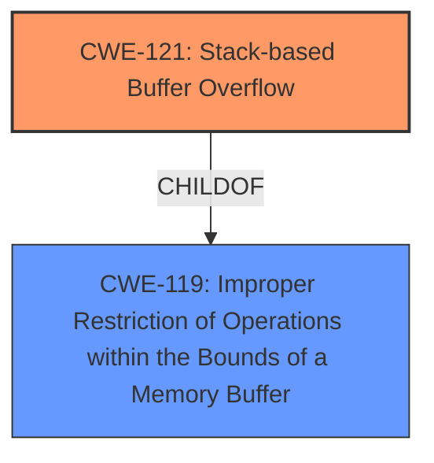

# Enhanced Analysis for CVE-2025-35003

# Summary
| CWE ID | CWE Name | Confidence | CWE Abstraction Level | CWE Vulnerability Mapping Label | CWE-Vulnerability Mapping Notes |
|---|---|---|---|---|---|
| CWE-121 | Stack-based Buffer Overflow | 1.0 | Variant | Primary | Allowed |
| CWE-119 | Improper Restriction of Operations within the Bounds of a Memory Buffer | 0.8 | Class | Secondary | Discouraged |

## Evidence and Confidence

*   **Confidence Score:** 0.9
*   **Evidence Strength:** HIGH

## Relationship Analysis
The primary CWE is CWE-121, which is a variant of CWE-119. CWE-119 is a more general class of weakness, but since the vulnerability is specifically a stack-based buffer overflow, CWE-121 is more appropriate.



## Vulnerability Chain
The vulnerability chain starts with **Improper Restriction of Operations within the Bounds of a Memory Buffer**, leading to a **stack-based buffer overflow** when processing maliciously crafted packets. This can result in a system crash, denial of service, or arbitrary code execution. The root cause is the improper restriction of operations, and the resulting weakness is the stack-based buffer overflow.

## Summary of Analysis
The analysis is based on the provided vulnerability description, which explicitly mentions both **Improper Restriction of Operations within the Bounds of a Memory Buffer and Stack-based Buffer Overflow**. The description states that these vulnerabilities can be exploited by receiving maliciously crafted packets, leading to a system crash, denial of service, or arbitrary code execution.

The relationship analysis indicates that CWE-121 (Stack-based Buffer Overflow) is a variant of CWE-119 (Improper Restriction of Operations within the Bounds of a Memory Buffer). Given the explicit mention of a stack-based buffer overflow, CWE-121 is the more specific and appropriate choice as the primary CWE.

The Retriever Results also support this decision, with CWE-121 and CWE-119 both appearing in the top results. However, CWE-121 is more specific, aligning with the recommendation to choose the most detailed CWE when possible.

The MITRE mapping guidance discourages the use of CWE-119 when more specific CWEs are available. Therefore, CWE-121 is selected as the primary CWE, with CWE-119 as a secondary CWE to represent the more general class of weakness.

The chosen CWEs are at the optimal level of specificity, as CWE-121 directly describes the type of buffer overflow, while CWE-119 captures the underlying **improper restriction of operations**.

Relevant CWE Information:

# Enhanced Context (25 CWEs)
The following CWEs were identified as potentially relevant to this vulnerability:

## CWE-1284: Improper Validation of Specified Quantity in Input
**Abstraction Level**: Base
**Similarity Score**: 0.73
**Source**: dense

**Description**:
The product receives input that is expected to specify a quantity (such as size or length), but it does not validate or incorrectly validates that the quantity has the required properties.

**Mapping Guidance**:
- Usage: Allowed
- Rationale: This CWE entry is at the Base level of abstraction, which is a preferred level of abstraction for mapping to the root causes of vulnerabilities.

## CWE-755: Improper Handling of Exceptional Conditions
**Abstraction Level**: Class
**Similarity Score**: 0.72
**Source**: dense

**Description**:
The product does not handle or incorrectly handles an exceptional condition.

**Mapping Guidance**:
- Usage: Discouraged
- Rationale: This CWE entry is a level-1 Class (i.e., a child of a Pillar). It might have lower-level children that would be more appropriate

## CWE-131: Incorrect Calculation of Buffer Size
**Abstraction Level**: Base
**Similarity Score**: 0.72
**Source**: dense

**Description**:
The product does not correctly calculate the size to be used when allocating a buffer, which could lead to a buffer overflow.

**Mapping Guidance**:
- Usage: Allowed
- Rationale: This CWE entry is at the Base level of abstraction, which is a preferred level of abstraction for mapping to the root causes of vulnerabilities.

## CWE-191: Integer Underflow (Wrap or Wraparound)
**Abstraction Level**: Base
**Similarity Score**: 0.72
**Source**: dense

**Description**:
The product subtracts one value from another, such that the result is less than the minimum allowable integer value, which produces a value that is not equal to the correct result.

**Mapping Guidance**:
- Usage: Allowed
- Rationale: This CWE entry is at the Base level of abstraction, which is a preferred level of abstraction for mapping to the root causes of vulnerabilities.

## CWE-121: Stack-based Buffer Overflow
**Abstraction Level**: Variant
**Similarity Score**: 0.71
**Source**: dense

**Description**:
A stack-based buffer overflow condition is a condition where the buffer being overwritten is allocated on the stack (i.e., is a local variable or, rarely, a parameter to a function).

**Mapping Guidance**:
- Usage: Allowed
- Rationale: This CWE entry is at the Variant level of abstraction, which is a preferred level of abstraction for mapping to the root causes of vulnerabilities.
Technical Explanation: The vulnerability description explicitly states "Stack-based Buffer Overflow vulnerabilities". This aligns directly with the definition of CWE-121, where the buffer being overwritten is allocated on the stack.
Security Implications: A stack-based buffer overflow can allow an attacker to overwrite adjacent memory locations on the stack, potentially leading to control flow hijacking and arbitrary code execution.
Relationship: CWE-121 is a variant of CWE-119 (Improper Restriction of Operations within the Bounds of a Memory Buffer).
Primary/Secondary: Primary
Mapping Guidance Influence: The usage is allowed and the abstraction level is variant.

## CWE-824: Access of Uninitialized Pointer
**Abstraction Level**: Base
**Similarity Score**: 0.71
**Source**: dense

**Description**:
The product accesses or uses a pointer that has not been initialized.

**Mapping Guidance**:
- Usage: Allowed
- Rationale: This CWE entry is at the Base level of abstraction, which is a preferred level of abstraction for mapping to the root causes of vulnerabilities.

## CWE-252: Unchecked Return Value
**Abstraction Level**: Base
**Similarity Score**: 0.71
**Source**: dense

**Description**:
The product does not check the return value from a method or function, which can prevent it from detecting unexpected states and conditions.

**Mapping Guidance**:
- Usage: Allowed
- Rationale: This CWE entry is at the Base level of abstraction, which is a preferred level of abstraction for mapping to the root causes of vulnerabilities.

## CWE-1285: Improper Validation of Specified Index, Position, or Offset in Input
**Abstraction Level**: Base
**Similarity Score**: 0.71
**Source**: dense

**Description**:
The product receives input that is expected to specify an index, position, or offset into an indexable resource such as a buffer or file, but it does not validate or incorrectly validates that the specified index/position/offset has the required properties.

**Mapping Guidance**:
- Usage: Allowed
- Rationale: This CWE entry is at the Base level of abstraction, which is a preferred level of abstraction for mapping to the root causes of vulnerabilities.

## CWE-119: Improper Restriction of Operations within the Bounds of a Memory Buffer
**Abstraction Level**: Class
**Similarity Score**: 0.71
**Source**: dense

**Description**:
The product performs operations on a memory buffer, but it reads from or writes to a memory location outside the buffer's intended boundary. This may result in read or write operations on unexpected memory locations that could be linked to other variables, data structures, or internal program data.

**Mapping Guidance**:
- Usage: Discouraged
- Rationale: CWE-119 is commonly misused in low-information vulnerability reports when lower-level CWEs could be used instead, or when more details about the vulnerability are available.
Technical Explanation: The vulnerability description mentions "Improper Restriction of Operations within the Bounds of a Memory Buffer". This aligns with the definition of CWE-119, where operations are performed outside the intended boundary of a memory buffer.
Security Implications: Improper restriction of operations can lead to read or write operations on unexpected memory locations, potentially causing data corruption, denial of service, or arbitrary code execution.
Relationship: CWE-119 is a parent of CWE-121 (Stack-based Buffer Overflow).
Primary/Secondary: Secondary
Mapping Guidance Influence: The usage is discouraged when lower-level CWEs are available. However, it is included as a secondary CWE to represent the underlying cause of the buffer overflow.

## CWE-7


## CWE Relationship Analysis

Current CWEs represent these abstraction levels: .


### Vulnerability Chain Analysis

**Chain starting from CWE-121:**
- 121 (Stack-based Buffer Overflow) - ROOT


**Chain starting from CWE-1284:**
- 1284 (Improper Validation of Specified Quantity in Input) - ROOT


### CWE Relationship Diagram

```mermaid
graph TD
    classDef primary fill:#f96,stroke:#333,stroke-width:2px
    classDef secondary fill:#69f,stroke:#333
    classDef tertiary fill:#9e9,stroke:#333
```